# Pocket Euler

[](https://travis-ci.org/imsky/PocketEuler)

This is the offline version of [Project Euler](https://projecteuler.net/).

### History

* Compiled by [Kyle Keen](http://kmkeen.com/local-euler/).
* Converted to Github Markdown by [Ivan Malopinsky](http://imsky.co).
* Missing answers provided by [George Netu](https://github.com/georgenetu).

### License

Project Euler is protected under CC Attribution-Non-Commercial-Share Alike 2.0 UK: England & Wales

### Usage

^sup and [sub] are frequently use for subscripts/superscripts.
Many symbols are utf8, my apologies if you are on a 7-bit TTY.

Answers are hashed with the MD5 algorithm. You can verify your answers online using [JavaScript MD5](http://blueimp.github.io/JavaScript-MD5/).

If you're using Linux or OS X, you can use `md5sum` to verify your answers as well:

```
echo -n 'myanswer' | md5sum
```

Problem 1
=========

If we list all the natural numbers below 10 that are multiples of 3 or 5,
we get 3, 5, 6 and 9. The sum of these multiples is 23.

Find the sum of all the multiples of 3 or 5 below 1000.

Answer: e1edf9d1967ca96767dcc2b2d6df69f4

Problem 2
=========

Each new term in the Fibonacci sequence is generated by adding the
previous two terms. By starting with 1 and 2, the first 10 terms will be:

    1, 2, 3, 5, 8, 13, 21, 34, 55, 89, ...

By considering the terms in the Fibonacci sequence whose values do not
exceed four million, find the sum of the even-valued terms.

Answer: 4194eb91842c8e7e6df099ca73c38f28

Problem 3
=========

The prime factors of 13195 are 5, 7, 13 and 29.

What is the largest prime factor of the number 600851475143?

Answer: 94c4dd41f9dddce696557d3717d98d82

Problem 4
=========

A palindromic number reads the same both ways. The largest palindrome made
from the product of two 2-digit numbers is 9009 = 91 × 99.

Find the largest palindrome made from the product of two 3-digit numbers.

Answer: d4cfc27d16ea72a96b83d9bdef6ce2ec

Problem 5
=========

2520 is the smallest number that can be divided by each of the numbers
from 1 to 10 without any remainder.

What is the smallest positive number that is evenly divisible by all of
the numbers from 1 to 20?

Answer: bc0d0a22a7a46212135ed0ba77d22f3a

Problem 6
=========

The sum of the squares of the first ten natural numbers is:

    1^2 + 2^2 + ... + 10^2 = 385

The square of the sum of the first ten natural numbers is:

    (1 + 2 + ... + 10)^2 = 55^2 = 3025

Hence the difference between the sum of the squares of the first ten
natural numbers and the square of the sum is 3025 − 385 = 2640.

Find the difference between the sum of the squares of the first one
hundred natural numbers and the square of the sum.

Answer: 867380888952c39a131fe1d832246ecc

Problem 7
=========

By listing the first six prime numbers: 2, 3, 5, 7, 11, and 13, we can see
that the 6th prime is 13.

What is the 10,001st prime number?

Answer: 8c32ab09ec0210af60d392e9b2009560

Problem 8
=========

The four adjacent digits in the 1000-digit number that have the greatest
product are 9 × 9 × 8 × 9 = 5832.

    73167176531330624919225119674426574742355349194934
    96983520312774506326239578318016984801869478851843
    85861560789112949495459501737958331952853208805511
    12540698747158523863050715693290963295227443043557
    66896648950445244523161731856403098711121722383113
    62229893423380308135336276614282806444486645238749
    30358907296290491560440772390713810515859307960866
    70172427121883998797908792274921901699720888093776
    65727333001053367881220235421809751254540594752243
    52584907711670556013604839586446706324415722155397
    53697817977846174064955149290862569321978468622482
    83972241375657056057490261407972968652414535100474
    82166370484403199890008895243450658541227588666881
    16427171479924442928230863465674813919123162824586
    17866458359124566529476545682848912883142607690042
    24219022671055626321111109370544217506941658960408
    07198403850962455444362981230987879927244284909188
    84580156166097919133875499200524063689912560717606
    05886116467109405077541002256983155200055935729725
    71636269561882670428252483600823257530420752963450

Find the thirteen adjacent digits in the 1000-digit number that have the
greatest product. What is the value of this product?

Answer: 0f53ea7949d32ef24f9186207600403c

Problem 9
=========

A Pythagorean triplet is a set of three natural numbers, a < b < c, for
which,

    a^2 + b^2 = c^2

For example, 3^2 + 4^2 = 9 + 16 = 25 = 5^2.

There exists exactly one Pythagorean triplet for which a + b + c = 1000.
Find the product abc.

Answer: 24eaa9820350012ff678de47cb85b639

Problem 10
==========

The sum of the primes below 10 is 2 + 3 + 5 + 7 = 17.

Find the sum of all the primes below two million.

Answer: d915b2a9ac8749a6b837404815f1ae25

Problem 11
==========

In the 20×20 grid below, four numbers along a diagonal line have been
marked in red.

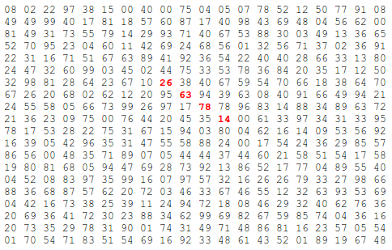

The product of these numbers is 26 × 63 × 78 × 14 = 1788696.

What is the greatest product of four adjacent numbers in the same
direction (up, down, left, right, or diagonally) in the 20×20 grid?

Answer: 678f5d2e1eaa42f04fa53411b4f441ac


Problem 12
==========

The sequence of triangle numbers is generated by adding the natural
numbers. So the 7th triangle number would be 1 + 2 + 3 + 4 + 5 + 6 + 7 =  28. 

The first ten terms would be:

    1, 3, 6, 10, 15, 21, 28, 36, 45, 55, ...

Let us list the factors of the first seven triangle numbers:

     1: 1
     3: 1,3
     6: 1,2,3,6
    10: 1,2,5,10
    15: 1,3,5,15
    21: 1,3,7,21
    28: 1,2,4,7,14,28

We can see that 28 is the first triangle number to have over five
divisors.

What is the value of the first triangle number to have over five hundred
divisors?

Answer: 8091de7d285989bbfa9a2f9f3bdcc7c0

Problem 13
==========


Work out the first ten digits of the sum of the following one-hundred
50-digit numbers.

    37107287533902102798797998220837590246510135740250
    46376937677490009712648124896970078050417018260538
    74324986199524741059474233309513058123726617309629
    91942213363574161572522430563301811072406154908250
    23067588207539346171171980310421047513778063246676
    89261670696623633820136378418383684178734361726757
    28112879812849979408065481931592621691275889832738
    44274228917432520321923589422876796487670272189318
    47451445736001306439091167216856844588711603153276
    70386486105843025439939619828917593665686757934951
    62176457141856560629502157223196586755079324193331
    64906352462741904929101432445813822663347944758178
    92575867718337217661963751590579239728245598838407
    58203565325359399008402633568948830189458628227828
    80181199384826282014278194139940567587151170094390
    35398664372827112653829987240784473053190104293586
    86515506006295864861532075273371959191420517255829
    71693888707715466499115593487603532921714970056938
    54370070576826684624621495650076471787294438377604
    53282654108756828443191190634694037855217779295145
    36123272525000296071075082563815656710885258350721
    45876576172410976447339110607218265236877223636045
    17423706905851860660448207621209813287860733969412
    81142660418086830619328460811191061556940512689692
    51934325451728388641918047049293215058642563049483
    62467221648435076201727918039944693004732956340691
    15732444386908125794514089057706229429197107928209
    55037687525678773091862540744969844508330393682126
    18336384825330154686196124348767681297534375946515
    80386287592878490201521685554828717201219257766954
    78182833757993103614740356856449095527097864797581
    16726320100436897842553539920931837441497806860984
    48403098129077791799088218795327364475675590848030
    87086987551392711854517078544161852424320693150332
    59959406895756536782107074926966537676326235447210
    69793950679652694742597709739166693763042633987085
    41052684708299085211399427365734116182760315001271
    65378607361501080857009149939512557028198746004375
    35829035317434717326932123578154982629742552737307
    94953759765105305946966067683156574377167401875275
    88902802571733229619176668713819931811048770190271
    25267680276078003013678680992525463401061632866526
    36270218540497705585629946580636237993140746255962
    24074486908231174977792365466257246923322810917141
    91430288197103288597806669760892938638285025333403
    34413065578016127815921815005561868836468420090470
    23053081172816430487623791969842487255036638784583
    11487696932154902810424020138335124462181441773470
    63783299490636259666498587618221225225512486764533
    67720186971698544312419572409913959008952310058822
    95548255300263520781532296796249481641953868218774
    76085327132285723110424803456124867697064507995236
    37774242535411291684276865538926205024910326572967
    23701913275725675285653248258265463092207058596522
    29798860272258331913126375147341994889534765745501
    18495701454879288984856827726077713721403798879715
    38298203783031473527721580348144513491373226651381
    34829543829199918180278916522431027392251122869539
    40957953066405232632538044100059654939159879593635
    29746152185502371307642255121183693803580388584903
    41698116222072977186158236678424689157993532961922
    62467957194401269043877107275048102390895523597457
    23189706772547915061505504953922979530901129967519
    86188088225875314529584099251203829009407770775672
    11306739708304724483816533873502340845647058077308
    82959174767140363198008187129011875491310547126581
    97623331044818386269515456334926366572897563400500
    42846280183517070527831839425882145521227251250327
    55121603546981200581762165212827652751691296897789
    32238195734329339946437501907836945765883352399886
    75506164965184775180738168837861091527357929701337
    62177842752192623401942399639168044983993173312731
    32924185707147349566916674687634660915035914677504
    99518671430235219628894890102423325116913619626622
    73267460800591547471830798392868535206946944540724
    76841822524674417161514036427982273348055556214818
    97142617910342598647204516893989422179826088076852
    87783646182799346313767754307809363333018982642090
    10848802521674670883215120185883543223812876952786
    71329612474782464538636993009049310363619763878039
    62184073572399794223406235393808339651327408011116
    66627891981488087797941876876144230030984490851411
    60661826293682836764744779239180335110989069790714
    85786944089552990653640447425576083659976645795096
    66024396409905389607120198219976047599490197230297
    64913982680032973156037120041377903785566085089252
    16730939319872750275468906903707539413042652315011
    94809377245048795150954100921645863754710598436791
    78639167021187492431995700641917969777599028300699
    15368713711936614952811305876380278410754449733078
    40789923115535562561142322423255033685442488917353
    44889911501440648020369068063960672322193204149535
    41503128880339536053299340368006977710650566631954
    81234880673210146739058568557934581403627822703280
    82616570773948327592232845941706525094512325230608
    22918802058777319719839450180888072429661980811197
    77158542502016545090413245809786882778948721859617
    72107838435069186155435662884062257473692284509516
    20849603980134001723930671666823555245252804609722
    53503534226472524250874054075591789781264330331690

Answer: 361113f19fd302adc31268f8283a4f2d


Problem 14
==========


The following iterative sequence is defined for the set of positive
integers:

    n → n/2 (n is even)
    n → 3n + 1 (n is odd)

Using the rule above and starting with 13, we generate the following
sequence:

    13 → 40 → 20 → 10 → 5 → 16 → 8 → 4 → 2 → 1

It can be seen that this sequence (starting at 13 and finishing at 1)
contains 10 terms. Although it has not been proved yet ([Collatz Problem](http://en.wikipedia.org/wiki/Collatz_conjecture)),
it is thought that all starting numbers finish at 1.

Which starting number, under one million, produces the longest chain?

NOTE: Once the chain starts the terms are allowed to go above one million.

Answer: 5052c3765262bb2c6be537abd60b305e

Problem 15
==========

Starting in the top left corner of a 2×2 grid, and only being able to move
to the right and down, there are exactly 6 routes to the bottom right
corner.


How many such routes are there through a 20×20 grid?

Answer: 928f3957168ac592c4215dcd04e0b678

Problem 16
==========

2^15 = 32768 and the sum of its digits is 3 + 2 + 7 + 6 + 8 = 26.

What is the sum of the digits of the number 2^1000?

Answer: 6a5889bb0190d0211a991f47bb19a777

Problem 17
==========

If the numbers 1 to 5 are written out in words: one, two, three, four,
five, then there are 3 + 3 + 5 + 4 + 4 = 19 letters used in total.

If all the numbers from 1 to 1000 (one thousand) inclusive were written
out in words, how many letters would be used?

NOTE: Do not count spaces or hyphens. For example, 342 (three hundred and
forty-two) contains 23 letters and 115 (one hundred and fifteen) contains
20 letters. The use of "and" when writing out numbers is in compliance
with British usage.

Answer: 6a979d4a9cf85135408529edc8a133d0

Problem 18
==========

By starting at the top of the triangle below and moving to adjacent
numbers on the row below, the maximum total from top to bottom is 23.

	   3
	  7 4
	 2 4 6
	8 5 9 3

That is, 3 + 7 + 4 + 9 = 23.

Find the maximum total from top to bottom of the triangle below:

						   75
						 95 64
						17 47 82
					  18 35 87 10
					 20 04 82 47 65
				   19 01 23 75 03 34
				  88 02 77 73 07 63 67
				99 65 04 28 06 16 70 92
			   41 41 26 56 83 40 80 70 33
			 41 48 72 33 47 32 37 16 94 29
			53 71 44 65 25 43 91 52 97 51 14
		  70 11 33 28 77 73 17 78 39 68 17 57
		 91 71 52 38 17 14 91 43 58 50 27 29 48
	   63 66 04 68 89 53 67 30 73 16 69 87 40 31
	  04 62 98 27 23 09 70 98 73 93 38 53 60 04 23

NOTE: As there are only 16384 routes, it is possible to solve this problem
by trying every route. However, [Problem 67](#problem-67), is the same challenge with
a triangle containing one-hundred rows; it cannot be solved by brute
force, and requires a clever method! ;o)

Answer: 708f3cf8100d5e71834b1db77dfa15d6


Problem 19
==========


You are given the following information, but you may prefer to do some
research for yourself.

     • 1 Jan 1900 was a Monday.
     • Thirty days has September,
       April, June and November.
       All the rest have thirty-one,
       Saving February alone,
       Which has twenty-eight, rain or shine.
       And on leap years, twenty-nine.
     • A leap year occurs on any year evenly divisible by 4, but not on a
       century unless it is divisible by 400.

How many Sundays fell on the first of the month during the twentieth
century (1 Jan 1901 to 31 Dec 2000)?

Answer: a4a042cf4fd6bfb47701cbc8a1653ada

Problem 20
==========

n! means n × (n − 1) × ... × 3 × 2 × 1

For example, 10! = 10 × 9 × ... × 3 × 2 × 1 = 3628800,
and the sum of the digits in the number 10! is 3 + 6 + 2 + 8 + 8 + 0 + 0 = 27.

Find the sum of the digits in the number 100!

Answer: 443cb001c138b2561a0d90720d6ce111

Problem 21
==========

Let d(n) be defined as the sum of proper divisors of n (numbers less than
n which divide evenly into n).
If d(a) = b and d(b) = a, where a ≠ b, then a and b are an amicable pair
and each of a and b are called amicable numbers.

For example, the proper divisors of 220 are 1, 2, 4, 5, 10, 11, 20, 22,
44, 55 and 110; therefore d(220) = 284. The proper divisors of 284 are 1,
2, 4, 71 and 142; so d(284) = 220.

Evaluate the sum of all the amicable numbers under 10000.

Answer: 51e04cd4e55e7e415bf24de9e1b0f3ff

Problem 22
==========

Using [names.txt](files/names.txt), a 46K text file containing over five-thousand first
names, begin by sorting it into alphabetical order. Then working out the
alphabetical value for each name, multiply this value by its alphabetical
position in the list to obtain a name score.

For example, when the list is sorted into alphabetical order, COLIN, which
is worth 3 + 15 + 12 + 9 + 14 = 53, is the 938th name in the list. So,
COLIN would obtain a score of 938 × 53 = 49714.

What is the total of all the name scores in the file?

Answer: f2c9c91cb025746f781fa4db8be3983f

Problem 23
==========

A perfect number is a number for which the sum of its proper divisors is
exactly equal to the number. For example, the sum of the proper divisors
of 28 would be 1 + 2 + 4 + 7 + 14 = 28, which means that 28 is a perfect
number.

A number n is called deficient if the sum of its proper divisors is less
than n and it is called abundant if this sum exceeds n.

As 12 is the smallest abundant number, 1 + 2 + 3 + 4 + 6 = 16, the
smallest number that can be written as the sum of two abundant numbers is
24. By mathematical analysis, it can be shown that all integers greater
than 28123 can be written as the sum of two abundant numbers. However,
this upper limit cannot be reduced any further by analysis even though it
is known that the greatest number that cannot be expressed as the sum of
two abundant numbers is less than this limit.

Find the sum of all the positive integers which cannot be written as the
sum of two abundant numbers.

Answer: 2c8258c0604152962f7787571511cf28

Problem 24
==========


A permutation is an ordered arrangement of objects. For example, 3124 is
one possible permutation of the digits 1, 2, 3 and 4. If all of the
permutations are listed numerically or alphabetically, we call it
lexicographic order. The lexicographic permutations of 0, 1 and 2 are:

    012   021   102   120   201   210

What is the millionth lexicographic permutation of the digits 0, 1, 2, 3,
4, 5, 6, 7, 8 and 9?

Answer: 7f155b45cb3f0a6e518d59ec348bff84


Problem 25
==========

The Fibonacci sequence is defined by the recurrence relation:

    F[n] = F[n−1] + F[n−2], where F[1] = 1 and F[2] = 1.

Hence the first 12 terms will be:

    F[1] = 1
    F[2] = 1
    F[3] = 2
    F[4] = 3
    F[5] = 5
    F[6] = 8
    F[7] = 13
    F[8] = 21
    F[9] = 34
    F[10] = 55
    F[11] = 89
    F[12] = 144

The 12th term, F[12], is the first term to contain three digits.

What is the first term in the Fibonacci sequence to contain 1000 digits?

Answer: a376802c0811f1b9088828288eb0d3f0

Problem 26
==========

A unit fraction contains 1 in the numerator. The decimal representation of
the unit fractions with denominators 2 to 10 are given:

     1/2  =  0.5
     1/3  =  0.(3)
     1/4  =  0.25
     1/5  =  0.2
     1/6  =  0.1(6)
     1/7  =  0.(142857)
     1/8  =  0.125
     1/9  =  0.(1)
     1/10 =  0.1

Where 0.1(6) means 0.166666..., and has a 1-digit recurring cycle. It can
be seen that 1/7 has a 6-digit recurring cycle.

Find the value of d < 1000 for which 1/d contains the longest recurring
cycle in its decimal fraction part.

Answer: 6aab1270668d8cac7cef2566a1c5f569


Problem 27
==========

Euler discovered the remarkable quadratic formula:

   n² + n + 41

It turns out that the formula will produce 40 primes for the consecutive
values n = 0 to 39. However, when n = 40, 40² + 40 + 41 = 40(40 + 1) + 41
is divisible by 41, and certainly when n = 41, 41² + 41 + 41 is clearly
divisible by 41.

The incredible formula  n² − 79n + 1601 was discovered, which produces 80
primes for the consecutive values n = 0 to 79. The product of the
coefficients, −79 and 1601, is −126479.

Considering quadratics of the form:

    n² + an + b, where |a| < 1000 and |b| < 1000

where |n| is the modulus/absolute value of n, e.g. |11| = 11 and |−4| = 4

Find the product of the coefficients, a and b, for the quadratic
expression that produces the maximum number of primes for consecutive
values of n, starting with n = 0.

Answer: 69d9e3218fd7abb6ff453ea96505183d

Problem 28
==========


Starting with the number 1 and moving to the right in a clockwise
direction a 5 by 5 spiral is formed as follows:

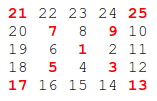

It can be verified that the sum of the numbers on the diagonals is 101.

What is the sum of the numbers on the diagonals in a 1001 by 1001 spiral
formed in the same way?

Answer: 0d53425bd7c5bf9919df3718c8e49fa6


Problem 29
==========

Consider all integer combinations of a^b for 2 ≤ a ≤ 5 and 2 ≤ b ≤ 5:

    2^2=4, 2^3=8, 2^4=16, 2^5=32
    3^2=9, 3^3=27, 3^4=81, 3^5=243
    4^2=16, 4^3=64, 4^4=256, 4^5=1024
    5^2=25, 5^3=125, 5^4=625, 5^5=3125

If they are then placed in numerical order, with any repeats removed, we
get the following sequence of 15 distinct terms:

    4, 8, 9, 16, 25, 27, 32, 64, 81, 125, 243, 256, 625, 1024, 3125

How many distinct terms are in the sequence generated by a^b for 2 ≤ a ≤
100 and 2 ≤ b ≤ 100?

Answer: 6f0ca67289d79eb35d19decbc0a08453


Problem 30
==========

Surprisingly there are only three numbers that can be written as the sum
of fourth powers of their digits:

    1634 = 1^4 + 6^4 + 3^4 + 4^4
    8208 = 8^4 + 2^4 + 0^4 + 8^4
    9474 = 9^4 + 4^4 + 7^4 + 4^4

As 1 = 1^4 is not a sum it is not included.

The sum of these numbers is 1634 + 8208 + 9474 = 19316.

Find the sum of all the numbers that can be written as the sum of fifth
powers of their digits.

Answer: 27a1779a8a8c323a307ac8a70bc4489d


Problem 31
==========


In England the currency is made up of pound, £, and pence, p, and there
are eight coins in general circulation:

     1p, 2p, 5p, 10p, 20p, 50p, £1 (100p) and £2 (200p).

It is possible to make £2 in the following way:

     1×£1 + 1×50p + 2×20p + 1×5p + 1×2p + 3×1p

How many different ways can £2 be made using any number of coins?

Answer: 142dfe4a33d624d2b830a9257e96726d


Problem 32
==========


We shall say that an n-digit number is pandigital if it makes use of all
the digits 1 to n exactly once; for example, the 5-digit number, 15234, is
1 through 5 pandigital.

The product 7254 is unusual, as the identity, 39 × 186 = 7254, containing
multiplicand, multiplier, and product is 1 through 9 pandigital.

Find the sum of all products whose multiplicand/multiplier/product
identity can be written as a 1 through 9 pandigital.

HINT: Some products can be obtained in more than one way so be sure to
only include it once in your sum.

Answer: 100f6e37d0b0564490a2ee27eff0660d


Problem 33
==========


The fraction 49/98 is a curious fraction, as an inexperienced
mathematician in attempting to simplify it may incorrectly believe that
49/98 = 4/8, which is correct, is obtained by cancelling the 9s.

We shall consider fractions like, 30/50 = 3/5, to be trivial
examples.

There are exactly four non-trivial examples of this type of fraction, less
than one in value, and containing two digits in the numerator and
denominator.

If the product of these four fractions is given in its lowest common
terms, find the value of the denominator.

Answer: f899139df5e1059396431415e770c6dd


Problem 34
==========

145 is a curious number, as 1! + 4! + 5! = 1 + 24 + 120 = 145.

Find the sum of all numbers which are equal to the sum of the factorial of
their digits.

Note: as 1! = 1 and 2! = 2 are not sums they are not included.

Answer: 60803ea798a0c0dfb7f36397d8d4d772

Problem 35
==========

The number, 197, is called a circular prime because all rotations of the
digits: 197, 971, and 719, are themselves prime.

There are thirteen such primes below 100: 2, 3, 5, 7, 11, 13, 17, 31, 37,
71, 73, 79, and 97.

How many circular primes are there below one million?

Answer: b53b3a3d6ab90ce0268229151c9bde11

Problem 36
==========

The decimal number, 585 = 1001001001₂ (binary), is palindromic in both
bases.

Find the sum of all numbers, less than one million, which are palindromic
in base 10 and base 2.

(Please note that the palindromic number, in either base, may not include
leading zeros.)

Answer: 0e175dc2f28833885f62e7345addff03

Problem 37
==========

The number 3797 has an interesting property. Being prime itself, it is
possible to continuously remove digits from left to right, and remain
prime at each stage: 3797, 797, 97, and 7. Similarly we can work from
right to left: 3797, 379, 37, and 3.

Find the sum of the only eleven primes that are both truncatable from left
to right and right to left.

NOTE: 2, 3, 5, and 7 are not considered to be truncatable primes.

Answer: cace46c61b00de1b60874936a093981d

Problem 38
==========

Take the number 192 and multiply it by each of 1, 2, and 3:

     192 × 1 = 192
     192 × 2 = 384
     192 × 3 = 576

By concatenating each product we get the 1 to 9 pandigital, 192384576. We
will call 192384576 the concatenated product of 192 and (1,2,3)

The same can be achieved by starting with 9 and multiplying by 1, 2, 3, 4,
and 5, giving the pandigital, 918273645, which is the concatenated product
of 9 and (1,2,3,4,5).

What is the largest 1 to 9 pandigital 9-digit number that can be formed as
the concatenated product of an integer with (1,2, ... , n) where n > 1?

Answer: f2a29ede8dc9fae7926dc7a4357ac25e

Problem 39
==========

If p is the perimeter of a right angle triangle with integral length
sides, {a,b,c}, there are exactly three solutions for p = 120.

    {20,48,52}, {24,45,51}, {30,40,50}

For which value of p ≤ 1000, is the number of solutions maximised?

Answer: fa83a11a198d5a7f0bf77a1987bcd006


Problem 40
==========

An irrational decimal fraction is created by concatenating the positive
integers: 0.123456789101112131415161718192021...

It can be seen that the 12th digit of the fractional part is 1.

If d[n] represents the nth digit of the fractional part, find the value
of the following expression.

      d[1] × d[10] × d[100] × d[1000] × d[10000] × d[100000] × d[1000000]
   
Answer: 6f3ef77ac0e3619e98159e9b6febf557


Problem 41
==========

We shall say that an n-digit number is pandigital if it makes use of all
the digits 1 to n exactly once. For example, 2143 is a 4-digit pandigital
and is also prime.

What is the largest n-digit pandigital prime that exists?
  
Answer: d0a1bd6ab4229b2d0754be8923431404


Problem 42
==========

The nth term of the sequence of triangle numbers is given by, t[n] = ½n(n+1);
so the first ten triangle numbers are:

    1, 3, 6, 10, 15, 21, 28, 36, 45, 55, ...

By converting each letter in a word to a number corresponding to its
alphabetical position and adding these values we form a word value. For
example, the word value for SKY is 19 + 11 + 25 = 55 = t[10]. If the word
value is a triangle number then we shall call the word a triangle word.

Using [words.txt](files/words.txt), a 16K text file containing nearly two-thousand common
English words, how many are triangle words?

Answer: 82aa4b0af34c2313a562076992e50aa3


Problem 43
==========


   The number, 1406357289, is a 0 to 9 pandigital number because it is made
   up of each of the digits 0 to 9 in some order, but it also has a rather
   interesting sub-string divisibility property.

   Let d[1] be the 1st digit, d[2] be the 2nd digit, and so on. In this
   way, we note the following:

     • d[2]d[3]d[4]=406 is divisible by 2
     • d[3]d[4]d[5]=063 is divisible by 3
     • d[4]d[5]d[6]=635 is divisible by 5
     • d[5]d[6]d[7]=357 is divisible by 7
     • d[6]d[7]d[8]=572 is divisible by 11
     • d[7]d[8]d[9]=728 is divisible by 13
     • d[8]d[9]d[10]=289 is divisible by 17

   Find the sum of all 0 to 9 pandigital numbers with this property.

   
   Answer: 115253b7721af0fdff25cd391dfc70cf


Problem 44
==========

Pentagonal numbers are generated by the formula, P[n]=n(3n−1)/2. The first
ten pentagonal numbers are:

    1, 5, 12, 22, 35, 51, 70, 92, 117, 145, ...

It can be seen that P[4] + P[7] = 22 + 70 = 92 = P[8]. However, their
difference, 70 − 22 = 48, is not pentagonal.

Find the pair of pentagonal numbers, P[j] and P[k], for which their sum
and difference are pentagonal and D = |P[k] − P[j]| is minimised; what is
the value of D?


Answer: 2c2556cb85621309ca647465ffa62370


Problem 45
==========

Triangle, pentagonal, and hexagonal numbers are generated by the following
formulae:

    Triangle     T[n]=n(n+1)/2    1, 3, 6, 10, 15, ...
    Pentagonal   P[n]=n(3n−1)/2   1, 5, 12, 22, 35, ...
    Hexagonal    H[n]=n(2n−1)     1, 6, 15, 28, 45, ...

It can be verified that T[285] = P[165] = H[143] = 40755.

Find the next triangle number that is also pentagonal and hexagonal.

Answer: 30dfe3e3b286add9d12e493ca7be63fc


Problem 46
==========

It was proposed by Christian Goldbach that every odd composite number can
be written as the sum of a prime and twice a square.

    9 = 7 + 2×1²
    15 = 7 + 2×2²
    21 = 3 + 2×3²
    25 = 7 + 2×3²
    27 = 19 + 2×2²
    33 = 31 + 2×1²

It turns out that the conjecture was false.

What is the smallest odd composite that cannot be written as the sum of a
prime and twice a square?

Answer: 89abe98de6071178edb1b28901a8f459


Problem 47
==========


The first two consecutive numbers to have two distinct prime factors are:

    14 = 2 × 7
    15 = 3 × 5

The first three consecutive numbers to have three distinct prime factors are:

    644 = 2² × 7 × 23
    645 = 3 × 5 × 43
    646 = 2 × 17 × 19.

Find the first four consecutive integers to have four distinct prime
factors. What is the first of these numbers?

Answer: 748f517ecdc29106e2738f88aa7530f4


Problem 48
==========

The series, 1¹ + 2² + 3³ + ... + 10¹⁰ = 10405071317.

Find the last ten digits of the series, 1¹ + 2² + 3³ + ... + 1000¹⁰⁰⁰.

Answer: 0829124724747ae1c65da8cae5263346

Problem 49
==========

The arithmetic sequence, 1487, 4817, 8147, in which each of the terms
increases by 3330, is unusual in two ways: (i) each of the three terms are
prime, and, (ii) each of the 4-digit numbers are permutations of one
another.

There are no arithmetic sequences made up of three 1-, 2-, or 3-digit
primes, exhibiting this property, but there is one other 4-digit
increasing sequence.

What 12-digit number do you form by concatenating the three terms in this
sequence?

Answer: 0b99933d3e2a9addccbb663d46cbb592

Problem 50
==========

The prime 41, can be written as the sum of six consecutive primes:

    41 = 2 + 3 + 5 + 7 + 11 + 13

This is the longest sum of consecutive primes that adds to a prime below
one-hundred.

The longest sum of consecutive primes below one-thousand that adds to a
prime, contains 21 terms, and is equal to 953.

Which prime, below one-million, can be written as the sum of the most
consecutive primes?

Answer: 73229bab6c5dc1c7cf7a4fa123caf6bc

Problem 51
==========

By replacing the 1st digit of the 2-digit number *3, it turns out that
six of the nine possible values: 13, 23, 43, 53, 73, and 83, are all
prime.

By replacing the 3rd and 4th digits of 56**3 with the same digit, this
5-digit number is the first example having seven primes among the ten
generated numbers, yielding the family: 56003, 56113, 56333, 56443, 56663,
56773, and 56993. Consequently 56003, being the first member of this
family, is the smallest prime with this property.

Find the smallest prime which, by replacing part of the number (not
necessarily adjacent digits) with the same digit, is part of an eight
prime value family.

Answer: e2a8daa5eb919905dadd795593084c22

Problem 52
==========

It can be seen that the number, 125874, and its double, 251748, contain
exactly the same digits, but in a different order.

Find the smallest positive integer, x, such that 2x, 3x, 4x, 5x, and 6x,
contain the same digits.

Answer: a420384997c8a1a93d5a84046117c2aa


Problem 53
==========

There are exactly ten ways of selecting three from five, 12345:

      123, 124, 125, 134, 135, 145, 234, 235, 245, and 345

In combinatorics, we use the notation, 5C[3] = 10.

In general,

      nC[r] =  ___n!___ ,where r ≤ n, n! = n×(n−1)×...×3×2×1, and 0! = 1.
               r!(n−r)!

It is not until n = 23, that a value exceeds one-million: 23C[10] = 1144066.

How many, not necessarily distinct, values of  nC[r], for 1 ≤ n ≤ 100,
are greater than one-million?

Answer: e3b21256183cf7c2c7a66be163579d37


Problem 54
==========

In the card game poker, a hand consists of five cards and are ranked, from
lowest to highest, in the following way:

* High Card: Highest value card.
* One Pair: Two cards of the same value.
* Two Pairs: Two different pairs.
* Three of a Kind: Three cards of the same value.
* Straight: All cards are consecutive values.
* Flush: All cards of the same suit.
* Full House: Three of a kind and a pair.
* Four of a Kind: Four cards of the same value.
* Straight Flush: All cards are consecutive values of same suit.
* Royal Flush: Ten, Jack, Queen, King, Ace, in same suit.

The cards are valued in the order:
2, 3, 4, 5, 6, 7, 8, 9, 10, Jack, Queen, King, Ace.

If two players have the same ranked hands then the rank made up of the
highest value wins; for example, a pair of eights beats a pair of fives
(see example 1 below). But if two ranks tie, for example, both players
have a pair of queens, then highest cards in each hand are compared (see
example 4 below); if the highest cards tie then the next highest cards are
compared, and so on.

Consider the following five hands dealt to two players:

    Hand   Player 1            Player 2              Winner
    1      5H 5C 6S 7S KD      2C 3S 8S 8D TD        Player 2
           Pair of Fives       Pair of Eights
    2      5D 8C 9S JS AC      2C 5C 7D 8S QH        Player 1
           Highest card Ace    Highest card Queen
    3      2D 9C AS AH AC      3D 6D 7D TD QD        Player 2
           Three Aces          Flush with Diamonds
           4D 6S 9H QH QC      3D 6D 7H QD QS
    4      Pair of Queens      Pair of Queens        Player 1
           Highest card Nine   Highest card Seven
    5      2H 2D 4C 4D 4S      3C 3D 3S 9S 9D
           Full House          Full House            Player 1
           With Three Fours    with Three Threes

The file, [poker.txt](files/poker.txt), contains one-thousand random hands dealt to two
players. Each line of the file contains ten cards (separated by a single
space): the first five are Player 1's cards and the last five are Player
2's cards. You can assume that all hands are valid (no invalid characters
or repeated cards), each player's hand is in no specific order, and in
each hand there is a clear winner.

How many hands does Player 1 win?

Answer: 142949df56ea8ae0be8b5306971900a4


Problem 55
==========

If we take 47, reverse and add, 47 + 74 = 121, which is palindromic.

Not all numbers produce palindromes so quickly. For example,

    349 + 943 = 1292,
    1292 + 2921 = 4213
    4213 + 3124 = 7337

That is, 349 took three iterations to arrive at a palindrome.

Although no one has proved it yet, it is thought that some numbers, like
196, never produce a palindrome. A number that never forms a palindrome
through the reverse and add process is called a Lychrel number. Due to the
theoretical nature of these numbers, and for the purpose of this problem,
we shall assume that a number is Lychrel until proven otherwise. In
addition you are given that for every number below ten-thousand, it will
either (i) become a palindrome in less than fifty iterations, or, (ii) no
one, with all the computing power that exists, has managed so far to map
it to a palindrome. In fact, 10677 is the first number to be shown to
require over fifty iterations before producing a palindrome:
4668731596684224866951378664 (53 iterations, 28-digits).

Surprisingly, there are palindromic numbers that are themselves Lychrel
numbers; the first example is 4994.

How many Lychrel numbers are there below ten-thousand?

NOTE: Wording was modified slightly on 24 April 2007 to emphasise the
theoretical nature of Lychrel numbers.

Answer: 077e29b11be80ab57e1a2ecabb7da330

Problem 56
==========

A googol (10^100) is a massive number: one followed by one-hundred zeros;
100^100 is almost unimaginably large: one followed by two-hundred zeros.
Despite their size, the sum of the digits in each number is only 1.

Considering natural numbers of the form, a^b, where a, b < 100, what is
the maximum digital sum?

Answer: c22abfa379f38b5b0411bc11fa9bf92f


Problem 57
==========


It is possible to show that the square root of two can be expressed as an
infinite continued fraction.

    √ 2 = 1 + 1/(2 + 1/(2 + 1/(2 + ... ))) = 1.414213...

By expanding this for the first four iterations, we get:

    1 + 1/2 = 3/2 = 1.5
    1 + 1/(2 + 1/2) = 7/5 = 1.4
    1 + 1/(2 + 1/(2 + 1/2)) = 17/12 = 1.41666...
    1 + 1/(2 + 1/(2 + 1/(2 + 1/2))) = 41/29 = 1.41379...

The next three expansions are 99/70, 239/169, and 577/408, but the eighth
expansion, 1393/985, is the first example where the number of digits in
the numerator exceeds the number of digits in the denominator.

In the first one-thousand expansions, how many fractions contain a
numerator with more digits than denominator?

Answer: b3e3e393c77e35a4a3f3cbd1e429b5dc


Problem 58
==========


Starting with 1 and spiralling anticlockwise in the following way, a
square spiral with side length 7 is formed.

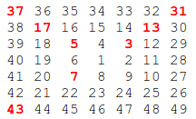

It is interesting to note that the odd squares lie along the bottom right
diagonal, but what is more interesting is that 8 out of the 13 numbers
lying along both diagonals are prime; that is, a ratio of 8/13 ≈ 62%.

If one complete new layer is wrapped around the spiral above, a square
spiral with side length 9 will be formed. If this process is continued,
what is the side length of the square spiral for which the ratio of primes
along both diagonals first falls below 10%?

Answer: b62fc92a2561538525c89be63f36bf7b


Problem 59
==========

Each character on a computer is assigned a unique code and the preferred
standard is ASCII (American Standard Code for Information Interchange).
For example, uppercase A = 65, asterisk (*) = 42, and lowercase k = 107.

A modern encryption method is to take a text file, convert the bytes to
ASCII, then XOR each byte with a given value, taken from a secret key. The
advantage with the XOR function is that using the same encryption key on
the cipher text, restores the plain text; for example, 65 XOR 42 = 107,
then 107 XOR 42 = 65.

For unbreakable encryption, the key is the same length as the plain text
message, and the key is made up of random bytes. The user would keep the
encrypted message and the encryption key in different locations, and
without both "halves", it is impossible to decrypt the message.

Unfortunately, this method is impractical for most users, so the modified
method is to use a password as a key. If the password is shorter than the
message, which is likely, the key is repeated cyclically throughout the
message. The balance for this method is using a sufficiently long password
key for security, but short enough to be memorable.

Your task has been made easy, as the encryption key consists of three
lower case characters. Using [cipher1.txt](files/cipher1.txt), a file containing the
encrypted ASCII codes, and the knowledge that the plain text must contain
common English words, decrypt the message and find the sum of the ASCII
values in the original text.

Answer: 68f891fe214e2bfa07c998ad5d0a390f


Problem 60
==========


The primes 3, 7, 109, and 673, are quite remarkable. By taking any two
primes and concatenating them in any order the result will always be
prime. For example, taking 7 and 109, both 7109 and 1097 are prime. The
sum of these four primes, 792, represents the lowest sum for a set of four
primes with this property.

Find the lowest sum for a set of five primes for which any two primes
concatenate to produce another prime.

Answer: a4b5a70ca8cf24d0eb4330748d1e72e5


Problem 61
==========

Triangle, square, pentagonal, hexagonal, heptagonal, and octagonal numbers
are all figurate (polygonal) numbers and are generated by the following
formulae:

    Triangle     P[3,n]=n(n+1)/2    1, 3, 6, 10, 15, ...
    Square       P[4,n]=n^2         1, 4, 9, 16, 25, ...
    Pentagonal   P[5,n]=n(3n−1)/2   1, 5, 12, 22, 35, ...
    Hexagonal    P[6,n]=n(2n−1)     1, 6, 15, 28, 45, ...
    Heptagonal   P[7,n]=n(5n−3)/2   1, 7, 18, 34, 55, ...
    Octagonal    P[8,n]=n(3n−2)     1, 8, 21, 40, 65, ...

The ordered set of three 4-digit numbers: 8128, 2882, 8281, has three
interesting properties.

1. The set is cyclic, in that the last two digits of each number is the
   first two digits of the next number (including the last number with
   the first).
2. Each polygonal type: triangle (P[3,127]=8128), square (P[4,91]=8281),
   and pentagonal (P[5,44]=2882), is represented by a different number in
   the set.
3. This is the only set of 4-digit numbers with this property.

Find the sum of the only ordered set of six cyclic 4-digit numbers for
which each polygonal type: triangle, square, pentagonal, hexagonal,
heptagonal, and octagonal, is represented by a different number in the set.

Answer: caec17d84884addeec35c3610645ab63

Problem 62
==========

The cube, 41063625 (345³), can be permuted to produce two other cubes:
56623104 (384³) and 66430125 (405³). In fact, 41063625 is the smallest
cube which has exactly three permutations of its digits which are also
cube.

Find the smallest cube for which exactly five permutations of its digits
are cube.

Answer: 8f46b522b5401b8b6df99a7410eea44b


Problem 63
==========

The 5-digit number, 16807=7^5, is also a fifth power. Similarly, the
9-digit number, 134217728=8^9, is a ninth power.

How many n-digit positive integers exist which are also an nth power?

Answer: f457c545a9ded88f18ecee47145a72c0

Problem 64
==========

All square roots are periodic when written as continued fractions and can
be written in the form:

```
√N = a[0] +  ___________1___________
              a[1] + _______1_______
                     a[2] + ____1___
                            a[3] + …
```

For example, let us consider √23:

```
√23 = 4 + √23 — 4 = 4 + ___1___ = 4 +  ______1______
						 __1__         1 + _√23 – 3_
						 √23—4                 7
```

If we continue we would get the following expansion:

```
√23 = 4 +  _________1__________
		   1 + ______ 1________
                3 + _____1______
                    1 + ___1____
                          8 + …
```

The process can be summarised as follows:

    a[0] = 4,   __1__ = _√23+4_   = 1 + _√23—3_
                √23—4      7               7
    a[1] = 1,   __7__  = _7(√23+3)_ = 3 + _√23—3_
                √23—3        14              2
    a[2] = 3,   __2__  = _2(√23+3)_ = 1 + _√23—4_
                √23—3        14              7
    a[3] = 1,   __7__  = _7(√23+4)_ = 8 + √23—4
                √23—4        7
    a[4] = 8,   __1__ = _√23+4_   = 1 + _√23—3_
                √23—4      7               7
    a[5] = 1,   __7__  = _7(√23+3)_ = 3 + _√23—3_
                √23—3        14              2
    a[6] = 3,   __2__  = _2(√23+3)_ = 1 + _√23—4_
                √23—3        14              7
    a[7] = 1,   __7__  = _7(√23+4)_ = 8 + √23—4
                √23—4        7

It can be seen that the sequence is repeating. For conciseness, we use the
notation √23 = [4;(1,3,1,8)], to indicate that the block (1,3,1,8) repeats
indefinitely.

The first ten continued fraction representations of (irrational) square
roots are:

    √2=[1;(2)], period=1
    √3=[1;(1,2)], period=2
    √5=[2;(4)], period=1
    √6=[2;(2,4)], period=2
    √7=[2;(1,1,1,4)], period=4
    √8=[2;(1,4)], period=2
    √10=[3;(6)], period=1
    √11=[3;(3,6)], period=2
    √12= [3;(2,6)], period=2
    √13=[3;(1,1,1,1,6)], period=5

Exactly four continued fractions, for N ≤ 13, have an odd period.

How many continued fractions for N ≤ 10000 have an odd period?

Answer: dc960c46c38bd16e953d97cdeefdbc68


Problem 65
==========

The square root of 2 can be written as an infinite continued fraction.
   
```
   √2 = 1 + _________1________
            2 + _______1______
                2 + _____1____
                    2 + ___1__
                        2 + …
```

The infinite continued fraction can be written, √2 = [1;(2)], (2)
indicates that 2 repeats ad infinitum. In a similar way, √23 =
[4;(1,3,1,8)].

It turns out that the sequence of partial values of continued fractions
for square roots provide the best rational approximations. Let us consider
the convergents for √2.

```
1 + _1_ = 3/2
     2  

1 + __1__ = 7/5
    2 +_1_
        2  

1 + ____1____ = 17/12
    2 + __1__  
        2 +_1_
            2  

1 + ______1______ = 41/29
    2 + ____1____
        2 + __1__  
            2 +_1_ 
                2 
```

Hence the sequence of the first ten convergents for √2 are:

    1, 3/2, 7/5, 17/12, 41/29, 99/70, 239/169, 577/408, 1393/985, 3363/2378, …

What is most surprising is that the important mathematical constant,
    e = [2; 1,2,1, 1,4,1, 1,6,1 , ... , 1,2k,1, ...].

The first ten terms in the sequence of convergents for e are:

    2, 3, 8/3, 11/4, 19/7, 87/32, 106/39, 193/71, 1264/465, 1457/536, ...

The sum of digits in the numerator of the 10^th convergent is 1+4+5+7=17.

Find the sum of digits in the numerator of the 100^th convergent of the
continued fraction for e.

Answer: 7a614fd06c325499f1680b9896beedeb


Problem 66
==========


Consider quadratic Diophantine equations of the form: x² – Dy² = 1

For example, when D=13, the minimal solution in x is 649² – 13×180² = 1.

It can be assumed that there are no solutions in positive integers when D
is square.

By finding minimal solutions in x for D = {2, 3, 5, 6, 7}, we obtain the
following:

    3² – 2×2² = 1
    2² – 3×1² = 1
    9² – 5×4² = 1
    5² – 6×2² = 1
    8² – 7×3² = 1

Hence, by considering minimal solutions in x for D ≤ 7, the largest x is
obtained when D=5.

Find the value of D ≤ 1000 in minimal solutions of x for which the largest
value of x is obtained.

Answer: 3a066bda8c96b9478bb0512f0a43028c


Problem 67
==========

By starting at the top of the triangle below and moving to adjacent
numbers on the row below, the maximum total from top to bottom is 23.

	   3
	  7 4
	 2 4 6
	8 5 9 3

That is, 3 + 7 + 4 + 9 = 23.

Find the maximum total from top to bottom in [triangle.txt](files/triangle.txt), a 15K text
file containing a triangle with one-hundred rows.

NOTE: This is a much more difficult version of [Problem 18](#problem-18). It is not
possible to try every route to solve this problem, as there are 2^99
altogether! If you could check one trillion (10^12) routes every second it
would take over twenty billion years to check them all. There is an
efficient algorithm to solve it. ;o)

Answer: 9d702ffd99ad9c70ac37e506facc8c38


Problem 68
==========

Consider the following "magic" 3-gon ring, filled with the numbers 1 to 6,
and each line adding to nine.


Working clockwise, and starting from the group of three with the
numerically lowest external node (4,3,2 in this example), each solution
can be described uniquely. For example, the above solution can be
described by the set: 4,3,2; 6,2,1; 5,1,3.

It is possible to complete the ring with four different totals: 9, 10, 11,
and 12. There are eight solutions in total.

	   Total          Solution Set
	   9              4,2,3; 5,3,1; 6,1,2
	   9              4,3,2; 6,2,1; 5,1,3
	   10             2,3,5; 4,5,1; 6,1,3
	   10             2,5,3; 6,3,1; 4,1,5
	   11             1,4,6; 3,6,2; 5,2,4
	   11             1,6,4; 5,4,2; 3,2,6
	   12             1,5,6; 2,6,4; 3,4,5
	   12             1,6,5; 3,5,4; 2,4,6

By concatenating each group it is possible to form 9-digit strings; the
maximum string for a 3-gon ring is 432621513.

Using the numbers 1 to 10, and depending on arrangements, it is possible
to form 16- and 17-digit strings. What is the maximum 16-digit string for
a "magic" 5-gon ring?


Answer: 26227442c6fed0292a528ac3790175be

Problem 69
==========

Euler's Totient function, φ(n) (sometimes called the phi function), is
used to determine the number of numbers less than n which are relatively
prime to n. For example, as 1, 2, 4, 5, 7, and 8, are all less than nine
and relatively prime to nine, φ(9)=6.

| n   | Relatively Prime | φ(n) | n/φ(n) |
| --- | ---------------- | ---- | ------ |
| 2   | 1                | 1    | 2      |
| 3   | 1, 2             | 2    | 1.5    |
| 4   | 1, 3             | 2    | 2      |
| 5   | 1, 2, 3, 4       | 4    | 1.25   |
| 6   | 1, 5             | 2    | 3      |
| 7   | 1, 2, 3, 4, 5, 6 | 6    | 1.166… |
| 8   | 1, 3, 5, 7       | 4    | 2      |
| 9   | 1, 2, 4, 5, 7, 8 | 6    | 1.5    |
| 10  | 1, 3, 7, 9       | 4    | 2.5    |

It can be seen that n=6 produces a maximum n/φ(n) for n ≤ 10.

Find the value of n ≤ 1,000,000 for which n/φ(n) is a maximum.

Answer: bf08b01ead83cbd62a9839ca1cf35ada


Problem 70
==========


Euler's Totient function, φ(n) (sometimes called the phi function), is
used to determine the number of positive numbers less than or equal to n
which are relatively prime to n. For example, as 1, 2, 4, 5, 7, and 8, are
all less than nine and relatively prime to nine, φ(9)=6.
The number 1 is considered to be relatively prime to every positive
number, so φ(1)=1.

Interestingly, φ(87109)=79180, and it can be seen that 87109 is a
permutation of 79180.

Find the value of n, 1 < n < 10^7, for which φ(n) is a permutation of n
and the ratio n/φ(n) produces a minimum.

Answer: 1884dde67ced589082c8b7043abce181


Problem 71
==========


Consider the fraction, n/d, where n and d are positive integers. If n<d
and HCF(n,d)=1, it is called a reduced proper fraction.

If we list the set of reduced proper fractions for d ≤ 8 in ascending
order of size, we get:

1/8, 1/7, 1/6, 1/5, 1/4, 2/7, 1/3, 3/8, 2/5, 3/7, 1/2, 4/7, 3/5, 5/8, 2/3, 5/7, 3/4, 4/5, 5/6, 6/7, 7/8

It can be seen that 2/5 is the fraction immediately to the left of 3/7.

By listing the set of reduced proper fractions for d ≤ 1,000,000 in
ascending order of size, find the numerator of the fraction immediately to
the left of 3/7.

Answer: 71f38fa2f04db30be52f883d583bfd6f


Problem 72
==========

Consider the fraction, n/d, where n and d are positive integers. If n<d
and HCF(n,d)=1, it is called a reduced proper fraction.

If we list the set of reduced proper fractions for d ≤ 8 in ascending
order of size, we get:

1/8, 1/7, 1/6, 1/5, 1/4, 2/7, 1/3, 3/8, 2/5, 3/7, 1/2, 4/7, 3/5, 5/8, 2/3, 5/7, 3/4, 4/5, 5/6, 6/7, 7/8

It can be seen that there are 21 elements in this set.

How many elements would be contained in the set of reduced proper
fractions for d ≤ 1,000,000?

Answer: 0384fb529dc651fe0f460acff3e9ac5d

Problem 73
==========

Consider the fraction, n/d, where n and d are positive integers. If n<d
and HCF(n,d)=1, it is called a reduced proper fraction.

If we list the set of reduced proper fractions for d ≤ 8 in ascending
order of size, we get:

1/8, 1/7, 1/6, 1/5, 1/4, 2/7, 1/3, 3/8, 2/5, 3/7, 1/2, 4/7, 3/5, 5/8, 2/3, 5/7, 3/4, 4/5, 5/6, 6/7, 7/8

It can be seen that there are 3 fractions between 1/3 and 1/2.

How many fractions lie between 1/3 and 1/2 in the sorted set of reduced
proper fractions for d ≤ 12,000?

Answer: 990a49eb474672444137fff1e5528a1b

Problem 74
==========

The number 145 is well known for the property that the sum of the
factorial of its digits is equal to 145:

1! + 4! + 5! = 1 + 24 + 120 = 145

Perhaps less well known is 169, in that it produces the longest chain of
numbers that link back to 169; it turns out that there are only three such
loops that exist:

    169 → 363601 → 1454 → 169
    871 → 45361 → 871
    872 → 45362 → 872

It is not difficult to prove that EVERY starting number will eventually
get stuck in a loop. For example,

    69 → 363600 → 1454 → 169 → 363601 (→ 1454)
    78 → 45360 → 871 → 45361 (→ 871)
    540 → 145 (→ 145)

Starting with 69 produces a chain of five non-repeating terms, but the
longest non-repeating chain with a starting number below one million is
sixty terms.

How many chains, with a starting number below one million, contain exactly
sixty non-repeating terms?

Answer: 69cb3ea317a32c4e6143e665fdb20b14

Problem 75
==========


It turns out that 12 cm is the smallest length of wire that can be bent to
form an integer sided right angle triangle in exactly one way, but there
are many more examples.

    12 cm: (3,4,5)
    24 cm: (6,8,10)
    30 cm: (5,12,13)
    36 cm: (9,12,15)
    40 cm: (8,15,17)
    48 cm: (12,16,20)

In contrast, some lengths of wire, like 20 cm, cannot be bent to form an
integer sided right angle triangle, and other lengths allow more than one
solution to be found; for example, using 120 cm it is possible to form
exactly three different integer sided right angle triangles.

120 cm: (30,40,50), (20,48,52), (24,45,51)

Given that L is the length of the wire, for how many values of L ≤
1,500,000 can exactly one integer sided right angle triangle be formed?

Answer: 583e391a7bd87f785412f72f486433cb


Problem 76
==========


It is possible to write five as a sum in exactly six different ways:

    4 + 1
    3 + 2
    3 + 1 + 1
    2 + 2 + 1
    2 + 1 + 1 + 1
    1 + 1 + 1 + 1 + 1

How many different ways can one hundred be written as a sum of at least
two positive integers?

Answer: 18ed0f01e082beffe0049ae1272689d2


Problem 77
==========

It is possible to write ten as the sum of primes in exactly five different
ways:

    7 + 3
    5 + 5
    5 + 3 + 2
    3 + 3 + 2 + 2
    2 + 2 + 2 + 2 + 2

What is the first value which can be written as the sum of primes in over
five thousand different ways?

Answer: e2c420d928d4bf8ce0ff2ec19b371514


Problem 78
==========

Let p(n) represent the number of different ways in which n coins can be
separated into piles. For example, five coins can separated into piles in
exactly seven different ways, so p(5)=7.

    OOOOO
    
    OOOO O
    
    OOO OO
    
    OOO O O
    
    OO OO O
    
    OO O O O
    
    O O O O O

Find the least value of n for which p(n) is divisible by one million.

Answer: ef2a8695e428116131cc94c651d0e566


Problem 79
==========

A common security method used for online banking is to ask the user for
three random characters from a passcode. For example, if the passcode was
531278, they may ask for the 2nd, 3rd, and 5th characters; the expected
reply would be: 317.

The text file, [keylog.txt](files/keylog.txt), contains fifty successful login attempts.

Given that the three characters are always asked for in order, analyse the
file so as to determine the shortest possible secret passcode of unknown
length.

Answer: 3ccc6e16d99b21d42948f6d49b90fa30

Problem 80
==========


It is well known that if the square root of a natural number is not an
integer, then it is irrational. The decimal expansion of such square roots
is infinite without any repeating pattern at all.

The square root of two is 1.41421356237309504880..., and the digital sum
of the first one hundred decimal digits is 475.

For the first one hundred natural numbers, find the total of the digital
sums of the first one hundred decimal digits for all the irrational square
roots.

Answer: 6cc501a25298e4051886ef1a126e9484


Problem 81
==========

In the 5 by 5 matrix below, the minimal path sum from the top left to the
bottom right, by only moving to the right and down, is indicated in bold
red and is equal to 2427.

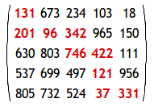

Find the minimal path sum, in [matrix.txt](files/matrix.txt), a 31K text file containing a
80 by 80 matrix, from the top left to the bottom right by only moving
right and down.

Answer: f9ffec84499832add77e6a8bb00246ec


Problem 82
==========

NOTE: This problem is a more challenging version of [Problem 81](#problem-81).

The minimal path sum in the 5 by 5 matrix below, by starting in any cell
in the left column and finishing in any cell in the right column, and only
moving up, down, and right, is indicated in red; the sum is equal
to 994.

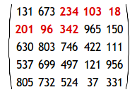

Find the minimal path sum, in [matrix.txt](files/matrix.txt), a 31K text file containing a
80 by 80 matrix, from the left column to the right column.

Answer: e6b3b1cd89b018d4754cf63863f6690a

Problem 83
==========

NOTE: This problem is a significantly more challenging version of
[Problem 81](#problem-81).

In the 5 by 5 matrix below, the minimal path sum from the top left to the
bottom right, by moving left, right, up, and down, is indicated in red and is equal to 2297.

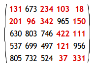

Find the minimal path sum, in [matrix.txt](files/matrix.txt), a 31K text file containing a
80 by 80 matrix, from the top left to the bottom right by moving left,
right, up, and down.

Answer: 61b28c4fbe8560003ee50fa5619d7a1e


Problem 84
==========


In the game, Monopoly, the standard board is set up in the following way:

    GO   A1  CC1  A2  T1  R1  B1  CH1  B2   B3  JAIL
    H2                                          C1
    T2                                          U1
    H1                                          C2
    CH3                                         C3
    R4                                          R2
    G3                                          D1
    CC3                                         CC2
    G2                                          D2
    G1                                          D3
    G2J  F3  U2   F2  F1  R3  E3  E2   CH2  E1  FP

A player starts on the GO square and adds the scores on two 6-sided dice
to determine the number of squares they advance in a clockwise direction.
Without any further rules we would expect to visit each square with equal
probability: 2.5%. However, landing on G2J (Go To Jail), CC (community
chest), and CH (chance) changes this distribution.

In addition to G2J, and one card from each of CC and CH, that orders the
player to go directly to jail, if a player rolls three consecutive
doubles, they do not advance the result of their 3rd roll. Instead they
proceed directly to jail.

At the beginning of the game, the CC and CH cards are shuffled. When a
player lands on CC or CH they take a card from the top of the respective
pile and, after following the instructions, it is returned to the bottom
of the pile. There are sixteen cards in each pile, but for the purpose of
this problem we are only concerned with cards that order a movement; any
instruction not concerned with movement will be ignored and the player
will remain on the CC/CH square.

Community Chest (2/16 cards):

1. Advance to GO
2. Go to JAIL

Chance (10/16 cards):

1. Advance to GO
2. Go to JAIL
3. Go to C1
4. Go to E3
5. Go to H2
6. Go to R1
7. Go to next R (railway company)
8. Go to next R
9. Go to next U (utility company)
10. Go back 3 squares.

The heart of this problem concerns the likelihood of visiting a particular
square. That is, the probability of finishing at that square after a roll.
For this reason it should be clear that, with the exception of G2J for
which the probability of finishing on it is zero, the CH squares will have
the lowest probabilities, as 5/8 request a movement to another square, and
it is the final square that the player finishes at on each roll that we
are interested in. We shall make no distinction between "Just Visiting"
and being sent to JAIL, and we shall also ignore the rule about requiring
a double to "get out of jail", assuming that they pay to get out on their
next turn.

By starting at GO and numbering the squares sequentially from 00 to 39 we
can concatenate these two-digit numbers to produce strings that correspond
with sets of squares.

Statistically it can be shown that the three most popular squares, in
order, are JAIL (6.24%) = Square 10, E3 (3.18%) = Square 24, and GO
(3.09%) = Square 00. So these three most popular squares can be listed
with the six-digit modal string: 102400.

If, instead of using two 6-sided dice, two 4-sided dice are used, find the
six-digit modal string.

Answer: ead3264438ef83a8c2da2e98067b4445


Problem 85
==========

By counting carefully it can be seen that a rectangular grid measuring 3
by 2 contains eighteen rectangles:


Although there exists no rectangular grid that contains exactly two
million rectangles, find the area of the grid with the nearest solution.

Answer: 92bf5e6240737e0326ea59846a83e076

Problem 86
==========

A spider, S, sits in one corner of a cuboid room, measuring 6 by 5 by 3,
and a fly, F, sits in the opposite corner. By travelling on the surfaces
of the room the shortest "straight line" distance from S to F is 10 and
the path is shown on the diagram.


However, there are up to three "shortest" path candidates for any given
cuboid and the shortest route doesn't always have integer length.

By considering all cuboid rooms with integer dimensions, up to a maximum
size of M by M by M, there are exactly 2060 cuboids for which the shortest
route has integer length when M=100, and this is the least value of M for
which the number of solutions first exceeds two thousand; the number of
solutions is 1975 when M=99.

Find the least value of M such that the number of solutions first exceeds
one million.

Answer: f5c3dd7514bf620a1b85450d2ae374b1

Problem 87
==========

The smallest number expressible as the sum of a prime square, prime cube,
and prime fourth power is 28. In fact, there are exactly four numbers
below fifty that can be expressed in such a way:

    28 = 2^2 + 2^3 + 2^4
    33 = 3^2 + 2^3 + 2^4
    49 = 5^2 + 2^3 + 2^4
    47 = 2^2 + 3^3 + 2^4

How many numbers below fifty million can be expressed as the sum of a
prime square, prime cube, and prime fourth power?

Answer: e7fb7907f1af626cc42e787e367ec602


Problem 88
==========

A natural number, N, that can be written as the sum and product of a given
set of at least two natural numbers, {a[1], a[2], ... , a[k]} is called a
product-sum number: N = a[1] + a[2] + ... + a[k] = a[1] × a[2] × ... × a[k].

For example, 6 = 1 + 2 + 3 = 1 × 2 × 3.

For a given set of size, k, we shall call the smallest N with this
property a minimal product-sum number. The minimal product-sum numbers for
sets of size, k = 2, 3, 4, 5, and 6 are as follows.

    k=2: 4 = 2 × 2 = 2 + 2
    k=3: 6 = 1 × 2 × 3 = 1 + 2 + 3
    k=4: 8 = 1 × 1 × 2 × 4 = 1 + 1 + 2 + 4
    k=5: 8 = 1 × 1 × 2 × 2 × 2 = 1 + 1 + 2 + 2 + 2
    k=6: 12 = 1 × 1 × 1 × 1 × 2 × 6 = 1 + 1 + 1 + 1 + 2 + 6

Hence for 2≤k≤6, the sum of all the minimal product-sum numbers is
4+6+8+12 = 30; note that 8 is only counted once in the sum.

In fact, as the complete set of minimal product-sum numbers for 2≤k≤12 is
{4, 6, 8, 12, 15, 16}, the sum is 61.

What is the sum of all the minimal product-sum numbers for 2≤k≤12000?

Answer: ffde7251f43906d31534ae69fa555757


Problem 89
==========

The rules for writing Roman numerals allow for many ways of writing each
number (see [1]About Roman Numerals...). However, there is always a "best"
way of writing a particular number.

For example, the following represent all of the legitimate ways of writing
the number sixteen:

    IIIIIIIIIIIIIIII
    VIIIIIIIIIII
    VVIIIIII
    XIIIIII
    VVVI
    XVI

The last example being considered the most efficient, as it uses the least
number of numerals.

The 11K text file, [roman.txt](files/roman.txt), contains one thousand numbers written in
valid, but not necessarily minimal, Roman numerals; that is, they are
arranged in descending units and obey the subtractive pair rule (see
[About Roman Numerals](files/about_roman_numerals.txt) for the definitive rules for this problem).

Find the number of characters saved by writing each of these in their
minimal form.

Note: You can assume that all the Roman numerals in the file contain no
more than four consecutive identical units.

Answer: 5c572eca050594c7bc3c36e7e8ab9550

Problem 90
==========

Each of the six faces on a cube has a different digit (0 to 9) written on
it; the same is done to a second cube. By placing the two cubes
side-by-side in different positions we can form a variety of 2-digit
numbers.

For example, the square number 64 could be formed:


In fact, by carefully choosing the digits on both cubes it is possible to
display all of the square numbers below one-hundred: 01, 04, 09, 16, 25,
36, 49, 64, and 81.

For example, one way this can be achieved is by placing {0, 5, 6, 7, 8, 9}
on one cube and {1, 2, 3, 4, 8, 9} on the other cube.

However, for this problem we shall allow the 6 or 9 to be turned
upside-down so that an arrangement like {0, 5, 6, 7, 8, 9} and {1, 2, 3,
4, 6, 7} allows for all nine square numbers to be displayed; otherwise it
would be impossible to obtain 09.

In determining a distinct arrangement we are interested in the digits on
each cube, not the order.

* {1, 2, 3, 4, 5, 6} is equivalent to {3, 6, 4, 1, 2, 5}
* {1, 2, 3, 4, 5, 6} is distinct from {1, 2, 3, 4, 5, 9}

But because we are allowing 6 and 9 to be reversed, the two distinct sets
in the last example both represent the extended set {1, 2, 3, 4, 5, 6, 9}
for the purpose of forming 2-digit numbers.

How many distinct arrangements of the two cubes allow for all of the
square numbers to be displayed?

Answer: 6a61d423d02a1c56250dc23ae7ff12f3

Problem 91
==========

The points P (x[1], y[1]) and Q (x[2], y[2]) are plotted at integer
co-ordinates and are joined to the origin, O(0,0), to form ΔOPQ.


There are exactly fourteen triangles containing a right angle that can be
formed when each co-ordinate lies between 0 and 2 inclusive; that is,
0 ≤ x[1], y[1], x[2], y[2] ≤ 2.

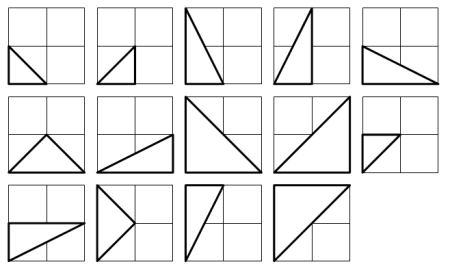

Given that 0 ≤ x[1], y[1], x[2], y[2] ≤ 50, how many right triangles can
be formed?

Answer: e8dc153260a59d4f236cfd7439d5dfd3

Problem 92
==========

A number chain is created by continuously adding the square of the digits
in a number to form a new number until it has been seen before.

For example,

    44 → 32 → 13 → 10 → 1 → 1
    85 → 89 → 145 → 42 → 20 → 4 → 16 → 37 → 58 → 89

Therefore any chain that arrives at 1 or 89 will become stuck in an
endless loop. What is most amazing is that EVERY starting number will
eventually arrive at 1 or 89.

How many starting numbers below ten million will arrive at 89?

Answer: 6cee918c0612bccc2dac03d05e07035f


Problem 93
==========


By using each of the digits from the set, {1, 2, 3, 4}, exactly once, and
making use of the four arithmetic operations (+, −, *, /) and
brackets/parentheses, it is possible to form different positive integer
targets.

For example,

    8 = (4 * (1 + 3)) / 2
    14 = 4 * (3 + 1 / 2)
    19 = 4 * (2 + 3) − 1
    36 = 3 * 4 * (2 + 1)

Note that concatenations of the digits, like 12 + 34, are not allowed.

Using the set, {1, 2, 3, 4}, it is possible to obtain thirty-one different
target numbers of which 36 is the maximum, and each of the numbers 1 to 28
can be obtained before encountering the first non-expressible number.

Find the set of four distinct digits, a < b < c < d, for which the longest
set of consecutive positive integers, 1 to n, can be obtained, giving your
answer as a string: abcd.

Answer: 26588e932c7ccfa1df309280702fe1b5


Problem 94
==========

It is easily proved that no equilateral triangle exists with integral
length sides and integral area. However, the almost equilateral triangle
5-5-6 has an area of 12 square units.

We shall define an almost equilateral triangle to be a triangle for which
two sides are equal and the third differs by no more than one unit.

Find the sum of the perimeters of all almost equilateral triangles with
integral side lengths and area and whose perimeters do not exceed one
billion (1,000,000,000).

Answer: 3218c6bb59f2539ec39ad4bf37c10913

Problem 95
==========

The proper divisors of a number are all the divisors excluding the number
itself. For example, the proper divisors of 28 are 1, 2, 4, 7, and 14. As
the sum of these divisors is equal to 28, we call it a perfect number.

Interestingly the sum of the proper divisors of 220 is 284 and the sum of
the proper divisors of 284 is 220, forming a chain of two numbers. For
this reason, 220 and 284 are called an amicable pair.

Perhaps less well known are longer chains. For example, starting with
12496, we form a chain of five numbers:

     12496 → 14288 → 15472 → 14536 → 14264 (→ 12496 → ...)

Since this chain returns to its starting point, it is called an amicable
chain.

Find the smallest member of the longest amicable chain with no element
exceeding one million.

Answer: cd2018beeece5fb0a71a96308e567bde


Problem 96
==========

Su Doku (Japanese meaning number place) is the name given to a popular
puzzle concept. Its origin is unclear, but credit must be attributed to
Leonhard Euler who invented a similar, and much more difficult, puzzle
idea called Latin Squares. The objective of Su Doku puzzles, however, is
to replace the blanks (or zeros) in a 9 by 9 grid in such that each row,
column, and 3 by 3 box contains each of the digits 1 to 9. Below is an
example of a typical starting puzzle grid and its solution grid.

	  ┌───────┬───────┬───────┐         ┌───────┬───────┬───────┐
	  │ 0 0 3 │ 0 2 0 │ 6 0 0 │         │ 4 8 3 │ 9 2 1 │ 6 5 7 │
	  │ 9 0 0 │ 3 0 5 │ 0 0 1 │         │ 9 6 7 │ 3 4 5 │ 8 2 1 │
	  │ 0 0 1 │ 8 0 6 │ 4 0 0 │         │ 2 5 1 │ 8 7 6 │ 4 9 3 │
	  ├───────┼───────┼───────┤         ├───────┼───────┼───────┤
	  │ 0 0 8 │ 1 0 2 │ 9 0 0 │         │ 5 4 8 │ 1 3 2 │ 9 7 6 │
	  │ 7 0 0 │ 0 0 0 │ 0 0 8 │         │ 7 2 9 │ 5 6 4 │ 1 3 8 │
	  │ 0 0 6 │ 7 0 8 │ 2 0 0 │         │ 1 3 6 │ 7 9 8 │ 2 4 5 │
	  ├───────┼───────┼───────┤         ├───────┼───────┼───────┤
	  │ 0 0 2 │ 6 0 9 │ 5 0 0 │         │ 3 7 2 │ 6 8 9 │ 5 1 4 │
	  │ 8 0 0 │ 2 0 3 │ 0 0 9 │         │ 8 1 4 │ 2 5 3 │ 7 6 9 │
	  │ 0 0 5 │ 0 1 0 │ 3 0 0 │         │ 6 9 5 │ 4 1 7 │ 3 8 2 │
	  └───────┴───────┴───────┘         └───────┴───────┴───────┘

A well constructed Su Doku puzzle has a unique solution and can be solved
by logic, although it may be necessary to employ "guess and test" methods
in order to eliminate options (there is much contested opinion over this).
The complexity of the search determines the difficulty of the puzzle; the
example above is considered easy because it can be solved by straight
forward direct deduction.

The 6K text file, [sudoku.txt](files/sudoku.txt), contains fifty different Su Doku puzzles
ranging in difficulty, but all with unique solutions (the first puzzle in
the file is the example above).

By solving all fifty puzzles find the sum of the 3-digit numbers found in
the top left corner of each solution grid; for example, 483 is the 3-digit
number found in the top left corner of the solution grid above.

Answer: 26f6abfa0d7725fef678e371897d5df0


Problem 97
==========


The first known prime found to exceed one million digits was discovered in
1999, and is a Mersenne prime of the form 2^6972593−1; it contains exactly
2,098,960 digits. Subsequently other Mersenne primes, of the form 2^p−1,
have been found which contain more digits.

However, in 2004 there was found a massive non-Mersenne prime which
contains 2,357,207 digits: 28433×2^7830457+1.

Find the last ten digits of this prime number.

Answer: 68c8c919526039022b923a72d5cc12b1


Problem 98
==========

By replacing each of the letters in the word CARE with 1, 2, 9, and 6
respectively, we form a square number: 1296 = 36^2. What is remarkable is
that, by using the same digital substitutions, the anagram, RACE, also
forms a square number: 9216 = 96^2. We shall call CARE (and RACE) a square
anagram word pair and specify further that leading zeroes are not
permitted, neither may a different letter have the same digital value as
another letter.

Using [words.txt](files/words.txt), a 16K text file containing nearly two-thousand common
English words, find all the square anagram word pairs (a palindromic word
is NOT considered to be an anagram of itself).

What is the largest square number formed by any member of such a pair?

NOTE: All anagrams formed must be contained in the given text file.

Answer: 36b3b5f54143786b7ab2ebb6bcd06e75


Problem 99
==========

Comparing two numbers written in index form like 2^11 and 3^7 is not
difficult, as any calculator would confirm that 2^11 = 2048 < 3^7 = 2187.

However, confirming that 632382^518061 > 519432^525806 would be much more
difficult, as both numbers contain over three million digits.

Using [base_exp.txt](files/base_exp.txt), a 22K text file containing one thousand lines with
a base/exponent pair on each line, determine which line number has the
greatest numerical value.

NOTE: The first two lines in the file represent the numbers in the example
given above.

Answer: 1ecfb463472ec9115b10c292ef8bc986

Problem 100
===========


   If a box contains twenty-one coloured discs, composed of fifteen blue
   discs and six red discs, and two discs were taken at random, it can be
   seen that the probability of taking two blue discs, P(BB) =
   (15/21)×(14/20) = 1/2.

   The next such arrangement, for which there is exactly 50% chance of taking
   two blue discs at random, is a box containing eighty-five blue discs and
   thirty-five red discs.

   By finding the first arrangement to contain over 10^12 = 1,000,000,000,000
   discs in total, determine the number of blue discs that the box would
   contain.

   
   Answer: 21156e3acc4ca35b7a318c541a0648d5


Problem 101
===========

If we are presented with the first k terms of a sequence it is impossible
to say with certainty the value of the next term, as there are infinitely
many polynomial functions that can model the sequence.

As an example, let us consider the sequence of cube numbers. This is
defined by the generating function,
u[n] = n^3: 1, 8, 27, 64, 125, 216, ...

Suppose we were only given the first two terms of this sequence. Working
on the principle that "simple is best" we should assume a linear
relationship and predict the next term to be 15 (common difference 7).
Even if we were presented with the first three terms, by the same
principle of simplicity, a quadratic relationship should be assumed.

We shall define OP(k, n) to be the nth term of the optimum polynomial
generating function for the first k terms of a sequence. It should be
clear that OP(k, n) will accurately generate the terms of the sequence for
n ≤ k, and potentially the first incorrect term (FIT) will be OP(k, k+1);
in which case we shall call it a bad OP (BOP).

As a basis, if we were only given the first term of sequence, it would be
most sensible to assume constancy; that is, for n ≥ 2, OP(1, n) = u[1].

Hence we obtain the following OPs for the cubic sequence:

    OP(1, n) = 1               1,[1], 1, 1, ...
    OP(2, n) = 7n−6            1, 8, [15], ...
    OP(3, n) = 6n^2−11n+6      1, 8, 27, [58], ...
    OP(4, n) = n^3             1, 8, 27, 64, 125, ...

Clearly no BOPs exist for k ≥ 4.

By considering the sum of FITs generated by the BOPs (indicated in brackets above), we obtain 1 + 15 + 58 = 74.

Consider the following tenth degree polynomial generating function:

   u[n] = 1 − n + n^2 − n^3 + n^4 − n^5 + n^6 − n^7 + n^8 − n^9 + n^10

Find the sum of FITs for the BOPs.


Answer: d382b0cc25e82446da83d3a792e1cd27


Problem 102
===========

Three distinct points are plotted at random on a Cartesian plane, for
which -1000 ≤ x, y ≤ 1000, such that a triangle is formed.

Consider the following two triangles:

				 A(-340,495), B(-153,-910), C(835,-947)

				 X(-175,41), Y(-421,-714), Z(574,-645)

It can be verified that triangle ABC contains the origin, whereas triangle
XYZ does not.

Using [triangles.txt](files/triangles.txt), a 27K text file containing the co-ordinates of one
thousand "random" triangles, find the number of triangles for which the
interior contains the origin.

NOTE: The first two examples in the file represent the triangles in the
example given above.

Answer: 74db120f0a8e5646ef5a30154e9f6deb


Problem 103
===========

Let S(A) represent the sum of elements in set A of size n. We shall call
it a special sum set if for any two non-empty disjoint subsets, B and C,
the following properties are true:

i. S(B) ≠ S(C); that is, sums of subsets cannot be equal.
ii. If B contains more elements than C then S(B) > S(C).

If S(A) is minimised for a given n, we shall call it an optimum special
sum set. The first five optimum special sum sets are given below.

```
n = 1: {1}
n = 2: {1, 2}
n = 3: {2, 3, 4}
n = 4: {3, 5, 6, 7}
n = 5: {6, 9, 11, 12, 13}
```

It seems that for a given optimum set, A = {a[1], a[2], ... , a[n]}, the
next optimum set is of the form B = {b, a[1]+b, a[2]+b, ... ,a[n]+b},
where b is the "middle" element on the previous row.

By applying this "rule" we would expect the optimum set for n = 6 to be A
= {11, 17, 20, 22, 23, 24}, with S(A) = 117. However, this is not the
optimum set, as we have merely applied an algorithm to provide a near
optimum set. The optimum set for n = 6 is A = {11, 18, 19, 20, 22, 25},
with S(A) = 115 and corresponding set string: 111819202225.

Given that A is an optimum special sum set for n = 7, find its set string.

NOTE: This problem is related to [Problem 105](#problem-105) and [Problem 106](#problem-106).

Answer: af8c238336c2a79bb81a24b3fef3330d


Problem 104
===========


   The Fibonacci sequence is defined by the recurrence relation:

     F[n] = F[n−1] + F[n−2], where F[1] = 1 and F[2] = 1.

   It turns out that F[541], which contains 113 digits, is the first
   Fibonacci number for which the last nine digits are 1-9 pandigital
   (contain all the digits 1 to 9, but not necessarily in order). And
   F[2749], which contains 575 digits, is the first Fibonacci number for
   which the first nine digits are 1-9 pandigital.

   Given that F[k] is the first Fibonacci number for which the first nine
   digits AND the last nine digits are 1-9 pandigital, find k.

   
   Answer: c8771ddd4df191098d70a8e94dd1cde7


Problem 105
===========


   Let S(A) represent the sum of elements in set A of size n. We shall call
   it a special sum set if for any two non-empty disjoint subsets, B and C,
   the following properties are true:

   i. S(B) ≠ S(C); that is, sums of subsets cannot be equal.
   ii. If B contains more elements than C then S(B) > S(C).

   For example, {81, 88, 75, 42, 87, 84, 86, 65} is not a special sum set
   because 65 + 87 + 88 = 75 + 81 + 84, whereas {157, 150, 164, 119, 79, 159,
   161, 139, 158} satisfies both rules for all possible subset pair
   combinations and S(A) = 1286.

   Using [sets.txt](files/sets.txt), a 4K text
   file with one-hundred sets containing seven to twelve elements (the two
   examples given above are the first two sets in the file), identify all the
   special sum sets, A[1], A[2], ..., A[k], and find the value of S(A[1]) +
   S(A[2]) + ... + S(A[k]).

   NOTE: This problem is related to [Problem 103](#problem-103) and [Problem 106](#problem-106).

   Answer: c87d30e494eff438fe37b4c810167da0


Problem 106
===========


Let S(A) represent the sum of elements in set A of size n. We shall call
it a special sum set if for any two non-empty disjoint subsets, B and C,
the following properties are true:

i. S(B) ≠ S(C); that is, sums of subsets cannot be equal.
ii. If B contains more elements than C then S(B) > S(C).

For this problem we shall assume that a given set contains n strictly
increasing elements and it already satisfies the second rule.

Surprisingly, out of the 25 possible subset pairs that can be obtained
from a set for which n = 4, only 1 of these pairs need to be tested for
equality (first rule). Similarly, when n = 7, only 70 out of the 966
subset pairs need to be tested.

For n = 12, how many of the 261625 subset pairs that can be obtained need
to be tested for equality?

NOTE: This problem is related to [Problem 103](#problem-103) and [Problem 105](#problem-105).

Answer: c8fd9e36fdeb06bcc93a0732c667b6d8


Problem 107
===========

The following undirected network consists of seven vertices and twelve
edges with a total weight of 243.


The same network can be represented by the matrix below.

			  ┌──────┬────┬────┬────┬────┬────┬────┬────┐
			  │      │ A  │ B  │ C  │ D  │ E  │ F  │ G  │
			  ├──────┼────┼────┼────┼────┼────┼────┼────┤
			  │ A    │ -  │ 16 │ 12 │ 21 │ -  │ -  │ -  │
			  ├──────┼────┼────┼────┼────┼────┼────┼────┤
			  │ B    │ 16 │ -  │ -  │ 17 │ 20 │ -  │ -  │
			  ├──────┼────┼────┼────┼────┼────┼────┼────┤
			  │ C    │ 12 │ -  │ -  │ 28 │ -  │ 31 │ -  │
			  ├──────┼────┼────┼────┼────┼────┼────┼────┤
			  │ D    │ 21 │ 17 │ 28 │ -  │ 18 │ 19 │ 23 │
			  ├──────┼────┼────┼────┼────┼────┼────┼────┤
			  │ E    │ -  │ 20 │ -  │ 18 │ -  │ -  │ 11 │
			  ├──────┼────┼────┼────┼────┼────┼────┼────┤
			  │ F    │ -  │ -  │ 31 │ 19 │ -  │ -  │ 27 │
			  ├──────┼────┼────┼────┼────┼────┼────┼────┤
			  │ G    │ -  │ -  │ -  │ 23 │ 11 │ 27 │ -  │
			  └──────┴────┴────┴────┴────┴────┴────┴────┘

However, it is possible to optimise the network by removing some edges and
still ensure that all points on the network remain connected. The network
which achieves the maximum saving is shown below. It has a weight of 93,
representing a saving of 243 − 93 = 150 from the original network.


Using [network.txt](files/network.txt), a 6K text file containing a network with forty
vertices, and given in matrix form, find the maximum saving which can be
achieved by removing redundant edges whilst ensuring that the network
remains connected.

Answer: b0db1202ec966e7855ca23626eb285b8

Problem 108
===========

In the following equation x, y, and n are positive integers.

							   1   1   1
							   ─ + ─ = ─
							   x   y   n

For n = 4 there are exactly three distinct solutions:

							   1   1    1
							   ─ + ─  = ─
							   5   20   4
							   1   1    1
							   ─ + ─  = ─
							   6   12   4
							   1   1    1
							   ─ + ─  = ─
							   8   8    4

What is the least value of n for which the number of distinct solutions
exceeds one-thousand?

NOTE: This problem is an easier version of [Problem 110](#problem-110); it is strongly
advised that you solve this one first.

Answer: 765ba18edd2844db2db95fba25d2f3e7


Problem 109
===========

In the game of darts a player throws three darts at a target board which
is split into twenty equal sized sections numbered one to twenty.


The score of a dart is determined by the number of the region that the
dart lands in. A dart landing outside the red/green outer ring scores
zero. The black and cream regions inside this ring represent single
scores. However, the red/green outer ring and middle ring score double and
treble scores respectively.

At the centre of the board are two concentric circles called the bull
region, or bulls-eye. The outer bull is worth 25 points and the inner bull
is a double, worth 50 points.

There are many variations of rules but in the most popular game the
players will begin with a score 301 or 501 and the first player to reduce
their running total to zero is a winner. However, it is normal to play a
"doubles out" system, which means that the player must land a double
(including the double bulls-eye at the centre of the board) on their final
dart to win; any other dart that would reduce their running total to one
or lower means the score for that set of three darts is "bust".

When a player is able to finish on their current score it is called a
"checkout" and the highest checkout is 170: T20 T20 D25 (two treble 20s
and double bull).

There are exactly eleven distinct ways to checkout on a score of 6:

							   ┌──┬──┬──┐
							   │D3│  │  │
							   ├──┼──┼──┤
							   │D1│D2│  │
							   ├──┼──┼──┤
							   │S2│D2│  │
							   ├──┼──┼──┤
							   │D2│D1│  │
							   ├──┼──┼──┤
							   │S4│D1│  │
							   ├──┼──┼──┤
							   │S1│S1│D2│
							   ├──┼──┼──┤
							   │S1│T1│D1│
							   ├──┼──┼──┤
							   │S1│S3│D1│
							   ├──┼──┼──┤
							   │D1│D1│D1│
							   ├──┼──┼──┤
							   │D1│S2│D1│
							   ├──┼──┼──┤
							   │S2│S2│D1│
							   └──┴──┴──┘

Note that D1 D2 is considered different to D2 D1 as they finish on
different doubles. However, the combination S1 T1 D1 is considered the
same as T1 S1 D1.

In addition we shall not include misses in considering combinations; for
example, D3 is the same as 0 D3 and 0 0 D3.

Incredibly there are 42336 distinct ways of checking out in total.

How many distinct ways can a player checkout with a score less than 100?

Answer: e6aebd5be1ba81557dbcc5f6f57bbe5c

Problem 110
===========

In the following equation x, y, and n are positive integers.

							   1   1   1
							   ─ + ─ = ─
							   x   y   n

It can be verified that when n = 1260 there are 113 distinct solutions and
this is the least value of n for which the total number of distinct
solutions exceeds one hundred.

What is the least value of n for which the number of distinct solutions
exceeds four million?

NOTE: This problem is a much more difficult version of [Problem 108](#problem-108) and
as it is well beyond the limitations of a brute force approach it requires
a clever implementation.

Answer: 591a7a92f10322866e6a02f3b2386a1c

Problem 111
===========

Considering 4-digit primes containing repeated digits it is clear that
they cannot all be the same: 1111 is divisible by 11, 2222 is divisible by
22, and so on. But there are nine 4-digit primes containing three ones:

		  1117, 1151, 1171, 1181, 1511, 1811, 2111, 4111, 8111

We shall say that M(n, d) represents the maximum number of repeated digits
for an n-digit prime where d is the repeated digit, N(n, d) represents the
number of such primes, and S(n, d) represents the sum of these primes.

So M(4, 1) = 3 is the maximum number of repeated digits for a 4-digit
prime where one is the repeated digit, there are N(4, 1) = 9 such primes,
and the sum of these primes is S(4, 1) = 22275. It turns out that for d =
0, it is only possible to have M(4, 0) = 2 repeated digits, but there are
N(4, 0) = 13 such cases.

In the same way we obtain the following results for 4-digit primes.
   
| Digit, d | M(4, d) | N(4, d) | S(4,d) |
| -------- | --------| ------- | ------ |
| 0        | 2       | 13      | 67061  |
| 1        | 3       | 9       | 22275  |
| 2        | 3       | 1       | 2221   |
| 3        | 3       | 12      | 46214  |
| 4        | 3       | 2       | 8888   |
| 5        | 3       | 1       | 5557   |
| 6        | 3       | 1       | 6661   |
| 7        | 3       | 9       | 57863  |
| 8        | 3       | 1       | 8887   |
| 9        | 3       | 7       | 48073  |

For d = 0 to 9, the sum of all S(4, d) is 273700.

Find the sum of all S(10, d).

Answer: cdf4d134a3b0caa10a69e2771ac4fd36


Problem 112
===========


   Working from left-to-right if no digit is exceeded by the digit to its
   left it is called an increasing number; for example, 134468.

   Similarly if no digit is exceeded by the digit to its right it is called a
   decreasing number; for example, 66420.

   We shall call a positive integer that is neither increasing nor decreasing
   a "bouncy" number; for example, 155349.

   Clearly there cannot be any bouncy numbers below one-hundred, but just
   over half of the numbers below one-thousand (525) are bouncy. In fact, the
   least number for which the proportion of bouncy numbers first reaches 50%
   is 538.

   Surprisingly, bouncy numbers become more and more common and by the time
   we reach 21780 the proportion of bouncy numbers is equal to 90%.

   Find the least number for which the proportion of bouncy numbers is
   exactly 99%.

   
   Answer: e08c982713a1c2bd3637dd489199722e


Problem 113
===========


   Working from left-to-right if no digit is exceeded by the digit to its
   left it is called an increasing number; for example, 134468.

   Similarly if no digit is exceeded by the digit to its right it is called a
   decreasing number; for example, 66420.

   We shall call a positive integer that is neither increasing nor decreasing
   a "bouncy" number; for example, 155349.

   As n increases, the proportion of bouncy numbers below n increases such
   that there are only 12951 numbers below one-million that are not bouncy
   and only 277032 non-bouncy numbers below 10^10.

   How many numbers below a googol (10^100) are not bouncy?

   
   Answer: a9e504ee704c87f9bddad6d3ffe39532


Problem 114
===========


   A row measuring seven units in length has red blocks with a minimum length
   of three units placed on it, such that any two red blocks (which are
   allowed to be different lengths) are separated by at least one black
   square. There are exactly seventeen ways of doing this.

                          ┌┬┬┬┬┬┬┐  ┌──┬┬┬┬┐  ┌┬──┬┬┬┐
                          └┴┴┴┴┴┴┘  └──┴┴┴┴┘  └┴──┴┴┴┘
                          ┌┬┬──┬┬┐  ┌┬┬┬──┬┐  ┌┬┬┬┬──┐
                          └┴┴──┴┴┘  └┴┴┴──┴┘  └┴┴┴┴──┘
                          ┌──┬┬──┐  ┌───┬┬┬┐  ┌┬───┬┬┐
                          └──┴┴──┘  └───┴┴┴┘  └┴───┴┴┘
                          ┌┬┬───┬┐  ┌┬┬┬───┐  ┌────┬┬┐
                          └┴┴───┴┘  └┴┴┴───┘  └────┴┴┘
                          ┌┬────┬┐  ┌┬┬────┐  ┌─────┬┐
                          └┴────┴┘  └┴┴────┘  └─────┴┘
                          ┌┬─────┐  ┌──────┐   
                          └┴─────┘  └──────┘

   How many ways can a row measuring fifty units in length be filled?

   NOTE: Although the example above does not lend itself to the possibility,
   in general it is permitted to mix block sizes. For example, on a row
   measuring eight units in length you could use red (3), black (1), and red
   (4).

   
   Answer: de48ca72bf252a8be7e0aad762eadcf8


Problem 115
===========

NOTE: This is a more difficult version of [Problem 114](#problem-114).

A row measuring n units in length has red blocks with a minimum length of
m units placed on it, such that any two red blocks (which are allowed to
be different lengths) are separated by at least one black square.

Let the fill-count function, F(m, n), represent the number of ways that a
row can be filled.

For example, F(3, 29) = 673135 and F(3, 30) = 1089155.

That is, for m = 3, it can be seen that n = 30 is the smallest value for
which the fill-count function first exceeds one million.

In the same way, for m = 10, it can be verified that F(10, 56) = 880711
and F(10, 57) = 1148904, so n = 57 is the least value for which the
fill-count function first exceeds one million.

For m = 50, find the least value of n for which the fill-count function
first exceeds one million.

Answer: 006f52e9102a8d3be2fe5614f42ba989


Problem 116
===========

A row of five black square tiles is to have a number of its tiles replaced
with coloured oblong tiles chosen from red (length two), green (length
three), or blue (length four).

If red tiles are chosen there are exactly seven ways this can be done.

					 ┌─╥╥╥┐  ┌╥─╥╥┐  ┌╥╥─╥┐  ┌╥╥╥─┐
					 └─╨╨╨┘  └╨─╨╨┘  └╨╨─╨┘  └╨╨╨─┘

					 ┌─╥─╥┐  ┌─╥╥─┐  ┌╥─╥─┐   
					 └─╨─╨┘  └─╨╨─┘  └╨─╨─┘

If green tiles are chosen there are three ways.

					   ┌──╥╥┐  ┌╥──╥┐  ┌╥╥──┐   
					   └──╨╨┘  └╨──╨┘  └╨╨──┘

And if blue tiles are chosen there are two ways.

							 ┌╥───┐  ┌───╥┐
							 └╨───┘  └───╨┘

Assuming that colours cannot be mixed there are 7 + 3 + 2 = 12 ways of
replacing the black tiles in a row measuring five units in length.

How many different ways can the black tiles in a row measuring fifty units
in length be replaced if colours cannot be mixed and at least one coloured
tile must be used?

NOTE: This is related to [Problem 117](#problem-117).

Answer: c21ca0ec54e6d1646a953a480f68feb4


Problem 117
===========

Using a combination of black square tiles and oblong tiles chosen from:
red tiles measuring two units, green tiles measuring three units, and blue
tiles measuring four units, it is possible to tile a row measuring five
units in length in exactly fifteen different ways.

					 ┌╥╥╥╥┐  ┌─╥╥╥┐  ┌╥─╥╥┐  ┌╥╥─╥┐
					 └╨╨╨╨┘  └─╨╨╨┘  └╨─╨╨┘  └╨╨─╨┘

					 ┌╥╥╥─┐  ┌─╥─╥┐  ┌─╥╥─┐  ┌╥─╥─┐
					 └╨╨╨─┘  └─╨─╨┘  └─╨╨─┘  └╨─╨─┘

					 ┌──╥╥┐  ┌╥──╥┐  ┌╥╥──┐  ┌─╥──┐
					 └──╨╨┘  └╨──╨┘  └╨╨──┘  └─╨──┘

					 ┌──╥─┐  ┌───╥┐  ┌╥───┐   
					 └──╨─┘  └───╨┘  └╨───┘

How many ways can a row measuring fifty units in length be tiled?

NOTE: This is related to [Problem 116](#problem-116).

Answer: 542612809b3dd08cf518b85450fce8d6


Problem 118
===========


   Using all of the digits 1 through 9 and concatenating them freely to form
   decimal integers, different sets can be formed. Interestingly with the set
   {2,5,47,89,631}, all of the elements belonging to it are prime.

   How many distinct sets containing each of the digits one through nine
   exactly once contain only prime elements?

   
   Answer: 080cc5a4ec71a747e260e274bdb13b64


Problem 119
===========


   The number 512 is interesting because it is equal to the sum of its digits
   raised to some power: 5 + 1 + 2 = 8, and 8^3 = 512. Another example of a
   number with this property is 614656 = 28^4.

   We shall define a[n] to be the nth term of this sequence and insist that a
   number must contain at least two digits to have a sum.

   You are given that a[2] = 512 and a[10] = 614656.

   Find a[30].

   
   Answer: 72fddfa6c52a120892ade628f3819da4


Problem 120
===========


   Let r be the remainder when (a−1)^n + (a+1)^n is divided by a^2.

   For example, if a = 7 and n = 3, then r = 42: 6^3 + 8^3 = 728 ≡ 42 mod 49.
   And as n varies, so too will r, but for a = 7 it turns out that r[max] =
   42.

   For 3 ≤ a ≤ 1000, find ∑ r[max].

   
   Answer: 0dd05ec40fe11279c2203b72e92a450a


Problem 121
===========


   A bag contains one red disc and one blue disc. In a game of chance a
   player takes a disc at random and its colour is noted. After each turn the
   disc is returned to the bag, an extra red disc is added, and another disc
   is taken at random.

   The player pays £1 to play and wins if they have taken more blue discs
   than red discs at the end of the game.

   If the game is played for four turns, the probability of a player winning
   is exactly 11/120, and so the maximum prize fund the banker should
   allocate for winning in this game would be £10 before they would expect to
   incur a loss. Note that any payout will be a whole number of pounds and
   also includes the original £1 paid to play the game, so in the example
   given the player actually wins £9.

   Find the maximum prize fund that should be allocated to a single game in
   which fifteen turns are played.

   
   Answer: 51de85ddd068f0bc787691d356176df9


Problem 122
===========


   The most naive way of computing n^15 requires fourteen multiplications:

   n × n × ... × n = n^15

   But using a "binary" method you can compute it in six multiplications:

   n × n = n^2
   n^2 × n^2 = n^4
   n^4 × n^4 = n^8
   n^8 × n^4 = n^12
   n^12 × n^2 = n^14
   n^14 × n = n^15

   However it is yet possible to compute it in only five multiplications:

   n × n = n^2
   n^2 × n = n^3
   n^3 × n^3 = n^6
   n^6 × n^6 = n^12
   n^12 × n^3 = n^15

   We shall define m(k) to be the minimum number of multiplications to
   compute n^k; for example m(15) = 5.

   For 1 ≤ k ≤ 200, find ∑ m(k).

   
   Answer: b710915795b9e9c02cf10d6d2bdb688c


Problem 123
===========


   Let p[n] be the nth prime: 2, 3, 5, 7, 11, ..., and let r be the remainder
   when (p[n]−1)^n + (p[n]+1)^n is divided by p[n]^2.

   For example, when n = 3, p[3] = 5, and 4^3 + 6^3 = 280 ≡ 5 mod 25.

   The least value of n for which the remainder first exceeds 10^9 is 7037.

   Find the least value of n for which the remainder first exceeds 10^10.

   
   Answer: 71497f728b86b55d965edbf1849cca8d


Problem 124
===========


   The radical of n, rad(n), is the product of the distinct prime factors of
   n. For example, 504 = 2^3 × 3^2 × 7, so rad(504) = 2 × 3 × 7 = 42.

   If we calculate rad(n) for 1 ≤ n ≤ 10, then sort them on rad(n), and
   sorting on n if the radical values are equal, we get:

                            Unsorted       Sorted
                            n  rad(n)   n  rad(n) k
                            1    1      1    1    1
                            2    2      2    2    2
                            3    3      4    2    3
                            4    2      8    2    4
                            5    5      3    3    5
                            6    6      9    3    6
                            7    7      5    5    7
                            8    2      6    6    8
                            9    3      7    7    9
                            10   10     10   10   10

   Let E(k) be the kth element in the sorted n column; for example, E(4) = 8
   and E(6) = 9.

   If rad(n) is sorted for 1 ≤ n ≤ 100000, find E(10000).

   
   Answer: f228d2e6f9099153388e9470180c8302


Problem 125
===========


   The palindromic number 595 is interesting because it can be written as the
   sum of consecutive squares: 6^2 + 7^2 + 8^2 + 9^2 + 10^2 + 11^2 + 12^2.

   There are exactly eleven palindromes below one-thousand that can be
   written as consecutive square sums, and the sum of these palindromes is
   4164. Note that 1 = 0^2 + 1^2 has not been included as this problem is
   concerned with the squares of positive integers.

   Find the sum of all the numbers less than 10^8 that are both palindromic
   and can be written as the sum of consecutive squares.

   
   Answer: 1b5635e8ab723e01570ca783129493dd


Problem 126
===========

The minimum number of cubes to cover every visible face on a cuboid
measuring 3 x 2 x 1 is twenty-two.

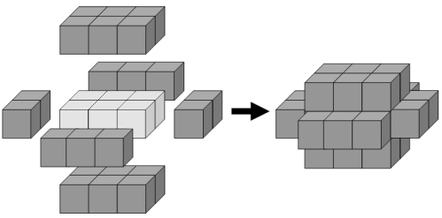

If we then add a second layer to this solid it would require forty-six
cubes to cover every visible face, the third layer would require
seventy-eight cubes, and the fourth layer would require one-hundred and
eighteen cubes to cover every visible face.

However, the first layer on a cuboid measuring 5 x 1 x 1 also requires
twenty-two cubes; similarly the first layer on cuboids measuring
5 x 3 x 1, 7 x 2 x 1, and 11 x 1 x 1 all contain forty-six cubes.

We shall define C(n) to represent the number of cuboids that contain n
cubes in one of its layers. So C(22) = 2, C(46) = 4, C(78) = 5, and C(118)
= 8.

It turns out that 154 is the least value of n for which C(n) = 10.

Find the least value of n for which C(n) = 1000.

Answer: 387d6ae83cbc6fa0b9192b56bf095c49


Problem 127
===========


   The radical of n, rad(n), is the product of distinct prime factors of n.
   For example, 504 = 2^3 × 3^2 × 7, so rad(504) = 2 × 3 × 7 = 42.

   We shall define the triplet of positive integers (a, b, c) to be an
   abc-hit if:

    1. GCD(a, b) = GCD(a, c) = GCD(b, c) = 1
    2. a < b
    3. a + b = c
    4. rad(abc) < c

   For example, (5, 27, 32) is an abc-hit, because:

    1. GCD(5, 27) = GCD(5, 32) = GCD(27, 32) = 1
    2. 5 < 27
    3. 5 + 27 = 32
    4. rad(4320) = 30 < 32

   It turns out that abc-hits are quite rare and there are only thirty-one
   abc-hits for c < 1000, with ∑c = 12523.

   Find ∑c for c < 120000.

   
   Answer: c6b1ae935b33c90a2c320b5f6ef3e4ba


Problem 128
===========


A hexagonal tile with number 1 is surrounded by a ring of six hexagonal
tiles, starting at "12 o'clock" and numbering the tiles 2 to 7 in an
anti-clockwise direction.

New rings are added in the same fashion, with the next rings being
numbered 8 to 19, 20 to 37, 38 to 61, and so on. The diagram below shows
the first three rings.

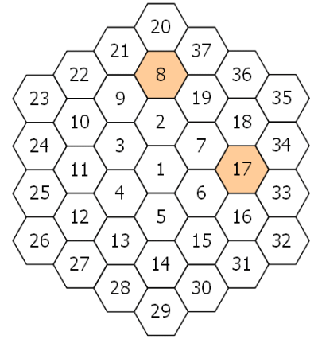

By finding the difference between tile n and each its six neighbours we
shall define PD(n) to be the number of those differences which are prime.

For example, working clockwise around tile 8 the differences are 12, 29,
11, 6, 1, and 13. So PD(8) = 3.

In the same way, the differences around tile 17 are 1, 17, 16, 1, 11, and
10, hence PD(17) = 2.

It can be shown that the maximum value of PD(n) is 3.

If all of the tiles for which PD(n) = 3 are listed in ascending order to
form a sequence, the 10th tile would be 271.

Find the 2000th tile in this sequence.

Answer: 93a1925da4792b4fa5d2dbb6ebb7c4a2


Problem 129
===========


   A number consisting entirely of ones is called a repunit. We shall define
   R(k) to be a repunit of length k; for example, R(6) = 111111.

   Given that n is a positive integer and GCD(n, 10) = 1, it can be shown
   that there always exists a value, k, for which R(k) is divisible by n, and
   let A(n) be the least such value of k; for example, A(7) = 6 and A(41) =
   5.

   The least value of n for which A(n) first exceeds ten is 17.

   Find the least value of n for which A(n) first exceeds one-million.

   
   Answer: 82cd979a2b79600137aea54fa0bd944b


Problem 130
===========


   A number consisting entirely of ones is called a repunit. We shall define
   R(k) to be a repunit of length k; for example, R(6) = 111111.

   Given that n is a positive integer and GCD(n, 10) = 1, it can be shown
   that there always exists a value, k, for which R(k) is divisible by n, and
   let A(n) be the least such value of k; for example, A(7) = 6 and A(41) =
   5.

   You are given that for all primes, p > 5, that p − 1 is divisible by A(p).
   For example, when p = 41, A(41) = 5, and 40 is divisible by 5.

   However, there are rare composite values for which this is also true; the
   first five examples being 91, 259, 451, 481, and 703.

   Find the sum of the first twenty-five composite values of n for which
   GCD(n, 10) = 1 and n − 1 is divisible by A(n).

   
   Answer: 20594ea0ef7a2f4cf40d19a9b82a0beb


Problem 131
===========


   There are some prime values, p, for which there exists a positive integer,
   n, such that the expression n^3 + n^2p is a perfect cube.

   For example, when p = 19, 8^3 + 8^2×19 = 12^3.

   What is perhaps most surprising is that for each prime with this property
   the value of n is unique, and there are only four such primes below
   one-hundred.

   How many primes below one million have this remarkable property?

   
   Answer: f7e6c85504ce6e82442c770f7c8606f0


Problem 132
===========


   A number consisting entirely of ones is called a repunit. We shall define
   R(k) to be a repunit of length k.

   For example, R(10) = 1111111111 = 11×41×271×9091, and the sum of these
   prime factors is 9414.

   Find the sum of the first forty prime factors of R(10^9).

   
   Answer: 5df3a36faa173a393a04a022b2d5d49d


Problem 133
===========


   A number consisting entirely of ones is called a repunit. We shall define
   R(k) to be a repunit of length k; for example, R(6) = 111111.

   Let us consider repunits of the form R(10^n).

   Although R(10), R(100), or R(1000) are not divisible by 17, R(10000) is
   divisible by 17. Yet there is no value of n for which R(10^n) will divide
   by 19. In fact, it is remarkable that 11, 17, 41, and 73 are the only four
   primes below one-hundred that can be a factor of R(10^n).

   Find the sum of all the primes below one-hundred thousand that will never
   be a factor of R(10^n).

   
   Answer: c1d33d79d08cde65eaa78e4583ea0594


Problem 134
===========


   Consider the consecutive primes p[1] = 19 and p[2] = 23. It can be
   verified that 1219 is the smallest number such that the last digits are
   formed by p[1] whilst also being divisible by p[2].

   In fact, with the exception of p[1] = 3 and p[2] = 5, for every pair of
   consecutive primes, p[2] > p[1], there exist values of n for which the
   last digits are formed by p[1] and n is divisible by p[2]. Let S be the
   smallest of these values of n.

   Find ∑ S for every pair of consecutive primes with 5 ≤ p[1] ≤ 1000000.

   
   Answer: f12b07460d2586ea47b4d305ae0b0539


Problem 135
===========


   Given the positive integers, x, y, and z, are consecutive terms of an
   arithmetic progression, the least value of the positive integer, n, for
   which the equation, x^2 − y^2 − z^2 = n, has exactly two solutions is n =
   27:

                   34^2 − 27^2 − 20^2 = 12^2 − 9^2 − 6^2 = 27

   It turns out that n = 1155 is the least value which has exactly ten
   solutions.

   How many values of n less than one million have exactly ten distinct
   solutions?

   
   Answer: c457d7ae48d08a6b84bc0b1b9bd7d474


Problem 136
===========


   The positive integers, x, y, and z, are consecutive terms of an arithmetic
   progression. Given that n is a positive integer, the equation, x^2 − y^2 −
   z^2 = n, has exactly one solution when n = 20:

                             13^2 − 10^2 − 7^2 = 20

   In fact there are twenty-five values of n below one hundred for which the
   equation has a unique solution.

   How many values of n less than fifty million have exactly one solution?

   
   Answer: 91db9e8e6cb2dbf9c07a6e0429697336


Problem 137
===========

Consider the infinite polynomial series `A[F](x)` = xF[1] + x^2F[2] +
x^3F[3] + ..., where F[k] is the kth term in the Fibonacci sequence: 1, 1,
2, 3, 5, 8, ... ; that is, F[k] = F[k−1] + F[k−2], F[1] = 1 and F[2] = 1.

For this problem we shall be interested in values of x for which `A[F](x)`
is a positive integer.

Surprisingly,

    `A[F](1/2)`  =  (1/2)⋅1 + (1/2)^2⋅1 + (1/2)^3⋅2 + (1/2)^4⋅3 + (1/2)^5⋅5 + ...
                 =  1/2 + 1/4 + 2/8 + 3/16 + 5/32 + ...
                 =  2

The corresponding values of x for the first five natural numbers are shown
below.

|     x     | `A[F](x)` |
| --------- | --------- |
| √2−1      | 1         |
| 1/2       | 2         |
| (√13−2)/3 | 3         |
| (√89−5)/8 | 4         |
| (√34−3)/5 | 5         |

We shall call `A[F](x)` a golden nugget if x is rational, because they
become increasingly rarer; for example, the 10th golden nugget is
74049690.

Find the 15th golden nugget.

Answer: 44845aa0f47ec925a3b43e6460a55e27

Problem 138
===========

Consider the isosceles triangle with base length, b = 16, and legs, L =
17.

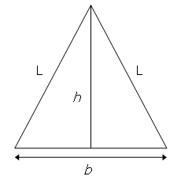

By using the Pythagorean theorem it can be seen that the height of the
triangle, h = √(17^2 − 8^2) = 15, which is one less than the base length.

With b = 272 and L = 305, we get h = 273, which is one more than the base
length, and this is the second smallest isosceles triangle with the
property that h = b ± 1.

Find ∑ L for the twelve smallest isosceles triangles for which h = b ± 1
and b, L are positive integers.

Answer: f7524f4d0d6d042c0f92a0d6469aff85

Problem 139
===========

Let (a, b, c) represent the three sides of a right angle triangle with
integral length sides. It is possible to place four such triangles
together to form a square with length c.

For example, (3, 4, 5) triangles can be placed together to form a 5 by 5
square with a 1 by 1 hole in the middle and it can be seen that the 5 by 5
square can be tiled with twenty-five 1 by 1 squares.


However, if (5, 12, 13) triangles were used then the hole would measure 7
by 7 and these could not be used to tile the 13 by 13 square.

Given that the perimeter of the right triangle is less than one-hundred
million, how many Pythagorean triangles would allow such a tiling to take
place?

Answer: 1c343ba00e6d17d7239bf45869ffed0c

Problem 140
===========

Consider the infinite polynomial series `A[G](x) = xG[1] + x^2G[2] +
x^3G[3] + ...`, where G[k] is the kth term of the second order recurrence
relation G[k] = G[k−1] + G[k−2], G[1] = 1 and G[2] = 4; that is, 1, 4, 5,
9, 14, 23, ... .

For this problem we shall be concerned with values of x for which `A[G](x)`
is a positive integer.

The corresponding values of x for the first five natural numbers are shown
below.

| x           | `A[G](x)` |
| ----------- | --------- |
| (√5−1)/4    | 1         |
| 2/5         | 2         |
| (√22−2)/6   | 3         |
| (√137−5)/14 | 4         |
| 1/2         | 5         |

We shall call `A[G](x)` a golden nugget if x is rational, because they
become increasingly rarer; for example, the 20th golden nugget is
211345365.

Find the sum of the first thirty golden nuggets.


Answer: e5d75f96929ba250b2732aad52f3028c


Problem 141
===========


   A positive integer, n, is divided by d and the quotient and remainder are
   q and r respectively. In addition d, q, and r are consecutive positive
   integer terms in a geometric sequence, but not necessarily in that order.

   For example, 58 divided by 6 has quotient 9 and remainder 4. It can also
   be seen that 4, 6, 9 are consecutive terms in a geometric sequence (common
   ratio 3/2).
   We will call such numbers, n, progressive.

   Some progressive numbers, such as 9 and 10404 = 102^2, happen to also be
   perfect squares.
   The sum of all progressive perfect squares below one hundred thousand is
   124657.

   Find the sum of all progressive perfect squares below one trillion
   (10^12).

   
   Answer: 2aaefa1db80951be140183f9e8c0194e


Problem 142
===========


   Find the smallest x + y + z with integers x > y > z > 0 such that x + y, x
   − y, x + z, x − z, y + z, y − z are all perfect squares.

   
   Answer: d3de282705508407532aa20ca8928e3b


Problem 143
===========


Let ABC be a triangle with all interior angles being less than 120
degrees. Let X be any point inside the triangle and let XA = p, XC = q,
and XB = r.

Fermat challenged Torricelli to find the position of X such that p + q + r
was minimised.

Torricelli was able to prove that if equilateral triangles AOB, BNC and
AMC are constructed on each side of triangle ABC, the circumscribed
circles of AOB, BNC, and AMC will intersect at a single point, T, inside
the triangle. Moreover he proved that T, called the Torricelli/Fermat
point, minimises p + q + r. Even more remarkable, it can be shown that
when the sum is minimised, AN = BM = CO = p + q + r and that AN, BM and CO
also intersect at T.

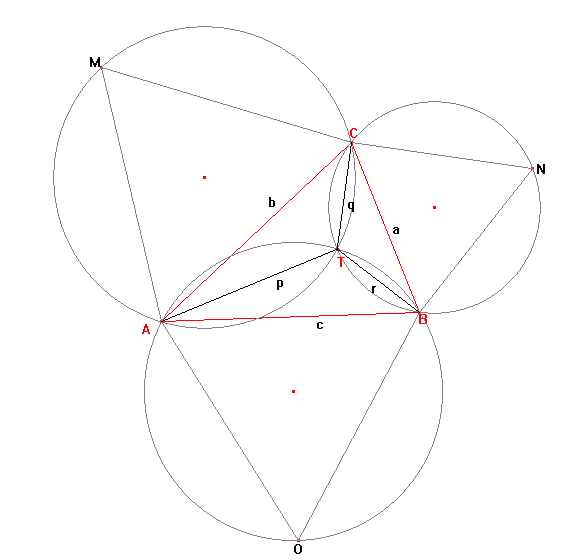

If the sum is minimised and a, b, c, p, q and r are all positive integers
we shall call triangle ABC a Torricelli triangle. For example, a = 399, b
= 455, c = 511 is an example of a Torricelli triangle, with p + q + r =
784.

Find the sum of all distinct values of p + q + r ≤ 120000 for Torricelli
triangles.

Answer: ec2d4c1a0c204d1f06ea5e2d189034f6


Problem 144
===========


In laser physics, a "white cell" is a mirror system that acts as a delay
line for the laser beam. The beam enters the cell, bounces around on the
mirrors, and eventually works its way back out.

The specific white cell we will be considering is an ellipse with the
equation 4x^2 + y^2 = 100

 

The section corresponding to −0.01 ≤ x ≤ +0.01 at the top is missing,
allowing the light to enter and exit through the hole.

The light beam in this problem starts at the point (0.0,10.1) just outside
the white cell, and the beam first impacts the mirror at (1.4,-9.6).

Each time the laser beam hits the surface of the ellipse, it follows the
usual law of reflection "angle of incidence equals angle of reflection."
That is, both the incident and reflected beams make the same angle with
the normal line at the point of incidence.

In the figure on the left, the red line shows the first two points of
contact between the laser beam and the wall of the white cell; the blue
line shows the line tangent to the ellipse at the point of incidence of
the first bounce.

The slope m of the tangent line at any point (x,y) of the given ellipse
is: m = −4x/y

The normal line is perpendicular to this tangent line at the point of
incidence.

The animation on the right shows the first 10 reflections of the beam.

How many times does the beam hit the internal surface of the white cell
before exiting?

Answer: 8dd48d6a2e2cad213179a3992c0be53c


Problem 145
===========


   Some positive integers n have the property that the sum [ n + reverse(n) ]
   consists entirely of odd (decimal) digits. For instance, 36 + 63 = 99 and
   409 + 904 = 1313. We will call such numbers reversible; so 36, 63, 409,
   and 904 are reversible. Leading zeroes are not allowed in either n or
   reverse(n).

   There are 120 reversible numbers below one-thousand.

   How many reversible numbers are there below one-billion (10^9)?

   
   Answer: 705e8444ad9c92e9a7589fb97515a9b6


Problem 146
===========


   The smallest positive integer n for which the numbers n^2+1, n^2+3, n^2+7,
   n^2+9, n^2+13, and n^2+27 are consecutive primes is 10. The sum of all
   such integers n below one-million is 1242490.

   What is the sum of all such integers n below 150 million?

   
   Answer: 525bd2bf0e31b0f19b38a1d21f2f6a16


Problem 147
===========

In a 3x2 cross-hatched grid, a total of 37 different rectangles could be
situated within that grid as indicated in the sketch.


There are 5 grids smaller than 3x2, vertical and horizontal dimensions
being important, i.e. 1x1, 2x1, 3x1, 1x2 and 2x2. If each of them is
cross-hatched, the following number of different rectangles could be
situated within those smaller grids:

1x1: 1
2x1: 4
3x1: 8
1x2: 4
2x2: 18

Adding those to the 37 of the 3x2 grid, a total of 72 different rectangles
could be situated within 3x2 and smaller grids.

How many different rectangles could be situated within 47x43 and smaller
grids?


Answer: d0fca7d85d4a4df043a2ae5772ea472e


Problem 148
===========


   We can easily verify that none of the entries in the first seven rows of
   Pascal's triangle are divisible by 7:

                                       1
                                    1     1
                                 1     2     1
                              1     3     3     1
                           1     4     6     4     1
                        1     5    10    10     5     1
                     1     6    15    20    15     6     1

   However, if we check the first one hundred rows, we will find that only
   2361 of the 5050 entries are not divisible by 7.

   Find the number of entries which are not divisible by 7 in the first one
   billion (10^9) rows of Pascal's triangle.

   
   Answer: 8a631ab4e3d06baf88299bf4e501b837


Problem 149
===========


   Looking at the table below, it is easy to verify that the maximum possible
   sum of adjacent numbers in any direction (horizontal, vertical, diagonal
   or anti-diagonal) is 16 (= 8 + 7 + 1).

                             ┌────┬────┬────┬─────┐
                             │ −2 │ 5  │ 3  │ 2   │
                             ├────┼────┼────┼─────┤
                             │ 9  │ −6 │ 5  │ 1   │
                             ├────┼────┼────┼─────┤
                             │ 3  │ 2  │ 7  │ 3   │
                             ├────┼────┼────┼─────┤
                             │ −1 │ 8  │ −4 │   8 │
                             └────┴────┴────┴─────┘

   Now, let us repeat the search, but on a much larger scale:

   First, generate four million pseudo-random numbers using a specific form
   of what is known as a "Lagged Fibonacci Generator":

   For 1 ≤ k ≤ 55, s[k] = [100003 − 200003k + 300007k^3] (modulo 1000000) −
   500000.
   For 56 ≤ k ≤ 4000000, s[k] = [s[k−24] + s[k−55] + 1000000] (modulo
   1000000) − 500000.

   Thus, s[10] = −393027 and s[100] = 86613.

   The terms of s are then arranged in a 2000×2000 table, using the first
   2000 numbers to fill the first row (sequentially), the next 2000 numbers
   to fill the second row, and so on.

   Finally, find the greatest sum of (any number of) adjacent entries in any
   direction (horizontal, vertical, diagonal or anti-diagonal).

   
   Answer: 96affc386f4b786c2521a32944424982


Problem 150
===========

In a triangular array of positive and negative integers, we wish to find a
sub-triangle such that the sum of the numbers it contains is the smallest
possible.

In the example below, it can be easily verified that the marked triangle
satisfies this condition having a sum of −42.

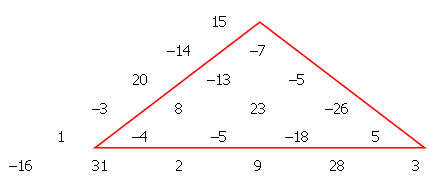

We wish to make such a triangular array with one thousand rows, so we
generate 500500 pseudo-random numbers s[k] in the range ±2^19, using a
type of random number generator (known as a Linear Congruential Generator)
as follows:

t := 0
for k = 1 up to k = 500500:
    t := (615949*t + 797807) modulo 2^20
    s[k] := t−2^19

Thus: s[1] = 273519, s[2] = −153582, s[3] = 450905 etc

Our triangular array is then formed using the pseudo-random numbers thus:

								  s[1]
							   s[2]  s[3]
						   s[4]  s[5]  s[6] 
						s[7]  s[8]  s[9]  s[10]
								  ...

Sub-triangles can start at any element of the array and extend down as far
as we like (taking-in the two elements directly below it from the next
row, the three elements directly below from the row after that, and so
on).
The "sum of a sub-triangle" is defined as the sum of all the elements it
contains.
Find the smallest possible sub-triangle sum.

Answer: 1802939e514020769701c59b422c0498


Problem 151
===========


A printing shop runs 16 batches (jobs) every week and each batch requires
a sheet of special colour-proofing paper of size A5.

Every Monday morning, the foreman opens a new envelope, containing a large
sheet of the special paper with size A1.

He proceeds to cut it in half, thus getting two sheets of size A2. Then he
cuts one of them in half to get two sheets of size A3 and so on until he
obtains the A5-size sheet needed for the first batch of the week.

All the unused sheets are placed back in the envelope.


At the beginning of each subsequent batch, he takes from the envelope one
sheet of paper at random. If it is of size A5, he uses it. If it is
larger, he repeats the 'cut-in-half' procedure until he has what he needs
and any remaining sheets are always placed back in the envelope.

Excluding the first and last batch of the week, find the expected number
of times (during each week) that the foreman finds a single sheet of paper
in the envelope.

Give your answer rounded to six decimal places using the format x.xxxxxx .

Answer: fb84a530fa9a8199edfadd618727fb70


Problem 152
===========

There are several ways to write the number 1/2 as a sum of inverse squares
using distinct integers.

For instance, the numbers {2,3,4,5,7,12,15,20,28,35} can be used:

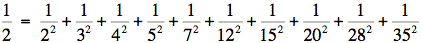

In fact, only using integers between 2 and 45 inclusive, there are exactly
three ways to do it, the remaining two being:
{2,3,4,6,7,9,10,20,28,35,36,45} and {2,3,4,6,7,9,12,15,28,30,35,36,45}.

How many ways are there to write the number 1/2 as a sum of inverse
squares using distinct integers between 2 and 80 inclusive?

Answer: 34ed066df378efacc9b924ec161e7639

Problem 153
===========

As we all know the equation x^2=-1 has no solutions for real x.
If we however introduce the imaginary number i this equation has two
solutions: x=i and x=-i.
If we go a step further the equation (x-3)^2=-4 has two complex solutions:
x=3+2i and x=3-2i.
x=3+2i and x=3-2i are called each others' complex conjugate.
Numbers of the form a+bi are called complex numbers.
In general a+bi and a−bi are each other's complex conjugate.

A Gaussian Integer is a complex number a+bi such that both a and b are
integers.
The regular integers are also Gaussian integers (with b=0).
To distinguish them from Gaussian integers with b ≠ 0 we call such
integers "rational integers."
A Gaussian integer is called a divisor of a rational integer n if the
result is also a Gaussian integer.
If for example we divide 5 by 1+2i we can simplify  in the following
manner:
Multiply numerator and denominator by the complex conjugate of 1+2i: 1−2i.
The result is .
So 1+2i is a divisor of 5.
Note that 1+i is not a divisor of 5 because .
Note also that if the Gaussian Integer (a+bi) is a divisor of a rational
integer n, then its complex conjugate (a−bi) is also a divisor of n.

In fact, 5 has six divisors such that the real part is positive: {1, 1 +
2i, 1 − 2i, 2 + i, 2 − i, 5}.
The following is a table of all of the divisors for the first five
positive rational integers:

|  n  | Gaussian integer divisors with positive real part | Sum s(n) of these divisors |
| --- | ------------------------------------------------- | -------------------------- |
| 1   | 1                                                 | 1                          |
| 2   | 1, 1+i, 1-i, 2                                    | 5                          |
| 3   | 1, 3                                              | 4                          |
| 4   | 1, 1+i, 1-i, 2, 2+2i, 2-2i, 4                     | 13                         |
| 5   | 1, 1+2i, 1-2i, 2+i, 2-i, 5                        | 12                         |


For divisors with positive real parts, then, we have: .

For 1 ≤ n ≤ 10^5, ∑ s(n)=17924657155.

What is ∑ s(n) for 1 ≤ n ≤ 10^8?

Answer: 08ec9d6e6c2275d37e7a227fb2d1f06f


Problem 154
===========

A triangular pyramid is constructed using spherical balls so that each
ball rests on exactly three balls of the next lower level.

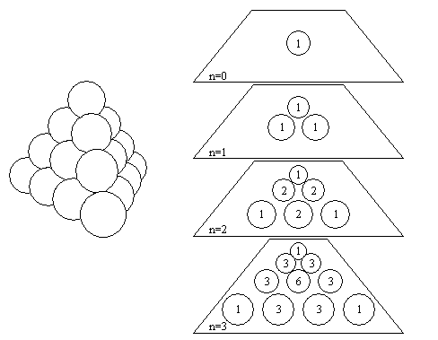

Then, we calculate the number of paths leading from the apex to each
position:

A path starts at the apex and progresses downwards to any of the three
spheres directly below the current position.

Consequently, the number of paths to reach a certain position is the sum
of the numbers immediately above it (depending on the position, there are
up to three numbers above it).

The result is Pascal's pyramid and the numbers at each level n are the
coefficients of the trinomial expansion (x + y + z)^n.

How many coefficients in the expansion of (x + y + z)^200000 are multiples
of 10^12?

Answer: de866633fa075beb3897cbbc8abf2400


Problem 155
===========

An electric circuit uses exclusively identical capacitors of the same
value C.
The capacitors can be connected in series or in parallel to form
sub-units, which can then be connected in series or in parallel with other
capacitors or other sub-units to form larger sub-units, and so on up to a
final circuit.

Using this simple procedure and up to n identical capacitors, we can make
circuits having a range of different total capacitances. For example,
using up to n=3 capacitors of 60 μF each, we can obtain the following 7
distinct total capacitance values:

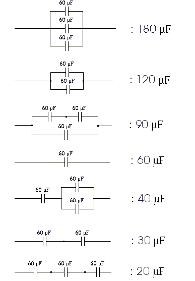

If we denote by D(n) the number of distinct total capacitance values we
can obtain when using up to n equal-valued capacitors and the simple
procedure described above, we have: D(1)=1, D(2)=3, D(3)=7 ...

Find D(18).

Reminder : When connecting capacitors C[1], C[2] etc in parallel, the
total capacitance is C[T] = C[1] + C[2] +...,
whereas when connecting them in series, the overall capacitance is given
by: 

Answer: da0a3fc900cc8ae42d514e280524ee39


Problem 156
===========


Starting from zero the natural numbers are written down in base 10 like
this: 0 1 2 3 4 5 6 7 8 9 10 11 12 ….

Consider the digit d=1. After we write down each number n, we will update
the number of ones that have occurred and call this number f(n,1). The
first values for f(n,1), then, are as follows:

| n   | f(n,1) |
| --- | ------ |
| 0   | 0      |
| 1   | 1      |
| 2   | 1      |
| 3   | 1      |
| 4   | 1      |
| 5   | 1      |
| 6   | 1      |
| 7   | 1      |
| 8   | 1      |
| 9   | 1      |
| 10  | 2      |
| 11  | 4      |
| 12  | 5      |

Note that f(n,1) never equals 3.
So the first two solutions of the equation f(n,1)=n are n=0 and n=1. The
next solution is n=199981.

In the same manner the function f(n,d) gives the total number of digits d
that have been written down after the number n has been written.
In fact, for every digit d ≠ 0, 0 is the first solution of the equation
f(n,d)=n.

Let s(d) be the sum of all the solutions for which f(n,d)=n.
You are given that s(1)=22786974071.

Find ∑ s(d) for 1 ≤ d ≤ 9.

Note: if, for some n, f(n,d)=n for more than one value of d this value of
n is counted again for every value of d for which f(n,d)=n.


Answer: ac0c6b67ed28cebb02b802e7a204aaee


Problem 157
===========

Consider the diophantine equation ^1/[a]+^1/[b]= ^p/[10^n] with a, b, p, n
positive integers and a ≤ b.
For n=1 this equation has 20 solutions that are listed below:

    1/1+1/1=20/10   1/1+1/2=15/10  1/1+1/5=12/10  1/1+1/10=11/10 1/2+1/2=10/10
    1/2+1/5=7/10    1/2+1/10=6/10  1/3+1/6=5/10   1/3+1/15=4/10  1/4+1/4=5/10
    1/4+1/20=3/10   1/5+1/5=4/10   1/5+1/10=3/10  1/6+1/30=2/10  1/10+1/10=2/10
    1/11+1/110=1/10 1/12+1/60=1/10 1/14+1/35=1/10 1/15+1/30=1/10 1/20+1/20=1/10

How many solutions has this equation for 1 ≤ n ≤ 9?

Answer: c96fc71df4ef8f6420fda7958957538c


Problem 158
===========


   Taking three different letters from the 26 letters of the alphabet,
   character strings of length three can be formed.
   Examples are 'abc', 'hat' and 'zyx'.
   When we study these three examples we see that for 'abc' two characters
   come lexicographically after its neighbour to the left.
   For 'hat' there is exactly one character that comes lexicographically
   after its neighbour to the left. For 'zyx' there are zero characters that
   come lexicographically after its neighbour to the left.
   In all there are 10400 strings of length 3 for which exactly one character
   comes lexicographically after its neighbour to the left.

   We now consider strings of n ≤ 26 different characters from the alphabet.
   For every n, p(n) is the number of strings of length n for which exactly
   one character comes lexicographically after its neighbour to the left.

   What is the maximum value of p(n)?

   
   Answer: 6070fa194890e52b2989af5b542aee90


Problem 159
===========

A composite number can be factored many different ways. For instance, not
including multiplication by one, 24 can be factored in 7 distinct ways:

    24 = 2x2x2x3
    24 = 2x3x4
    24 = 2x2x6
    24 = 4x6
    24 = 3x8
    24 = 2x12
    24 = 24

Recall that the digital root of a number, in base 10, is found by adding
together the digits of that number, and repeating that process until a
number is arrived at that is less than 10. Thus the digital root of 467 is 8.

We shall call a Digital Root Sum (DRS) the sum of the digital roots of the
individual factors of our number.
The chart below demonstrates all of the DRS values for 24.
   
| Factorisation | Digital Root Sum |
| ------------- | ---------------- |
| 2x2x2x3       | 9                |
| 2x3x4         | 9                |
| 2x2x6         | 10               |
| 4x6           | 10               |
| 3x8           | 11               |
| 2x12          | 5                |
| 24            | 6                |

The maximum Digital Root Sum of 24 is 11.
The function mdrs(n) gives the maximum Digital Root Sum of n. So
mdrs(24)=11.
Find ∑mdrs(n) for 1 < n < 1,000,000.


Answer: 2ab79df40adc1028d1fa83a6333db907


Problem 160
===========


   For any N, let f(N) be the last five digits before the trailing zeroes in
   N!.
   For example,

   9! = 362880 so f(9)=36288
   10! = 3628800 so f(10)=36288
   20! = 2432902008176640000 so f(20)=17664

   Find f(1,000,000,000,000)

   
   Answer: e51ada1e23f810eb1b51a18bb6825f85


Problem 161
===========

A triomino is a shape consisting of three squares joined via the
edges.There are two basic forms:

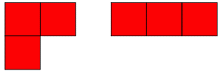

If all possible orientations are taken into account there are six:


Any n by m grid for which nxm is divisible by 3 can be tiled with
triominoes.
If we consider tilings that can be obtained by reflection or rotation from
another tiling as different there are 41 ways a 2 by 9 grid can be tiled
with triominoes:

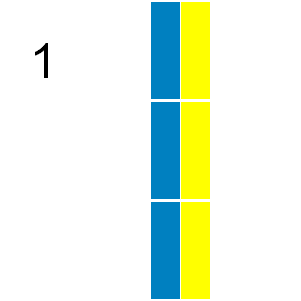

In how many ways can a 9 by 12 grid be tiled in this way by triominoes?

Answer: 975ccc38bb5402c5b485f3de5928d919


Problem 162
===========


   In the hexadecimal number system numbers are represented using 16
   different digits:

                        0,1,2,3,4,5,6,7,8,9,A,B,C,D,E,F

   The hexadecimal number AF when written in the decimal number system equals
   10x16+15=175.

   In the 3-digit hexadecimal numbers 10A, 1A0, A10, and A01 the digits 0,1
   and A are all present.
   Like numbers written in base ten we write hexadecimal numbers without
   leading zeroes.

   How many hexadecimal numbers containing at most sixteen hexadecimal digits
   exist with all of the digits 0,1, and A present at least once?
   Give your answer as a hexadecimal number.

   (A,B,C,D,E and F in upper case, without any leading or trailing code that
   marks the number as hexadecimal and without leading zeroes , e.g. 1A3F and
   not: 1a3f and not 0x1a3f and not $1A3F and not #1A3F and not 0000001A3F)

   
   Answer: 049419b9fdad9af74d5888626fff56a3


Problem 163
===========

Consider an equilateral triangle in which straight lines are drawn from
each vertex to the middle of the opposite side, such as in the size 1
triangle in the sketch below.

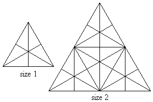

Sixteen triangles of either different shape or size or orientation or
location can now be observed in that triangle. Using size 1 triangles as
building blocks, larger triangles can be formed, such as the size 2
triangle in the above sketch. One-hundred and four triangles of either
different shape or size or orientation or location can now be observed in
that size 2 triangle.

It can be observed that the size 2 triangle contains 4 size 1 triangle
building blocks. A size 3 triangle would contain 9 size 1 triangle
building blocks and a size n triangle would thus contain n^2 size 1
triangle building blocks.

If we denote T(n) as the number of triangles present in a triangle of size
n, then

T(1) = 16
T(2) = 104

Find T(36).

Answer: a4f66a42a5b5dc395d00463d77e0a0c6


Problem 164
===========


   How many 20 digit numbers n (without any leading zero) exist such that no
   three consecutive digits of n have a sum greater than 9?

   
   Answer: 6e96debf3bfe7cc132401bafe5a5d6d6


Problem 165
===========


   A segment is uniquely defined by its two endpoints.
   By considering two line segments in plane geometry there are three
   possibilities:
   the segments have zero points, one point, or infinitely many points in
   common.

   Moreover when two segments have exactly one point in common it might be
   the case that that common point is an endpoint of either one of the
   segments or of both. If a common point of two segments is not an endpoint
   of either of the segments it is an interior point of both segments.
   We will call a common point T of two segments L[1] and L[2] a true
   intersection point of L[1] and L[2] if T is the only common point of L[1]
   and L[2] and T is an interior point of both segments.

   Consider the three segments L[1], L[2], and L[3]:

   L[1]: (27, 44) to (12, 32)
   L[2]: (46, 53) to (17, 62)
   L[3]: (46, 70) to (22, 40)

   It can be verified that line segments L[2] and L[3] have a true
   intersection point. We note that as the one of the end points of L[3]:
   (22,40) lies on L[1] this is not considered to be a true point of
   intersection. L[1] and L[2] have no common point. So among the three line
   segments, we find one true intersection point.

   Now let us do the same for 5000 line segments. To this end, we generate
   20000 numbers using the so-called "Blum Blum Shub" pseudo-random number
   generator.

   s[0] = 290797

   s[n+1] = s[n]×s[n] (modulo 50515093)

   t[n] = s[n] (modulo 500)

   To create each line segment, we use four consecutive numbers t[n]. That
   is, the first line segment is given by:

   (t[1], t[2]) to (t[3], t[4])

   The first four numbers computed according to the above generator should
   be: 27, 144, 12 and 232. The first segment would thus be (27,144) to
   (12,232).

   How many distinct true intersection points are found among the 5000 line
   segments?

   
   Answer: b87b096af5a545b4f7a45cfed4e67c87


Problem 166
===========


   A 4x4 grid is filled with digits d, 0 ≤ d ≤ 9.

   It can be seen that in the grid

                                    6 3 3 0
                                    5 0 4 3
                                    0 7 1 4
                                    1 2 4 5

   the sum of each row and each column has the value 12. Moreover the sum of
   each diagonal is also 12.

   In how many ways can you fill a 4x4 grid with the digits d, 0 ≤ d ≤ 9 so
   that each row, each column, and both diagonals have the same sum?

   
   Answer: e4f39f61ee7f1bfe433a177c07f5512f


Problem 167
===========


   For two positive integers a and b, the Ulam sequence U(a,b) is defined by
   U(a,b)[1] = a, U(a,b)[2] = b and for k > 2,U(a,b)[k] is the smallest
   integer greater than U(a,b)[(k-1)] which can be written in exactly one way
   as the sum of two distinct previous members of U(a,b).

   For example, the sequence U(1,2) begins with
   1, 2, 3 = 1 + 2, 4 = 1 + 3, 6 = 2 + 4, 8 = 2 + 6, 11 = 3 + 8;
   5 does not belong to it because 5 = 1 + 4 = 2 + 3 has two representations
   as the sum of two previous members, likewise 7 = 1 + 6 = 3 + 4.

   Find ∑U(2,2n+1)[k] for 2 ≤ n ≤10, where k = 10^11.

   
   Answer: aa5b61f6f4d96cbaeb5944b8fcdf64a3


Problem 168
===========


   Consider the number 142857. We can right-rotate this number by moving the
   last digit (7) to the front of it, giving us 714285.
   It can be verified that 714285=5×142857.
   This demonstrates an unusual property of 142857: it is a divisor of its
   right-rotation.

   Find the last 5 digits of the sum of all integers n, 10 < n < 10^100, that
   have this property.

   
   Answer: 39e7aab76650b018578830bc6dba007a


Problem 169
===========


   Define f(0)=1 and f(n) to be the number of different ways n can be
   expressed as a sum of integer powers of 2 using each power no more than
   twice.

   For example, f(10)=5 since there are five different ways to express 10:

   1 + 1 + 8
   1 + 1 + 4 + 4
   1 + 1 + 2 + 2 + 4
   2 + 4 + 4
   2 + 8

   What is f(10^25)?

   
   Answer: d149d4836703a8908becea56ddd3ed42


Problem 170
===========


   Take the number 6 and multiply it by each of 1273 and 9854:

   6 × 1273 = 7638
   6 × 9854 = 59124

   By concatenating these products we get the 1 to 9 pandigital 763859124. We
   will call 763859124 the "concatenated product of 6 and (1273,9854)".
   Notice too, that the concatenation of the input numbers, 612739854, is
   also 1 to 9 pandigital.

   The same can be done for 0 to 9 pandigital numbers.

   What is the largest 0 to 9 pandigital 10-digit concatenated product of an
   integer with two or more other integers, such that the concatenation of
   the input numbers is also a 0 to 9 pandigital 10-digit number?

   
   Answer: 6ffe65352f717c1731666a107ace96c1


Problem 171
===========


   For a positive integer n, let f(n) be the sum of the squares of the digits
   (in base 10) of n, e.g.

   f(3) = 3^2 = 9,
   f(25) = 2^2 + 5^2 = 4 + 25 = 29,
   f(442) = 4^2 + 4^2 + 2^2 = 16 + 16 + 4 = 36

   Find the last nine digits of the sum of all n, 0 < n < 10^20, such that
   f(n) is a perfect square.

   
   Answer: ff586db8c4a5699ec78c645fcb27db7b


Problem 172
===========


   How many 18-digit numbers n (without leading zeros) are there such that no
   digit occurs more than three times in n?

   
   Answer: f5f260ee21ead7478403c2ccd18a1829


Problem 173
===========

We shall define a square lamina to be a square outline with a square
"hole" so that the shape possesses vertical and horizontal symmetry. For
example, using exactly thirty-two square tiles we can form two different
square laminae:

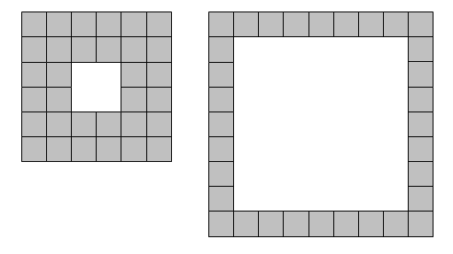

With one-hundred tiles, and not necessarily using all of the tiles at one
time, it is possible to form forty-one different square laminae.

Using up to one million tiles how many different square laminae can be
formed?

Answer: 177f825c89a68aefae37b8dec9bb8a9b


Problem 174
===========

We shall define a square lamina to be a square outline with a square
"hole" so that the shape possesses vertical and horizontal symmetry.

Given eight tiles it is possible to form a lamina in only one way: 3x3
square with a 1x1 hole in the middle. However, using thirty-two tiles it
is possible to form two distinct laminae.


If t represents the number of tiles used, we shall say that t = 8 is type
L(1) and t = 32 is type L(2).

Let N(n) be the number of t ≤ 1000000 such that t is type L(n); for
example, N(15) = 832.

What is ∑ N(n) for 1 ≤ n ≤ 10?

Answer: 73166006522ed7f51ed3e2ca66353b66

Problem 175
===========

   Define f(0)=1 and f(n) to be the number of ways to write n as a sum of
   powers of 2 where no power occurs more than twice.

   For example, f(10)=5 since there are five different ways to express 10:
   10 = 8+2 = 8+1+1 = 4+4+2 = 4+2+2+1+1 = 4+4+1+1

   It can be shown that for every fraction p/q (p>0, q>0) there exists at
   least one integer n such that
   f(n)/f(n-1)=p/q.

   For instance, the smallest n for which f(n)/f(n-1)=13/17 is 241.
   The binary expansion of 241 is 11110001.
   Reading this binary number from the most significant bit to the least
   significant bit there are 4 one's, 3 zeroes and 1 one. We shall call the
   string 4,3,1 the Shortened Binary Expansion of 241.

   Find the Shortened Binary Expansion of the smallest n for which
   f(n)/f(n-1)=123456789/987654321.

   Give your answer as comma separated integers, without any whitespaces.
   
   Answer: 796dddd004c3465229058072f5b4583e


Problem 176
===========


   The four right-angled triangles with sides (9,12,15), (12,16,20),
   (5,12,13) and (12,35,37) all have one of the shorter sides (catheti) equal
   to 12. It can be shown that no other integer sided right-angled triangle
   exists with one of the catheti equal to 12.

   Find the smallest integer that can be the length of a cathetus of exactly
   47547 different integer sided right-angled triangles.

   
   Answer: c47c782ebaf8cdbb60eebfa86cd0003c


Problem 177
===========

Let ABCD be a convex quadrilateral, with diagonals AC and BD. At each
vertex the diagonal makes an angle with each of the two sides, creating
eight corner angles.

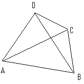

For example, at vertex A, the two angles are CAD, CAB.

We call such a quadrilateral for which all eight corner angles have
integer values when measured in degrees an "integer angled quadrilateral".
An example of an integer angled quadrilateral is a square, where all eight
corner angles are 45°. Another example is given by DAC = 20°, BAC = 60°,
ABD = 50°, CBD = 30°, BCA = 40°, DCA = 30°, CDB = 80°, ADB = 50°.

What is the total number of non-similar integer angled quadrilaterals?

Note: In your calculations you may assume that a calculated angle is
integral if it is within a tolerance of 10^-9 of an integer value.

Answer: d7a85236af930db0f7e84f2de8ee7ac2


Problem 178
===========

   Consider the number 45656.
   It can be seen that each pair of consecutive digits of 45656 has a
   difference of one.
   A number for which every pair of consecutive digits has a difference of
   one is called a step number.
   A pandigital number contains every decimal digit from 0 to 9 at least
   once.
   How many pandigital step numbers less than 10^40 are there?
   
   Answer: 2ffddfa898fa5df6321aebea84d4f33f


Problem 179
===========


   Find the number of integers 1 < n < 10^7, for which n and n + 1 have the
   same number of positive divisors. For example, 14 has the positive
   divisors 1, 2, 7, 14 while 15 has 1, 3, 5, 15.

   
   Answer: bafa0132bc7fc422a8d53bebb9d003c9


Problem 180
===========


For any integer n, consider the three functions

```
f[1,n](x,y,z) = x^n+1 + y^n+1 − z^n+1
f[2,n](x,y,z) = (xy + yz + zx)*(x^n-1 + y^n-1 − z^n-1)
f[3,n](x,y,z) = xyz*(x^n-2 + y^n-2 − z^n-2)
```

and their combination

```
f[n](x,y,z) = f[1,n](x,y,z) + f[2,n](x,y,z) − f[3,n](x,y,z)
```

We call (x,y,z) a golden triple of order k if x, y, and z are all rational
numbers of the form a / b with
0 < a < b ≤ k and there is (at least) one integer n, so that `f[n](x,y,z)` = 0.

Let s(x,y,z) = x + y + z.
Let t = u / v be the sum of all distinct s(x,y,z) for all golden triples
(x,y,z) of order 35.
All the s(x,y,z) and t must be in reduced form.

Find u + v.

Answer: 6459f69d151314c59df404868f45fa96


Problem 181
===========


   Having three black objects B and one white object W they can be grouped in
   7 ways like this:

        (BBBW)  (B,BBW)  (B,B,BW)  (B,B,B,W)  (B,BB,W)  (BBB,W)  (BB,BW)

   In how many ways can sixty black objects B and forty white objects W be
   thus grouped?

   
   Answer: 0e1233ecbc058dabf54a8602eac55d95


Problem 182
===========


   The RSA encryption is based on the following procedure:

   Generate two distinct primes p and q.
   Compute n=pq and φ=(p-1)(q-1).
   Find an integer e, 1<e<φ, such that gcd(e,φ)=1.

   A message in this system is a number in the interval [0,n-1].
   A text to be encrypted is then somehow converted to messages (numbers in
   the interval [0,n-1]).
   To encrypt the text, for each message, m, c=m^e mod n is calculated.

   To decrypt the text, the following procedure is needed: calculate d such
   that ed=1 mod φ, then for each encrypted message, c, calculate m=c^d mod
   n.

   There exist values of e and m such that m^e mod n=m.
   We call messages m for which m^e mod n=m unconcealed messages.

   An issue when choosing e is that there should not be too many unconcealed
   messages.
   For instance, let p=19 and q=37.
   Then n=19*37=703 and φ=18*36=648.
   If we choose e=181, then, although gcd(181,648)=1 it turns out that all
   possible messages
   m (0≤m≤n-1) are unconcealed when calculating m^e mod n.
   For any valid choice of e there exist some unconcealed messages.
   It's important that the number of unconcealed messages is at a minimum.

   Choose p=1009 and q=3643.
   Find the sum of all values of e, 1<e<φ(1009,3643) and gcd(e,φ)=1, so that
   the number of unconcealed messages for this value of e is at a minimum.

   
   Answer: 088ad9a61e60b9309e91cfc3ed27d729


Problem 183
===========


   Let N be a positive integer and let N be split into k equal parts, r =
   N/k, so that N = r + r + ... + r.
   Let P be the product of these parts, P = r × r × ... × r = r^k.

   For example, if 11 is split into five equal parts, 11 = 2.2 + 2.2 + 2.2 +
   2.2 + 2.2, then P = 2.2^5 = 51.53632.

   Let M(N) = P[max] for a given value of N.

   It turns out that the maximum for N = 11 is found by splitting eleven into
   four equal parts which leads to P[max] = (11/4)^4; that is, M(11) =
   14641/256 = 57.19140625, which is a terminating decimal.

   However, for N = 8 the maximum is achieved by splitting it into three
   equal parts, so M(8) = 512/27, which is a non-terminating decimal.

   Let D(N) = N if M(N) is a non-terminating decimal and D(N) = -N if M(N) is
   a terminating decimal.

   For example, ΣD(N) for 5 ≤ N ≤ 100 is 2438.

   Find ΣD(N) for 5 ≤ N ≤ 10000.

   
   Answer: 438bc10af8f8eb366ec1371478ca3d3c


Problem 184
===========

Consider the set I[r] of points (x,y) with integer co-ordinates in the
interior of the circle with radius r, centered at the origin, i.e. x^2 +
y^2 < r^2.

For a radius of 2, I[2] contains the nine points (0,0), (1,0), (1,1),
(0,1), (-1,1), (-1,0), (-1,-1), (0,-1) and (1,-1). There are eight
triangles having all three vertices in I[2] which contain the origin in
the interior. Two of them are shown below, the others are obtained from
these by rotation.

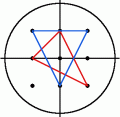

For a radius of 3, there are 360 triangles containing the origin in the
interior and having all vertices in I[3] and for I[5] the number is 10600.

How many triangles are there containing the origin in the interior and
having all three vertices in I[105]?

Answer: aa80f8619ed594e5d7852564457dbca6


Problem 185
===========


The game Number Mind is a variant of the well known game Master Mind.

Instead of coloured pegs, you have to guess a secret sequence of digits.
After each guess you're only told in how many places you've guessed the
correct digit. So, if the sequence was 1234 and you guessed 2036, you'd be
told that you have one correct digit; however, you would NOT be told that
you also have another digit in the wrong place.

For instance, given the following guesses for a 5-digit secret sequence,

    90342 ;2 correct
    70794 ;0 correct
    39458 ;2 correct
    34109 ;1 correct
    51545 ;2 correct
    12531 ;1 correct

The correct sequence 39542 is unique.

Based on the following guesses,

    5616185650518293 ;2 correct
    3847439647293047 ;1 correct
    5855462940810587 ;3 correct
    9742855507068353 ;3 correct
    4296849643607543 ;3 correct
    3174248439465858 ;1 correct
    4513559094146117 ;2 correct
    7890971548908067 ;3 correct
    8157356344118483 ;1 correct
    2615250744386899 ;2 correct
    8690095851526254 ;3 correct
    6375711915077050 ;1 correct
    6913859173121360 ;1 correct
    6442889055042768 ;2 correct
    2321386104303845 ;0 correct
    2326509471271448 ;2 correct
    5251583379644322 ;2 correct
    1748270476758276 ;3 correct
    4895722652190306 ;1 correct
    3041631117224635 ;3 correct
    1841236454324589 ;3 correct
    2659862637316867 ;2 correct

Find the unique 16-digit secret sequence.


Answer: 70f84864f21c4bf07ee53436580cd4bb


Problem 186
===========


Here are the records from a busy telephone system with one million users:

| RecNr | Caller   | Called  |
| ----- | -------- | ------- |
| 1     | 200007   | 100053  |
| 2     | 600183   | 500439  |
| 3     | 600863   | 701497  |
| …     | …        | …       |

The telephone number of the caller and the called number in record n are
Caller(n) = S[2n-1] and Called(n) = S[2n] where S[1,2,3,...] come from the
"Lagged Fibonacci Generator":

For 1 ≤ k ≤ 55, S[k] = [100003 - 200003k + 300007k^3] (modulo 1000000)
For 56 ≤ k, S[k] = [S[k-24] + S[k-55]] (modulo 1000000)

If Caller(n) = Called(n) then the user is assumed to have misdialled and
the call fails; otherwise the call is successful.

From the start of the records, we say that any pair of users X and Y are
friends if X calls Y or vice-versa. Similarly, X is a friend of a friend
of Z if X is a friend of Y and Y is a friend of Z; and so on for longer
chains.

The Prime Minister's phone number is 524287. After how many successful
calls, not counting misdials, will 99% of the users (including the PM) be
a friend, or a friend of a friend etc., of the Prime Minister?


Answer: b21d68f1871abf1d5bbcf1206b3f1643


Problem 187
===========


   A composite is a number containing at least two prime factors. For
   example, 15 = 3 × 5; 9 = 3 × 3; 12 = 2 × 2 × 3.

   There are ten composites below thirty containing precisely two, not
   necessarily distinct, prime factors:4, 6, 9, 10, 14, 15, 21, 22, 25, 26.

   How many composite integers, n < 10^8, have precisely two, not necessarily
   distinct, prime factors?

   
   Answer: b3e6977523511d2cbbef8fccb1e394db


Problem 188
===========


   The hyperexponentiation or tetration of a number a by a positive integer
   b, denoted by a↑↑b or ^ba, is recursively defined by:

   a↑↑1 = a,
   a↑↑(k+1) = a^(a↑↑k).

   Thus we have e.g. 3↑↑2 = 3^3 = 27, hence 3↑↑3 = 3^27 = 7625597484987 and
   3↑↑4 is roughly 10^3.6383346400240996*10^12.

   Find the last 8 digits of 1777↑↑1855.

   
   Answer: 62746b4d40a2b87c3dd6caee5d33e6a1


Problem 189
===========

Consider the following configuration of 64 triangles:

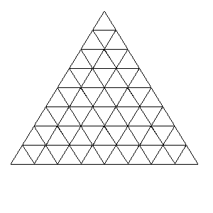

We wish to colour the interior of each triangle with one of three colours:
red, green or blue, so that no two neighbouring triangles have the same
colour. Such a colouring shall be called valid. Here, two triangles are
said to be neighbouring if they share an edge.
Note: if they only share a vertex, then they are not neighbours.

For example, here is a valid colouring of the above grid:


A colouring C' which is obtained from a colouring C by rotation or
reflection is considered distinct from C unless the two are identical.

How many distinct valid colourings are there for the above configuration?

Answer: d3dfdd37601678212b746c34699f1484


Problem 190
===========


   Let S[m] = (x[1], x[2], ... , x[m]) be the m-tuple of positive real
   numbers with x[1] + x[2] + ... + x[m] = m for which P[m] = x[1] * x[2]^2 *
   ... * x[m]^m is maximised.

   For example, it can be verified that [P[10]] = 4112 ([ ] is the integer
   part function).

   Find Σ[P[m]] for 2 ≤ m ≤ 15.

   
   Answer: 40cfcabd9b30d79ec81151fc756e9946


Problem 191
===========

A particular school offers cash rewards to children with good attendance
and punctuality. If they are absent for three consecutive days or late on
more than one occasion then they forfeit their prize.

During an n-day period a trinary string is formed for each child
consisting of L's (late), O's (on time), and A's (absent).

Although there are eighty-one trinary strings for a 4-day period that can
be formed, exactly forty-three strings would lead to a prize:

    OOOO OOOA OOOL OOAO OOAA OOAL OOLO OOLA OAOO OAOA
    OAOL OAAO OAAL OALO OALA OLOO OLOA OLAO OLAA AOOO
    AOOA AOOL AOAO AOAA AOAL AOLO AOLA AAOO AAOA AAOL
    AALO AALA ALOO ALOA ALAO ALAA LOOO LOOA LOAO LOAA
    LAOO LAOA LAAO

How many "prize" strings exist over a 30-day period?

Answer: e04dfa598b22a87570f63063f3ff595d


Problem 192
===========


   Let x be a real number.
   A best approximation to x for the denominator bound d is a rational number
   r/s in reduced form, with s ≤ d, such that any rational number which is
   closer to x than r/s has a denominator larger than d:

                           |p/q-x| < |r/s-x| ⇒ q > d

   For example, the best approximation to √13 for the denominator bound 20 is
   18/5 and the best approximation to √13 for the denominator bound 30 is
   101/28.

   Find the sum of all denominators of the best approximations to √n for the
   denominator bound 10^12, where n is not a perfect square and 1 < n ≤
   100000.

   
   Answer: e5ec7d4b094709b1fcebbd73b10e6264


Problem 193
===========


   A positive integer n is called squarefree, if no square of a prime divides
   n, thus 1, 2, 3, 5, 6, 7, 10, 11 are squarefree, but not 4, 8, 9, 12.

   How many squarefree numbers are there below 2^50?

   
   Answer: ea29fcf755b560777b0b6d8714234d18


Problem 194
===========


Consider graphs built with the units A: 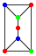 and B: 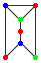, where the units are glued
alongthe vertical edges as in the graph 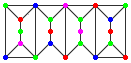.

A configuration of type (a,b,c) is a graph thus built of a units A and b
units B, where the graph's vertices are coloured using up to c colours, so
that no two adjacent vertices have the same colour.
The compound graph above is an example of a configuration of type (2,2,6),
in fact of type (2,2,c) for all c ≥ 4.

Let N(a,b,c) be the number of configurations of type (a,b,c).
For example, N(1,0,3) = 24, N(0,2,4) = 92928 and N(2,2,3) = 20736.

Find the last 8 digits of N(25,75,1984).

Answer: e070561d568a80a0e45d7835e3817ba4


Problem 195
===========


   Let's call an integer sided triangle with exactly one angle of 60 degrees
   a 60-degree triangle.
   Let r be the radius of the inscribed circle of such a 60-degree triangle.

   There are 1234 60-degree triangles for which r ≤ 100.
   Let T(n) be the number of 60-degree triangles for which r ≤ n, so
   T(100) = 1234,  T(1000) = 22767, and  T(10000) = 359912.

   Find T(1053779).

   
   Answer: 0fe232937a6d9f2a40825b86f568a38c


Problem 196
===========


   Build a triangle from all positive integers in the following way:
   
   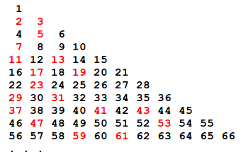

   Each positive integer has up to eight neighbours in the triangle.

   A set of three primes is called a prime triplet if one of the three primes
   has the other two as neighbours in the triangle.

   For example, in the second row, the prime numbers 2 and 3 are elements of
   some prime triplet.

   If row 8 is considered, it contains two primes which are elements of some
   prime triplet, i.e. 29 and 31.
   If row 9 is considered, it contains only one prime which is an element of
   some prime triplet: 37.

   Define S(n) as the sum of the primes in row n which are elements of any
   prime triplet.
   Then S(8)=60 and S(9)=37.

   You are given that S(10000)=950007619.

   Find  S(5678027) + S(7208785).

   
   Answer: fb6b6b0a4b7b31ba429152bc0b6bd037


Problem 197
===========


   Given is the function f(x) = ⌊2^30.403243784-x^2⌋ × 10^-9 ( ⌊ ⌋ is the
   floor-function),
   the sequence u[n] is defined by u[0] = -1 and u[n+1] = f(u[n]).

   Find u[n] + u[n+1] for n = 10^12.
   Give your answer with 9 digits after the decimal point.

   
   Answer: c98cbf87636906f2465d481be815e454


Problem 198
===========


   A best approximation to a real number x for the denominator bound d is a
   rational number r/s (in reduced form) with s ≤ d, so that any rational
   number p/q which is closer to x than r/s has q > d.

   Usually the best approximation to a real number is uniquely determined for
   all denominator bounds. However, there are some exceptions, e.g. 9/40 has
   the two best approximations 1/4 and 1/5 for the denominator bound 6.We
   shall call a real number x ambiguous, if there is at least one denominator
   bound for which x possesses two best approximations. Clearly, an ambiguous
   number is necessarily rational.

   How many ambiguous numbers x = p/q,0 < x < 1/100, are there whose
   denominator q does not exceed 10^8?

   
   Answer: e59816f440fec9368c681314a127f3ee


Problem 199
===========


Three circles of equal radius are placed inside a larger circle such that
each pair of circles is tangent to one another and the inner circles do
not overlap. There are four uncovered "gaps" which are to be filled
iteratively with more tangent circles.


At each iteration, a maximally sized circle is placed in each gap, which
creates more gaps for the next iteration. After 3 iterations (pictured),
there are 108 gaps and the fraction of the area which is not covered by
circles is 0.06790342, rounded to eight decimal places.

What fraction of the area is not covered by circles after 10 iterations?
Give your answer rounded to eight decimal places using the format
x.xxxxxxxx .


Answer: 0f8fd87159c28ae5fea6ac91a95d48dd


Problem 200
===========


   We shall define a sqube to be a number of the form, p^2q^3, where p and q
   are distinct primes.
   For example, 200 = 5^22^3 or 120072949 = 23^261^3.

   The first five squbes are 72, 108, 200, 392, and 500.

   Interestingly, 200 is also the first number for which you cannot change
   any single digit to make a prime; we shall call such numbers, prime-proof.
   The next prime-proof sqube which contains the contiguous sub-string "200"
   is 1992008.

   Find the 200th prime-proof sqube containing the contiguous sub-string
   "200".

   
   Answer: c911c8e346aa813da5f5ed4f8e9128d8


Problem 201
===========

For any set A of numbers, let sum(A) be the sum of the elements of A.
Consider the set B = {1,3,6,8,10,11}.
There are 20 subsets of B containing three elements, and their sums are:

    sum({1,3,6}) = 10,
    sum({1,3,8}) = 12,
    sum({1,3,10}) = 14,
    sum({1,3,11}) = 15,
    sum({1,6,8}) = 15,
    sum({1,6,10}) = 17,
    sum({1,6,11}) = 18,
    sum({1,8,10}) = 19,
    sum({1,8,11}) = 20,
    sum({1,10,11}) = 22,
    sum({3,6,8}) = 17,
    sum({3,6,10}) = 19,
    sum({3,6,11}) = 20,
    sum({3,8,10}) = 21,
    sum({3,8,11}) = 22,
    sum({3,10,11}) = 24,
    sum({6,8,10}) = 24,
    sum({6,8,11}) = 25,
    sum({6,10,11}) = 27,
    sum({8,10,11}) = 29.

Some of these sums occur more than once, others are unique.
For a set A, let U(A,k) be the set of unique sums of k-element subsets of
A, in our example we find U(B,3) = {10,12,14,18,21,25,27,29} and
sum(U(B,3)) = 156.

Now consider the 100-element set S = {1^2, 2^2, ... , 100^2}.
S has 100891344545564193334812497256 50-element subsets.

Determine the sum of all integers which are the sum of exactly one of the
50-element subsets of S, i.e. find sum(U(S,50)).

Answer: b7ad07c58c81a940b8ff067a13b2760d


Problem 202
===========

Three mirrors are arranged in the shape of an equilateral triangle, with
their reflective surfaces pointing inwards. There is an infinitesimal gap
at each vertex of the triangle through which a laser beam may pass.

Label the vertices A, B and C. There are 2 ways in which a laser beam may
enter vertex C, bounce off 11 surfaces, then exit through the same vertex:
one way is shown below; the other is the reverse of that.


There are 80840 ways in which a laser beam may enter vertex C, bounce off
1000001 surfaces, then exit through the same vertex.

In how many ways can a laser beam enter at vertex C, bounce off
12017639147 surfaces, then exit through the same vertex?

Answer: e9774949b5efad0d40d60ede379c5321

Problem 203
===========


   The binomial coefficients ^nC[k] can be arranged in triangular form,
   Pascal's triangle, like this:

                                       1
                                    1     1
                                 1     2     1
                              1     3     3     1
                            1    4     6     4     1
                          1   5     10    10    5    1
                        1   6    15    20    15    6   1
                      1   7   21    35    35    21   7   1

                                   .........

   It can be seen that the first eight rows of Pascal's triangle contain
   twelve distinct numbers: 1, 2, 3, 4, 5, 6, 7, 10, 15, 20, 21 and 35.

   A positive integer n is called squarefree if no square of a prime divides
   n.Of the twelve distinct numbers in the first eight rows of Pascal's
   triangle, all except 4 and 20 are squarefree.The sum of the distinct
   squarefree numbers in the first eight rows is 105.

   Find the sum of the distinct squarefree numbers in the first 51 rows of
   Pascal's triangle.

   
   Answer: d7ec16d216c923d3c927f46cfc914e92


Problem 204
===========


   A Hamming number is a positive number which has no prime factor larger
   than 5.
   So the first few Hamming numbers are 1, 2, 3, 4, 5, 6, 8, 9, 10, 12, 15.
   There are 1105 Hamming numbers not exceeding 10^8.

   We will call a positive number a generalised Hamming number of type n, if
   it has no prime factor larger than n.
   Hence the Hamming numbers are the generalised Hamming numbers of type 5.

   How many generalised Hamming numbers of type 100 are there which don't
   exceed 10^9?

   
   Answer: 4118ffb9edc56a033b5b27ca0bf34366


Problem 205
===========


   Peter has nine four-sided (pyramidal) dice, each with faces numbered 1, 2,
   3, 4.
   Colin has six six-sided (cubic) dice, each with faces numbered 1, 2, 3, 4,
   5, 6.

   Peter and Colin roll their dice and compare totals: the highest total
   wins. The result is a draw if the totals are equal.

   What is the probability that Pyramidal Pete beats Cubic Colin? Give your
   answer rounded to seven decimal places in the form 0.abcdefg

   
   Answer: ba6c6c3888227a0799eca38191b587be


Problem 206
===========


   Find the unique positive integer whose square has the form
   1_2_3_4_5_6_7_8_9_0,
   where each “_” is a single digit.

   
   Answer: 09f9d87cb4b1ebb34e1f607e55a351d8


Problem 207
===========


   For some positive integers k, there exists an integer partition of the
   form   4^t = 2^t + k,
   where 4^t, 2^t, and k are all positive integers and t is a real number.

   The first two such partitions are 4^1 = 2^1 + 2 and 4^1.5849625... =
   2^1.5849625... + 6.

   Partitions where t is also an integer are called perfect.
   For any m ≥ 1 let P(m) be the proportion of such partitions that are
   perfect with k ≤ m.
   Thus P(6) = 1/2.

   In the following table are listed some values of P(m)

      P(5) = 1/1
      P(10) = 1/2
      P(15) = 2/3
      P(20) = 1/2
      P(25) = 1/2
      P(30) = 2/5
      ...
      P(180) = 1/4
      P(185) = 3/13

   Find the smallest m for which P(m) < 1/12345

   
   Answer: 3f17b264ed1717fe5fbde1e399bd501f


Problem 208
===========


A robot moves in a series of one-fifth circular arcs (72°), with a free
choice of a clockwise or an anticlockwise arc for each step, but no
turning on the spot.

One of 70932 possible closed paths of 25 arcs starting northward is


Given that the robot starts facing North, how many journeys of 70 arcs in
length can it take that return it, after the final arc, to its starting
position?
(Any arc may be traversed multiple times.)

Answer: 3010e33173f30e0aac79e84835b48823


Problem 209
===========

A k-input binary truth table is a map from k input bits(binary digits, 0
[false] or 1 [true]) to 1 output bit. For example, the 2-input binary
truth tables for the logical AND and XOR functions are:

    ┌────┬────┬─────────┐    ┌────┬────┬─────────┐
    │ x  │ y  │x AND y  │    │ x  │ y  │x XOR y  │
    ├────┼────┼─────────┤    ├────┼────┼─────────┤
    │ 0  │ 0  │    0    │    │ 0  │ 0  │    0    │
    ├────┼────┼─────────┤    ├────┼────┼─────────┤
    │ 0  │ 1  │    0    │    │ 0  │ 1  │    1    │
    ├────┼────┼─────────┤    ├────┼────┼─────────┤
    │ 1  │ 0  │    0    │    │ 1  │ 0  │    1    │
    ├────┼────┼─────────┤    ├────┼────┼─────────┤
    │ 1  │ 1  │    1    │    │ 1  │ 1  │    0    │
    └────┴────┴─────────┘    └────┴────┴─────────┘

How many 6-input binary truth tables, τ, satisfy the formula

	 τ(a, b, c, d, e, f) AND τ(b, c, d, e, f, a XOR (b AND c)) = 0

Answer: 954157aa4762df2ee29580ee5a351b13


Problem 210
===========

   Consider the set S(r) of points (x,y) with integer coordinates satisfying
   |x| + |y| ≤ r.
   Let O be the point (0,0) and C the point (r/4,r/4).
   Let N(r) be the number of points B in S(r), so that the triangle OBC has
   an obtuse angle, i.e. the largest angle α satisfies 90°<α<180°.
   So, for example, N(4)=24 and N(8)=100.

   What is N(1,000,000,000)?

   
   Answer: 0c808b02789c4db462322ab2ac070bbb


Problem 211
===========


   For a positive integer n, let σ[2](n) be the sum of the squares of its
   divisors. For example,

                       σ[2](10) = 1 + 4 + 25 + 100 = 130.

   Find the sum of all n, 0 < n < 64,000,000 such that σ[2](n) is a perfect
   square.

   
   Answer: 5fe0ed146690e7bca448687a94353a73


Problem 212
===========


   An axis-aligned cuboid, specified by parameters { (x[0],y[0],z[0]),
   (dx,dy,dz) }, consists of all points (X,Y,Z) such that x[0] ≤ X ≤ x[0]+dx,
   y[0] ≤ Y ≤ y[0]+dy and z[0] ≤ Z ≤ z[0]+dz. The volume of the cuboid is the
   product, dx × dy × dz. The combined volume of a collection of cuboids is
   the volume of their union and will be less than the sum of the individual
   volumes if any cuboids overlap.

   Let C[1],...,C[50000] be a collection of 50000 axis-aligned cuboids such
   that C[n] has parameters

   x[0] = S[6n-5] modulo 10000
   y[0] = S[6n-4] modulo 10000
   z[0] = S[6n-3] modulo 10000
   dx = 1 + (S[6n-2] modulo 399)
   dy = 1 + (S[6n-1] modulo 399)
   dz = 1 + (S[6n] modulo 399)

   where S[1],...,S[300000] come from the "Lagged Fibonacci Generator":

   For 1 ≤ k ≤ 55, S[k] = [100003 - 200003k + 300007k^3]   (modulo 1000000)
   For 56 ≤ k, S[k] = [S[k-24] + S[k-55]]   (modulo 1000000)

   Thus, C[1] has parameters {(7,53,183),(94,369,56)}, C[2] has parameters
   {(2383,3563,5079),(42,212,344)}, and so on.

   The combined volume of the first 100 cuboids, C[1],...,C[100], is
   723581599.

   What is the combined volume of all 50000 cuboids, C[1],...,C[50000] ?

   
   Answer: 76650c9c077929e1ce5a80a1ac81fa96


Problem 213
===========


   A 30×30 grid of squares contains 900 fleas, initially one flea per square.
   When a bell is rung, each flea jumps to an adjacent square at random
   (usually 4 possibilities, except for fleas on the edge of the grid or at
   the corners).

   What is the expected number of unoccupied squares after 50 rings of the
   bell? Give your answer rounded to six decimal places.

   
   Answer: f81ee7dd444a3d895a4a446f9d115bf8


Problem 214
===========


   Let φ be Euler's totient function, i.e. for a natural number n,φ(n) is the
   number of k, 1 ≤ k ≤ n, for which gcd(k,n) = 1.

   By iterating φ, each positive integer generates a decreasing chain of
   numbers ending in 1.
   E.g. if we start with 5 the sequence 5,4,2,1 is generated.
   Here is a listing of all chains with length 4:

                                                                      5,4,2,1
                                                                      7,6,2,1
                                                                      8,4,2,1
                                                                      9,6,2,1
                                                                     10,4,2,1
                                                                     12,4,2,1
                                                                     14,6,2,1
                                                                     18,6,2,1

   Only two of these chains start with a prime, their sum is 12.

   What is the sum of all primes less than 40000000 which generate a chain of
   length 25?

   
   Answer: 1cefd865483c03552d5247ffb05685c7


Problem 215
===========


Consider the problem of building a wall out of 2×1 and 3×1 bricks
(horizontal×vertical dimensions) such that, for extra strength, the gaps
between horizontally-adjacent bricks never line up in consecutive layers,
i.e. never form a "running crack".

For example, the following 9×3 wall is not acceptable due to the running
crack shown in red:


There are eight ways of forming a crack-free 9×3 wall, written W(9,3) = 8.

Calculate W(32,10).

Answer: 60212c9ec4a6cd1d14277c32b6adf2d8


Problem 216
===========


   Consider numbers t(n) of the form t(n) = 2n^2-1 with n > 1.
   The first such numbers are 7, 17, 31, 49, 71, 97, 127 and 161.
   It turns out that only 49 = 7*7 and 161 = 7*23 are not prime.
   For n ≤ 10000 there are 2202 numbers t(n) that are prime.

   How many numbers t(n) are prime for n ≤ 50,000,000 ?

   
   Answer: e512153424a482deb9de401ac0465a72


Problem 217
===========


   A positive integer with k (decimal) digits is called balanced if its first
   ⌈^k/[2]⌉ digits sum to the same value as its last ⌈^k/[2]⌉ digits, where
   ⌈x⌉, pronounced ceiling of x, is the smallest integer ≥ x, thus ⌈π⌉ = 4
   and ⌈5⌉ = 5.

   So, for example, all palindromes are balanced, as is 13722.

   Let T(n) be the sum of all balanced numbers less than 10^n.
   Thus: T(1) = 45, T(2) = 540 and T(5) = 334795890.

   Find T(47) mod 3^15

   
   Answer: 11bff97aac06892e1a07ebf7febfa8db


Problem 218
===========


Consider the right angled triangle with sides a=7, b=24 and c=25.The area
of this triangle is 84, which is divisible by the perfect numbers 6 and 28.

Moreover it is a primitive right angled triangle as gcd(a,b)=1 and gcd(b,c)=1. 
Also c is a perfect square.

We will call a right angled triangle perfect if
* it is a primitive right angled triangle
* its hypotenuse is a perfect square

We will call a right angled triangle super-perfect if
* it is a perfect right angled triangle and
* its area is a multiple of the perfect numbers 6 and 28.

How many perfect right-angled triangles with c≤10^16 exist that are not
super-perfect?

Answer: cfcd208495d565ef66e7dff9f98764da

Problem 219
===========


Let A and B be bit strings (sequences of 0's and 1's).
If A is equal to the leftmost length(A) bits of B, then A is said to be a
prefix of B.
For example, 00110 is a prefix of 001101001, but not of 00111 or 100110.

A prefix-free code of size n is a collection of n distinct bit strings
such that no string is a prefix of any other. For example, this is a
prefix-free code of size 6:

    0000, 0001, 001, 01, 10, 11

Now suppose that it costs one penny to transmit a '0' bit, but four pence
to transmit a '1'.
Then the total cost of the prefix-free code shown above is 35 pence, which
happens to be the cheapest possible for the skewed pricing scheme in
question.
In short, we write Cost(6) = 35.

What is Cost(10^9)?

Answer: 578c22ef288b88c60fbcf4541351aff5


Problem 220
===========


Let D[0] be the two-letter string "Fa". For n≥1, derive D[n] from D[n-1]
by the string-rewriting rules:

    "a" → "aRbFR"
    "b" → "LFaLb"

Thus, D[0] = "Fa", D[1] = "FaRbFR", D[2] = "FaRbFRRLFaLbFR", and so on.

These strings can be interpreted as instructions to a computer graphics
program, with "F" meaning "draw forward one unit", "L" meaning "turn left
90 degrees", "R" meaning "turn right 90 degrees", and "a" and "b" being
ignored. The initial position of the computer cursor is (0,0), pointing up
towards (0,1).

Then D[n] is an exotic drawing known as the Heighway Dragon of order n.
For example, D[10] is shown below; counting each "F" as one step, the
highlighted spot at (18,16) is the position reached after 500 steps.


What is the position of the cursor after 10^12 steps in D[50] ?
Give your answer in the form x,y with no spaces.

Answer: e2018d8efde8ea00319f1adc042f150b


Problem 221
===========


We shall call a positive integer A an "Alexandrian integer", if there
exist integers p, q, r such that:

    A = p · q · r    and   1 = 1 + 1 + 1
                           A   p   q   r

For example, 630 is an Alexandrian integer (p = 5, q = −7, r = −18).In
fact, 630 is the 6th Alexandrian integer, the first 6 Alexandrian
integers being: 6, 42, 120, 156, 420 and 630.

Find the 150000^th Alexandrian integer.

Answer: cb000c24f653d9c8f78b74123e6515ab


Problem 222
===========


   What is the length of the shortest pipe, of internal radius 50mm, that can
   fully contain 21 balls of radii 30mm, 31mm, ..., 50mm?

   Give your answer in micrometres (10^-6 m) rounded to the nearest integer.

   
   Answer: 6984ba429b968467619ec98a8ee51abf


Problem 223
===========

Let us call an integer sided triangle with sides a ≤ b ≤ c barely acute if
the sides satisfy:  a^2 + b^2 = c^2 + 1.

How many barely acute triangles are there with perimeter ≤ 25,000,000?

Answer: cb875e59736a1967c8da8fc8062a6bc5

Problem 224
===========


Let us call an integer sided triangle with sides a ≤ b ≤ c barely obtuse
if the sides satisfy:  a^2 + b^2 = c^2 - 1.

How many barely obtuse triangles are there with perimeter ≤ 75,000,000?

Answer: c43cfb12750dee27b4b0d016261e831b

Problem 225
===========


   The sequence 1, 1, 1, 3, 5, 9, 17, 31, 57, 105, 193, 355, 653, 1201 ...
   is defined by T[1] = T[2] = T[3] = 1 and T[n] = T[n-1] + T[n-2] + T[n-3].

   It can be shown that 27 does not divide any terms of this sequence.
   In fact, 27 is the first odd number with this property.

   Find the 124th odd number that does not divide any terms of the above
   sequence.

   
   Answer: f1981e4bd8a0d6d8462016d2fc6276b3


Problem 226
===========

The blancmange curve is the set of points (x,y) such that 0 ≤ x ≤ 1 and ,
where s(x) = the distance from x to the nearest integer.

The area under the blancmange curve is equal to ½, shown in pink in the
diagram below.


Let C be the circle with centre (¼,½) and radius ¼, shown in black in the
diagram.

What area under the blancmange curve is enclosed by C?
Give your answer rounded to eight decimal places in the form 0.abcdefgh

Answer: ce6fd32d1d2fb58c4c0c1f7962c39f04

Problem 227
===========

"The Chase" is a game played with two dice and an even number of players.

The players sit around a table; the game begins with two opposite players
having one die each. On each turn, the two players with a die roll it.
If a player rolls a 1, he passes the die to his neighbour on the left; if
he rolls a 6, he passes the die to his neighbour on the right; otherwise,
he keeps the die for the next turn.
The game ends when one player has both dice after they have been rolled
and passed; that player has then lost.

In a game with 100 players, what is the expected number of turns the game
lasts?

Give your answer rounded to ten significant digits.

Answer: 7b87cd0a96f0f2f12f911cdc66608d95

Problem 228
===========

Let S[n] be the regular n-sided polygon – or shape – whose vertices v[k]
(k = 1,2,…,n) have coordinates:

	  x[k]   =   cos( ^2k-1/[n] × 180° )
	  y[k]   =   sin( ^2k-1/[n] × 180° )

Each S[n] is to be interpreted as a filled shape consisting of all points
on the perimeter and in the interior.

The Minkowski sum, S+T, of two shapes S and T is the result of adding
every point in S to every point in T, where point addition is performed
coordinate-wise: (u, v) + (x, y) = (u+x, v+y).

For example, the sum of S[3] and S[4] is the six-sided shape shown in pink
below:


How many sides does S[1864] + S[1865] + … + S[1909] have?

Answer: 35d0195ddaf58e52e12400de1c9333d8

Problem 229
===========


Consider the number 3600. It is very special, because

    3600 = 48^2 + 36^2

    3600 = 20^2 + 2×40^2

    3600 = 30^2 + 3×30^2

    3600 = 45^2 + 7×15^2

Similarly, we find that 88201 = 99^2 + 280^2 = 287^2 + 2×54^2 = 283^2 +
3×52^2 = 197^2 + 7×84^2.

In 1747, Euler proved which numbers are representable as a sum of two
squares. We are interested in the numbers n which admit representations of
all of the following four types:

    n = a[1]^2 +   b[1]^2

    n = a[2]^2 + 2 b[2]^2

    n = a[3]^2 + 3 b[3]^2

    n = a[7]^2 + 7 b[7]^2,

where the a[k] and b[k] are positive integers.

There are 75373 such numbers that do not exceed 10^7.
How many such numbers are there that do not exceed 2×10^9?

Answer: d68b5ec8df4a56991901f67afbdef24f

Problem 230
===========

For any two strings of digits, A and B, we define F[A,B] to be the
sequence (A,B,AB,BAB,ABBAB,...) in which each term is the concatenation of
the previous two.

Further, we define D[A,B](n) to be the nth digit in the first term of
F[A,B] that contains at least n digits.

Example:

Let A=1415926535, B=8979323846. We wish to find D[A,B](35), say.

The first few terms of F[A,B] are:

    1415926535
    8979323846
    14159265358979323846
    897932384614159265358979323846
    14159265358979323846897932384614159265358979323846

Then D[A,B](35) is the 35th digit in the fifth term, which is 9.

Now we use for A the first 100 digits of π behind the decimal point:

   14159265358979323846264338327950288419716939937510
   58209749445923078164062862089986280348253421170679

and for B the next hundred digits:

   82148086513282306647093844609550582231725359408128
   48111745028410270193852110555964462294895493038196.

Find ∑[n = 0,1,...,17]   10^n× D[A,B]((127+19n)×7^n).

Answer: 040735038021ff4704bbd3a0964369ef


Problem 231
===========


   The binomial coefficient ^10C[3] = 120.
   120 = 2^3 × 3 × 5 = 2 × 2 × 2 × 3 × 5, and 2 + 2 + 2 + 3 + 5 = 14.
   So the sum of the terms in the prime factorisation of ^10C[3] is 14.

   Find the sum of the terms in the prime factorisation of
   ^20000000C[15000000].

   
   Answer: ef8bc4d9a843e71126bd10b5065132a5


Problem 232
===========


   Two players share an unbiased coin and take it in turns to play "The
   Race". On Player 1's turn, he tosses the coin once: if it comes up Heads,
   he scores one point; if it comes up Tails, he scores nothing. On Player
   2's turn, she chooses a positive integer T and tosses the coin T times: if
   it comes up all Heads, she scores 2^T-1 points; otherwise, she scores
   nothing. Player 1 goes first. The winner is the first to 100 or more
   points.

   On each turn Player 2 selects the number, T, of coin tosses that maximises
   the probability of her winning.

   What is the probability that Player 2 wins?

   Give your answer rounded to eight decimal places in the form 0.abcdefgh .

   
   Answer: c8d5b243aa6e6b507725766f7c197a1d


Problem 233
===========


   Let f(N) be the number of points with integer coordinates that are on a
   circle passing through (0,0), (N,0),(0,N), and (N,N).

   It can be shown that f(10000) = 36.

   What is the sum of all positive integers N ≤ 10^11 such that f(N) = 420 ?

   
   Answer: 7e80b27798170abb493e3b4671bd82ca


Problem 234
===========


   For an integer n ≥ 4, we define the lower prime square root of n, denoted
   by lps(n), as the largest prime ≤ √n and the upper prime square root of n,
   ups(n), as the smallest prime ≥ √n.

   So, for example, lps(4) = 2 = ups(4), lps(1000) = 31, ups(1000) = 37.
   Let us call an integer n ≥ 4 semidivisible, if one of lps(n) and ups(n)
   divides n, but not both.

   The sum of the semidivisible numbers not exceeding 15 is 30, the numbers
   are 8, 10 and 12.
   15 is not semidivisible because it is a multiple of both lps(15) = 3 and
   ups(15) = 5.
   As a further example, the sum of the 92 semidivisible numbers up to 1000
   is 34825.

   What is the sum of all semidivisible numbers not exceeding 999966663333 ?

   
   Answer: c24a5d60f8ce5d04dec7466987c84d68


Problem 235
===========


   Given is the arithmetic-geometric sequence u(k) = (900-3k)r^k-1.
   Let s(n) = Σ[k=1...n]u(k).

   Find the value of r for which s(5000) = -600,000,000,000.

   Give your answer rounded to 12 places behind the decimal point.

   
   Answer: 41b13508789be1001308e065d4f83ea2


Problem 236
===========


   Suppliers 'A' and 'B' provided the following numbers of products for the
   luxury hamper market:

                                                         Product       'A'  'B'
                                                    Beluga Caviar      5248 640
                                                    Christmas Cake     1312 1888
                                                    Gammon Joint       2624 3776
                                                    Vintage Port       5760 3776
                                                    Champagne Truffles 3936 5664

   Although the suppliers try very hard to ship their goods in perfect
   condition, there is inevitably some spoilage - i.e. products gone bad.

   The suppliers compare their performance using two types of statistic:

     • The five per-product spoilage rates for each supplier are equal to the
       number of products gone bad divided by the number of products
       supplied, for each of the five products in turn.
     • The overall spoilage rate for each supplier is equal to the total
       number of products gone bad divided by the total number of products
       provided by that supplier.

   To their surprise, the suppliers found that each of the five per-product
   spoilage rates was worse (higher) for 'B' than for 'A' by the same factor
   (ratio of spoilage rates), m>1; and yet, paradoxically, the overall
   spoilage rate was worse for 'A' than for 'B', also by a factor of m.

   There are thirty-five m>1 for which this surprising result could have
   occurred, the smallest of which is 1476/1475.

   What's the largest possible value of m?
   Give your answer as a fraction reduced to its lowest terms, in the form
   u/v.

   
   Answer: 6e707fcffc510520d981ae16a29579bb


Problem 237
===========

Let T(n) be the number of tours over a 4 × n playing board such that:

* The tour starts in the top left corner.
* The tour consists of moves that are up, down, left, or right one square.
* The tour visits each square exactly once.
* The tour ends in the bottom left corner.

The diagram shows one tour over a 4 × 10 board:


T(10) is 2329. What is T(10^12) modulo 10^8?

Answer: 0742988a3948491b15fb48e476c78a6a


Problem 238
===========


   Create a sequence of numbers using the "Blum Blum Shub" pseudo-random
   number generator:

                          s[0]   = 14025256
                          s[n+1] = s[n]^2 mod 20300713

   Concatenate these numbers  s[0]s[1]s[2]… to create a string w of infinite
   length.
   Then, w = 14025256741014958470038053646…

   For a positive integer k, if no substring of w exists with a sum of digits
   equal to k, p(k) is defined to be zero. If at least one substring of w
   exists with a sum of digits equal to k, we define p(k) = z, where z is the
   starting position of the earliest such substring.

   For instance:

   The substrings 1, 14, 1402, …
   with respective sums of digits equal to 1, 5, 7, …
   start at position 1, hence p(1) = p(5) = p(7) = … = 1.

   The substrings 4, 402, 4025, …
   with respective sums of digits equal to 4, 6, 11, …
   start at position 2, hence p(4) = p(6) = p(11) = … = 2.

   The substrings 02, 0252, …
   with respective sums of digits equal to 2, 9, …
   start at position 3, hence p(2) = p(9) = … = 3.

   Note that substring 025 starting at position 3, has a sum of digits equal
   to 7, but there was an earlier substring (starting at position 1) with a
   sum of digits equal to 7, so p(7) = 1, not 3.

   We can verify that, for 0 < k ≤ 10^3, ∑ p(k) = 4742.

   Find ∑ p(k), for 0 < k ≤ 2·10^15.

   
   Answer: 424ed6613a372ccb9a90dddb8961ca16


Problem 239
===========


   A set of disks numbered 1 through 100 are placed in a line in random
   order.

   What is the probability that we have a partial derangement such that
   exactly 22 prime number discs are found away from their natural positions?
   (Any number of non-prime disks may also be found in or out of their
   natural positions.)

   Give your answer rounded to 12 places behind the decimal point in the form
   0.abcdefghijkl.

   
   Answer: 451fd2b8c19fbfec650a5c4699f6ef6e


Problem 240
===========


   There are 1111 ways in which five 6-sided dice (sides numbered 1 to 6) can
   be rolled so that the top three sum to 15. Some examples are:

   D[1],D[2],D[3],D[4],D[5] = 4,3,6,3,5
   D[1],D[2],D[3],D[4],D[5] = 4,3,3,5,6
   D[1],D[2],D[3],D[4],D[5] = 3,3,3,6,6
   D[1],D[2],D[3],D[4],D[5] = 6,6,3,3,3

   In how many ways can twenty 12-sided dice (sides numbered 1 to 12) be
   rolled so that the top ten sum to 70?

   
   Answer: cb31a3106db3876e77cd160664cd683e


Problem 241
===========


   For a positive integer n, let σ(n) be the sum of all divisors of n, so
   e.g. σ(6) = 1 + 2 + 3 + 6 = 12.

   A perfect number, as you probably know, is a number with σ(n) = 2n.

   Let us define the perfection quotient of a positive integer p(n) =  σ(n) .
   as                                                                   n

   Find the sum of all positive integers n ≤ 10^18 for which p(n) has the
   form k + ^1⁄[2], where k is an integer.

   
   Answer: 556bfef2cacd1eff8af9126c5c13dcbc


Problem 242
===========


   Given the set {1,2,...,n}, we define f(n,k) as the number of its k-element
   subsets with an odd sum of elements. For example, f(5,3) = 4, since the
   set {1,2,3,4,5} has four 3-element subsets having an odd sum of elements,
   i.e.: {1,2,4}, {1,3,5}, {2,3,4} and {2,4,5}.

   When all three values n, k and f(n,k) are odd, we say that they make
   an odd-triplet [n,k,f(n,k)].

   There are exactly five odd-triplets with n ≤ 10, namely:
   [1,1,f(1,1) = 1], [5,1,f(5,1) = 3], [5,5,f(5,5) = 1], [9,1,f(9,1) = 5] and
   [9,9,f(9,9) = 1].

   How many odd-triplets are there with n ≤ 10^12 ?

   
   Answer: ba73cb75365ddca8f94a23e3fedfb6de


Problem 243
===========


   A positive fraction whose numerator is less than its denominator is called
   a proper fraction.
   For any denominator, d, there will be d−1 proper fractions; for example,
   with d = 12:
   1/12 , 2/12 , 3/12 , 4/12 , 5/12 , 6/12 , 7/12 ,
   8/12 , 9/12 , 10/12 , 11/12 .

   We shall call a fraction that cannot be cancelled down a resilient
   fraction.
   Furthermore we shall define the resilience of a denominator, R(d), to be
   the ratio of its proper fractions that are resilient; for example, R(12) =
   4/11 .
   In fact, d = 12 is the smallest denominator having a resilience R(d) <
   4/10 .

   Find the smallest denominator d, having a resilience R(d) < 15499/94744
   .

   
   Answer: 531721a10786c5c2a444b474fcf039f9


Problem 244
===========

You probably know the game Fifteen Puzzle. Here, instead of numbered
tiles, we have seven red tiles and eight blue tiles.

A move is denoted by the uppercase initial of the direction (Left, Right,
Up, Down) in which the tile is slid, e.g. starting from configuration (S),
by the sequence LULUR we reach the configuration (E):

(S) , (E) 

For each path, its checksum is calculated by (pseudocode):
   
    checksum = 0
    checksum = (checksum × 243 + m[1]) mod 100 000 007
    checksum = (checksum × 243 + m[2]) mod 100 000 007
       …
    checksum = (checksum × 243 + m[n]) mod 100 000 007
    
where m[k] is the ASCII value of the k^th letter in the move sequence and
the ASCII values for the moves are:

                                 ┌──────┬─────┐
                                 │L     │76   │
                                 ├──────┼─────┤
                                 │R     │82   │
                                 ├──────┼─────┤
                                 │U     │85   │
                                 ├──────┼─────┤
                                 │D     │68   │
                                 └──────┴─────┘

For the sequence LULUR given above, the checksum would be 19761398.

Now, starting from configuration (S),find all shortest ways to reach
configuration (T).

(S) , (T) 

What is the sum of all checksums for the paths having the minimal length?

Answer: f8fd502ec1d0084a79d43d9dc5bd3a3d


Problem 245
===========


   We shall call a fraction that cannot be cancelled down a resilient
   fraction.
   Furthermore we shall define the resilience of a denominator, R(d), to be
   the ratio of its proper fractions that are resilient; for example, R(12) =
   ^4⁄[11].

   The resilience of a number d > 1 is     φ(d)  , where φ is Euler's totient
   then                                    d - 1 function.

   We further define the coresilience of a number n > 1 as C(n) =  n - φ(n) .
                                                                    n - 1

   The coresilience of a prime p is C(p) =    1   .
                                            p - 1

   Find the sum of all composite integers 1 < n ≤ 2×10^11, for which C(n) is
   a unit fraction.

   
   Answer: 0ebeb502fb0bd7157609835d27c266bc


Problem 246
===========


A definition for an ellipse is:
Given a circle c with centre M and radius r and a point G such that
d(G,M)<r, the locus of the points that are equidistant from c and G form
an ellipse.

The construction of the points of the ellipse is shown below.


Given are the points M(-2000,1500) and G(8000,1500).
Given is also the circle c with centre M and radius 15000.
The locus of the points that are equidistant from G and c form an ellipse.
From a point P outside e the two tangents t[1] and t[2] to the ellipse are drawn.
Let the points where t[1] and t[2] touch the ellipse be R and S.


For how many lattice points P is angle RPS greater than 45 degrees?

Answer: 94c521ffeb906391d161b66fec433827


Problem 247
===========

Consider the region constrained by 1 ≤ x and 0 ≤ y ≤ ^1/[x].

Let S[1] be the largest square that can fit under the curve.
Let S[2] be the largest square that fits in the remaining area, and so on.
Let the index of S[n] be the pair (left, below) indicating the number of
squares to the left of S[n] and the number of squares below S[n].


The diagram shows some such squares labelled by number.
S[2] has one square to its left and none below, so the index of S[2] is
(1,0).
It can be seen that the index of S[32] is (1,1) as is the index of S[50].
50 is the largest n for which the index of S[n] is (1,1).

What is the largest n for which the index of S[n] is (3,3)?

Answer: 257956694e7665e3d512ad5b819ef79d


Problem 248
===========


   The first number n for which φ(n)=13! is 6227180929.

   Find the 150,000^th such number.

   
   Answer: b69a3ba674f6c7c5f2ce244f9e9cc873


Problem 249
===========


   Let S = {2, 3, 5, ..., 4999} be the set of prime numbers less than 5000.

   Find the number of subsets of S, the sum of whose elements is a prime
   number.
   Enter the rightmost 16 digits as your answer.

   
   Answer: a470ee3ca52f2b68d7034e48b39b8b26


Problem 250
===========


   Find the number of non-empty subsets of {1^1, 2^2, 3^3,...,
   250250^250250}, the sum of whose elements is divisible by 250. Enter the
   rightmost 16 digits as your answer.

   
   Answer: 4a5614f3700956273fe0d271f921d5f4


Problem 251
===========


A triplet of positive integers (a,b,c) is called a Cardano Triplet if it
satisfies the condition:


For example, (2,1,5) is a Cardano Triplet.

There exist 149 Cardano Triplets for which a+b+c ≤ 1000.

Find how many Cardano Triplets exist such that a+b+c ≤ 110,000,000.

Answer: 9690315a09a4d9f58dcc19ad96e6e889


Problem 252
===========


Given a set of points on a plane, we define a convex hole to be a convex
polygon having as vertices any of the given points and not containing any
of the given points in its interior (in addition to the vertices, other
given points may lie on the perimeter of the polygon).

As an example, the image below shows a set of twenty points and a few such
convex holes. The convex hole shown as a red heptagon has an area equal to
1049694.5 square units, which is the highest possible area for a convex
hole on the given set of points.


For our example, we used the first 20 points (T[2k−1], T[2k]), for
k = 1,2,…,20, produced with the pseudo-random number generator:

				 S[0]   = 290797
				 S[n+1] = S[n]^2 mod 50515093
				 T[n]   = ( S[n] mod 2000 ) − 1000

i.e. (527, 144), (−488, 732), (−454, −947), …

What is the maximum area for a convex hole on the set containing the first
500 points in the pseudo-random sequence?
Specify your answer including one digit after the decimal point.


Answer: 53b1ced82e1b588d756750c4d2f77e0d


Problem 253
===========

A small child has a “number caterpillar” consisting of forty jigsaw
pieces, each with one number on it, which, when connected together in a
line, reveal the numbers 1 to 40 in order.

Every night, the child's father has to pick up the pieces of the
caterpillar that have been scattered across the play room. He picks up the
pieces at random and places them in the correct order.
As the caterpillar is built up in this way, it forms distinct segments
that gradually merge together.
The number of segments starts at zero (no pieces placed), generally
increases up to about eleven or twelve, then tends to drop again before
finishing at a single segment (all pieces placed).

For example:
   
| Piece Placed | Segments So Far |
| ------------ | --------------- |
| 12           | 1               |
| 4            | 2               |
| 29           | 3               |
| 6            | 4               |
| 34           | 5               |
| 5            | 4               |
| 35           | 4               |
| …            | …               |

Let M be the maximum number of segments encountered during a random
tidy-up of the caterpillar.
For a caterpillar of ten pieces, the number of possibilities for each M is

| M   | Possibilities |
| --- | ------------- |
| 1   | 512           |
| 2   | 250912        |
| 3   | 1815264       |
| 4   | 1418112       |
| 5   | 144000        |

so the most likely value of M is 3 and the average value is 385643/113400 = 3.400732, 
rounded to six decimal places.

The most likely value of M for a forty-piece caterpillar is 11; but what
is the average value of M?

Give your answer rounded to six decimal places.

Answer: 228de0a37019fd7c7051029f3d126422


Problem 254
===========


   Define f(n) as the sum of the factorials of the digits of n. For example,
   f(342) = 3! + 4! + 2! = 32.

   Define sf(n) as the sum of the digits of f(n). So sf(342) = 3 + 2 = 5.

   Define g(i) to be the smallest positive integer n such that sf(n) = i.
   Though sf(342) is 5, sf(25) is also 5, and it can be verified that g(5) is
   25.

   Define sg(i) as the sum of the digits of g(i). So sg(5) = 2 + 5 = 7.

   Further, it can be verified that g(20) is 267 and ∑ sg(i) for 1 ≤ i ≤ 20
   is 156.

   What is ∑ sg(i) for 1 ≤ i ≤ 150?

   
   Answer: 936014adf2de65d41979ad900325e485


Problem 255
===========


We define the rounded-square-root of a positive integer n as the square
root of n rounded to the nearest integer.

The following procedure (essentially Heron's method adapted to integer
arithmetic) finds the rounded-square-root of n:

Let d be the number of digits of the number n.
If d is odd, set x[0] = 2×10^(d-1)⁄2.
If d is even, set x[0] = 7×10^(d-2)⁄2.
Repeat:


until x[k+1] = x[k].

As an example, let us find the rounded-square-root of n = 4321.
n has 4 digits, so x[0] = 7×10^(4-2)⁄2 = 70.


Since x[2] = x[1], we stop here.
So, after just two iterations, we have found that the rounded-square-root
of 4321 is 66 (the actual square root is 65.7343137…).

The number of iterations required when using this method is surprisingly
low.
For example, we can find the rounded-square-root of a 5-digit integer
(10,000 ≤ n ≤ 99,999) with an average of 3.2102888889 iterations (the
average value was rounded to 10 decimal places).

Using the procedure described above, what is the average number of
iterations required to find the rounded-square-root of a 14-digit number
(10^13 ≤ n < 10^14)?
Give your answer rounded to 10 decimal places.

Note: The symbols ⌊x⌋ and ⌈x⌉ represent the floor function and ceiling
function respectively.

Answer: 12be028b156b49faa1137febda940ab5


Problem 256
===========


Tatami are rectangular mats, used to completely cover the floor of a room,
without overlap.

Assuming that the only type of available tatami has dimensions 1×2, there
are obviously some limitations for the shape and size of the rooms that
can be covered.

For this problem, we consider only rectangular rooms with integer
dimensions a, b and even size s = a·b.
We use the term 'size' to denote the floor surface area of the room, and —
without loss of generality — we add the condition a ≤ b.

There is one rule to follow when laying out tatami: there must be no
points where corners of four different mats meet.
For example, consider the two arrangements below for a 4×4 room:


The arrangement on the left is acceptable, whereas the one on the right is
not: a red "X" in the middle, marks the point where four tatami meet.

Because of this rule, certain even-sized rooms cannot be covered with
tatami: we call them tatami-free rooms.
Further, we define T(s) as the number of tatami-free rooms of size s.

The smallest tatami-free room has size s = 70 and dimensions 7×10.
All the other rooms of size s = 70 can be covered with tatami; they are:
1×70, 2×35 and 5×14.
Hence, T(70) = 1.

Similarly, we can verify that T(1320) = 5 because there are exactly 5
tatami-free rooms of size s = 1320:
20×66, 22×60, 24×55, 30×44 and 33×40.
In fact, s = 1320 is the smallest room-size s for which T(s) = 5.

Find the smallest room-size s for which T(s) = 200.

Answer: ef8eb0c177d00a5b80e1723786a22698


Problem 257
===========


Given is an integer sided triangle ABC with sides a ≤ b ≤ c. (AB = c, BC =
a and AC = b).
The angular bisectors of the triangle intersect the sides at points E, F
and G (see picture below).


The segments EF, EG and FG partition the triangle ABC into four smaller
triangles: AEG, BFE, CGF and EFG.
It can be proven that for each of these four triangles the ratio
area(ABC)/area(subtriangle) is rational.
However, there exist triangles for which some or all of these ratios are
integral.

How many triangles ABC with perimeter≤100,000,000 exist so that the ratio
area(ABC)/area(AEG) is integral?

Answer: 3ba58bde91c83c98904050d90e466ce2


Problem 258
===========


   A sequence is defined as:

     • g[k] = 1, for 0 ≤ k ≤ 1999
     • g[k] = g[k-2000] + g[k-1999], for k ≥ 2000.

   Find g[k] mod 20092010 for k = 10^18.

   
   Answer: 18eca0138f3acbde20dcc24ed06627ea


Problem 259
===========


   A positive integer will be called reachable if it can result from an
   arithmetic expression obeying the following rules:

     • Uses the digits 1 through 9, in that order and exactly once each.
     • Any successive digits can be concatenated (for example, using the
       digits 2, 3 and 4 we obtain the number 234).
     • Only the four usual binary arithmetic operations (addition,
       subtraction, multiplication and division) are allowed.
     • Each operation can be used any number of times, or not at all.
     • Unary minus is not allowed.
     • Any number of (possibly nested) parentheses may be used to define the
       order of operations.

   For example, 42 is reachable, since (1/23) * ((4*5)-6) * (78-9) = 42.

   What is the sum of all positive reachable integers?

   
   Answer: 771828a57c269d873335c9091af78f76


Problem 260
===========


   A game is played with three piles of stones and two players.
   At her turn, a player removes one or more stones from the piles. However,
   if she takes stones from more than one pile, she must remove the same
   number of stones from each of the selected piles.

   In other words, the player chooses some N>0 and removes:

     • N stones from any single pile; or
     • N stones from each of any two piles (2N total); or
     • N stones from each of the three piles (3N total).

   The player taking the last stone(s) wins the game.

   A winning configuration is one where the first player can force a win.
   For example, (0,0,13), (0,11,11) and (5,5,5) are winning configurations
   because the first player can immediately remove all stones.

   A losing configuration is one where the second player can force a win, no
   matter what the first player does.
   For example, (0,1,2) and (1,3,3) are losing configurations: any legal move
   leaves a winning configuration for the second player.

   Consider all losing configurations (x[i],y[i],z[i]) where x[i] ≤ y[i] ≤
   z[i] ≤ 100.
   We can verify that Σ(x[i]+y[i]+z[i]) = 173895 for these.

   Find Σ(x[i]+y[i]+z[i]) where (x[i],y[i],z[i]) ranges over the losing
   configurations
   with x[i] ≤ y[i] ≤ z[i] ≤ 1000.

   
   Answer: cab69719e6968409ba167707a09875cb


Problem 261
===========


   Let us call a positive integer k a square-pivot, if there is a pair of
   integers m > 0 and n ≥ k, such that the sum of the (m+1) consecutive
   squares up to k equals the sum of the m consecutive squares from (n+1) on:

                 (k-m)^2 + ... + k^2 = (n+1)^2 + ... + (n+m)^2.

   Some small square-pivots are

     • 4: 3^2 + 4^2 = 5^2
     • 21: 20^2 + 21^2 = 29^2
     • 24: 21^2 + 22^2 + 23^2 + 24^2 = 25^2 + 26^2 + 27^2
     • 110: 108^2 + 109^2 + 110^2 = 133^2 + 134^2

   Find the sum of all distinct square-pivots ≤ 10^10.

   
   Answer: d45ddf64010ed143228a6a6b84837de9


Problem 262
===========


The following equation represents the continuous topography of a
mountainous region, giving the elevation h at any point (x,y):


A mosquito intends to fly from A(200,200) to B(1400,1400), without leaving
the area given by 0 ≤ x, y ≤ 1600.

Because of the intervening mountains, it first rises straight up to a
point A', having elevation f. Then, while remaining at the same elevation
f, it flies around any obstacles until it arrives at a point B' directly
above B.

First, determine f[min] which is the minimum constant elevation allowing
such a trip from A to B, while remaining in the specified area.
Then, find the length of the shortest path between A' and B', while flying
at that constant elevation f[min].

Give that length as your answer, rounded to three decimal places.

Note: For convenience, the elevation function shown above is repeated
below, in a form suitable for most programming languages:
h=( 5000-0.005*(x*x+y*y+x*y)+12.5*(x+y) ) * exp(
-abs(0.000001*(x*x+y*y)-0.0015*(x+y)+0.7) )

Answer: a5921e175a44d31e7f82f7f9a61a36af


Problem 263
===========


   Consider the number 6. The divisors of 6 are: 1,2,3 and 6.
   Every number from 1 up to and including 6 can be written as a sum of
   distinct divisors of 6:
   1=1, 2=2, 3=1+2, 4=1+3, 5=2+3, 6=6.
   A number n is called a practical number if every number from 1 up to and
   including n can be expressed as a sum of distinct divisors of n.

   A pair of consecutive prime numbers with a difference of six is called a
   sexy pair (since "sex" is the Latin word for "six"). The first sexy pair
   is (23, 29).

   We may occasionally find a triple-pair, which means three consecutive sexy
   prime pairs, such that the second member of each pair is the first member
   of the next pair.

   We shall call a number n such that :

     • (n-9, n-3), (n-3,n+3), (n+3, n+9) form a triple-pair, and
     • the numbers n-8, n-4, n, n+4 and n+8 are all practical,

   an engineers’ paradise.

   Find the sum of the first four engineers’ paradises.

   
   Answer: 8fe3eb7196c69a080740e076cff9b4a1


Problem 264
===========

Consider all the triangles having:

* All their vertices on lattice points.
* Circumcentre at the origin O.
* Orthocentre at the point H(5, 0).

There are nine such triangles having a perimeter ≤ 50.
Listed and shown in ascending order of their perimeter, they are:

    A(-4, 3), B(5, 0), C(4, -3)
    A(4, 3), B(5, 0), C(-4, -3)
    A(-3, 4), B(5, 0), C(3, -4)

    A(3, 4), B(5, 0), C(-3, -4)
    A(0, 5), B(5, 0), C(0, -5)
    A(1, 8), B(8, -1), C(-4, -7)

    A(8, 1), B(1, -8), C(-4, 7)
    A(2, 9), B(9, -2), C(-6, -7)
    A(9, 2), B(2, -9), C(-6, 7)


The sum of their perimeters, rounded to four decimal places, is 291.0089.

Find all such triangles with a perimeter ≤ 10^5.
Enter as your answer the sum of their perimeters rounded to four decimal
places.

Answer: 287514a045a38be0a75a1786694c77ee


Problem 265
===========


2^N binary digits can be placed in a circle so that all the N-digit
clockwise subsequences are distinct.

For N=3, two such circular arrangements are possible, ignoring rotations:


For the first arrangement, the 3-digit subsequences, in clockwise order,
are:
000, 001, 010, 101, 011, 111, 110 and 100.

Each circular arrangement can be encoded as a number by concatenating the
binary digits starting with the subsequence of all zeros as the most
significant bits and proceeding clockwise. The two arrangements for N=3
are thus represented as 23 and 29:
						   00010111 [2] = 23
						   00011101 [2] = 29

Calling S(N) the sum of the unique numeric representations, we can see
that S(3) = 23 + 29 = 52.

Find S(5).

Answer: c25cebbc8dce4bdcf96cb395a11afcc3


Problem 266
===========


   The divisors of 12 are: 1,2,3,4,6 and 12.
   The largest divisor of 12 that does not exceed the square root of 12 is 3.
   We shall call the largest divisor of an integer n that does not exceed the
   square root of n the pseudo square root (PSR) of n.
   It can be seen that PSR(3102)=47.

   Let p be the product of the primes below 190.
   Find PSR(p) mod 10^16.

   
   Answer: 32da1d501e539ab509f104e2db68d57a


Problem 267
===========


   You are given a unique investment opportunity.

   Starting with £1 of capital, you can choose a fixed proportion, f, of your
   capital to bet on a fair coin toss repeatedly for 1000 tosses.

   Your return is double your bet for heads and you lose your bet for tails.

   For example, if f = 1/4, for the first toss you bet £0.25, and if heads
   comes up you win £0.5 and so then have £1.5. You then bet £0.375 and if
   the second toss is tails, you have £1.125.

   Choosing f to maximize your chances of having at least £1,000,000,000
   after 1,000 flips, what is the chance that you become a billionaire?

   All computations are assumed to be exact (no rounding), but give your
   answer rounded to 12 digits behind the decimal point in the form
   0.abcdefghijkl.

   
   Answer: b8dd3306c2c64eacb0ac36b414892edb


Problem 268
===========


   It can be verified that there are 23 positive integers less than 1000 that
   are divisible by at least four distinct primes less than 100.

   Find how many positive integers less than 10^16 are divisible by at least
   four distinct primes less than 100.

   
   Answer: 6f84b20c10311cb24a824416a3c3e0a4


Problem 269
===========

A root or zero of a polynomial P(x) is a solution to the equation P(x) =
0.
Define P[n] as the polynomial whose coefficients are the digits of n.
For example, `P[5703](x)` = 5x^3 + 7x^2 + 3.

We can see that:

```
P[n](0) is the last digit of n,
P[n](1) is the sum of the digits of n,
P[n](10) is n itself.
```

Define Z(k) as the number of positive integers, n, not exceeding k for
which the polynomial P[n] has at least one integer root.

It can be verified that Z(100 000) is 14696.

What is Z(10^16)?

Answer: f7ba868cb52a9b9c7e58b1b92e230be8


Problem 270
===========


A square piece of paper with integer dimensions N×N is placed with a
corner at the origin and two of its sides along the x- and y-axes. Then,
we cut it up respecting the following rules:

* We only make straight cuts between two points lying on different sides
  of the square, and having integer coordinates.
* Two cuts cannot cross, but several cuts can meet at the same border point.
* Proceed until no more legal cuts can be made.

Counting any reflections or rotations as distinct, we call C(N) the number
of ways to cut an N×N square. For example, C(1) = 2 and C(2) = 30 (shown
below).


What is C(30) mod 10^8 ?

Answer: 2a592dfd1e9e3e9e38578affa7c72605


Problem 271
===========


   For a positive number n, define S(n) as the sum of the integers x, for
   which 1<x<n and
   x^3≡1 mod n.

   When n=91, there are 8 possible values for x, namely : 9, 16, 22, 29, 53,
   74, 79, 81.
   Thus, S(91)=9+16+22+29+53+74+79+81=363.

   Find S(13082761331670030).

   
   Answer: c4157aab542bd0dfa465c890e1286cc5


Problem 272
===========


   For a positive number n, define C(n) as the number of the integers x, for
   which 1<x<n and
   x^3≡1 mod n.

   When n=91, there are 8 possible values for x, namely : 9, 16, 22, 29, 53,
   74, 79, 81.
   Thus, C(91)=8.

   Find the sum of the positive numbers n≤10^11 for which C(n)=242.

   
   Answer: d84d2020055b3e8867dc359e739e0312


Problem 273
===========


   Consider equations of the form: a^2 + b^2 = N, 0 ≤ a ≤ b, a, b and N
   integer.

   For N=65 there are two solutions:

   a=1, b=8 and a=4, b=7.

   We call S(N) the sum of the values of a of all solutions of a^2 + b^2 = N,
   0 ≤ a ≤ b, a, b and N integer.

   Thus S(65) = 1 + 4 = 5.

   Find ∑S(N), for all squarefree N only divisible by primes of the form 4k+1
   with 4k+1 < 150.

   
   Answer: 2b03731e58e9d60e559ee5fdce4f0d14


Problem 274
===========


   For each integer p > 1 coprime to 10 there is a positive divisibility
   multiplier m < p which preserves divisibility by p for the following
   function on any positive integer, n:

   f(n) = (all but the last digit of n) + (the last digit of n) * m

   That is, if m is the divisibility multiplier for p, then f(n) is divisible
   by p if and only if n is divisible by p.

   (When n is much larger than p, f(n) will be less than n and repeated
   application of f provides a multiplicative divisibility test for p.)

   For example, the divisibility multiplier for 113 is 34.

   f(76275) = 7627 + 5 * 34 = 7797 : 76275 and 7797 are both divisible by 113
   f(12345) = 1234 + 5 * 34 = 1404 : 12345 and 1404 are both not divisible by
   113

   The sum of the divisibility multipliers for the primes that are coprime to
   10 and less than 1000 is 39517. What is the sum of the divisibility
   multipliers for the primes that are coprime to 10 and less than 10^7?

   
   Answer: ffd68ca67b9c3ea2653d375051e70288


Problem 275
===========

Let us define a balanced sculpture of order n as follows:

* A polyomino made up of n+1 tiles known as the blocks (n tiles)
   and the plinth (remaining tile);
* the plinth has its centre at position (x = 0, y = 0);
* the blocks have y-coordinates greater than zero (so the plinth is the
   unique lowest tile);
* the centre of mass of all the blocks, combined, has x-coordinate equal to zero.

When counting the sculptures, any arrangements which are simply
reflections about the y-axis, are not counted as distinct. For example,
the 18 balanced sculptures of order 6 are shown below; note that each pair
of mirror images (about the y-axis) is counted as one sculpture:


There are 964 balanced sculptures of order 10 and 360505 of order 15.
How many balanced sculptures are there of order 18?

Answer: a2a192f9790dcbfe4b450a82c4461d4a


Problem 276
===========


   Consider the triangles with integer sides a, b and c with a ≤ b ≤ c.
   An integer sided triangle (a,b,c) is called primitive if gcd(a,b,c)=1.
   How many primitive integer sided triangles exist with a perimeter not
   exceeding 10 000 000?

   
   Answer: 29ae64e74ebfdf459dac56786e95c5d5


Problem 277
===========


   A modified Collatz sequence of integers is obtained from a starting value
   a[1] in the following way:

   a[n+1] = a[n]/3 if a[n] is divisible by 3. We shall denote this as a large
   downward step, "D".

   a[n+1] = (4a[n] + 2)/3 if a[n] divided by 3 gives a remainder of 1. We
   shall denote this as an upward step, "U".

   a[n+1] = (2a[n] - 1)/3 if a[n] divided by 3 gives a remainder of 2. We
   shall denote this as a small downward step, "d".

   The sequence terminates when some a[n] = 1.

   Given any integer, we can list out the sequence of steps.
   For instance if a[1]=231, then the sequence
   {a[n]}={231,77,51,17,11,7,10,14,9,3,1} corresponds to the steps
   "DdDddUUdDD".

   Of course, there are other sequences that begin with that same sequence
   "DdDddUUdDD....".
   For instance, if a[1]=1004064, then the sequence is
   DdDddUUdDDDdUDUUUdDdUUDDDUdDD.
   In fact, 1004064 is the smallest possible a[1] > 10^6 that begins with the
   sequence DdDddUUdDD.

   What is the smallest a[1] > 10^15 that begins with the sequence
   "UDDDUdddDDUDDddDdDddDDUDDdUUDd"?

   
   Answer: 9508afff135320c18d82c93a8b70cd11


Problem 278
===========


   Given the values of integers 1 < a[1] < a[2] <... < a[n], consider the
   linear combination
   q[1]a[1] + q[2]a[2] + ... + q[n]a[n] = b, using only integer values q[k] ≥
   0.

   Note that for a given set of a[k], it may be that not all values of b are
   possible.
   For instance, if a[1] = 5 and a[2] = 7, there are no q[1] ≥ 0 and q[2] ≥ 0
   such that b could be
   1, 2, 3, 4, 6, 8, 9, 11, 13, 16, 18 or 23.
   In fact, 23 is the largest impossible value of b for a[1] = 5 and a[2] =
   7.
   We therefore call f(5, 7) = 23.
   Similarly, it can be shown that f(6, 10, 15)=29 and f(14, 22, 77) = 195.

   Find ∑ f(p*q,p*r,q*r), where p, q and r are prime numbers and p < q < r <
   5000.

   
   Answer: 7e680606b5e9890a19894dbdbbbd102a


Problem 279
===========


   How many triangles are there with integral sides, at least one integral
   angle (measured in degrees), and a perimeter that does not exceed 10^8?

   
   Answer: 1f51455a8180fdeeb21285dfb6cba45f


Problem 280
===========


   A laborious ant walks randomly on a 5x5 grid. The walk starts from the
   central square. At each step, the ant moves to an adjacent square at
   random, without leaving the grid; thus there are 2, 3 or 4 possible moves
   at each step depending on the ant's position.

   At the start of the walk, a seed is placed on each square of the lower
   row. When the ant isn't carrying a seed and reaches a square of the lower
   row containing a seed, it will start to carry the seed. The ant will drop
   the seed on the first empty square of the upper row it eventually reaches.

   What's the expected number of steps until all seeds have been dropped in
   the top row?
   Give your answer rounded to 6 decimal places.

   
   Answer: 27f07f04d1908e5ce4fa6eac09881cc2


Problem 281
===========

You are given a pizza (perfect circle) that has been cut into m·n equal
pieces and you want to have exactly one topping on each slice.

Let f(m,n) denote the number of ways you can have toppings on the pizza
with m different toppings (m ≥ 2), using each topping on exactly n slices
(n ≥ 1).
Reflections are considered distinct, rotations are not.

Thus, for instance, f(2,1) = 1, f(2,2) = f(3,1) = 2 and f(3,2) = 16.
f(3,2) is shown below:


Find the sum of all f(m,n) such that f(m,n) ≤ 10^15.

Answer: ceee6ced9d64aad844310c8ce2aae2b7


Problem 282
===========

For non-negative integers m, n, the Ackermann function A(m, n) is defined
as follows:


For example A(1, 0) = 2, A(2, 2) = 7 and A(3, 4) = 125.

Find A(n, n) and give your answer mod 14^8.

Answer: a1cc665e127af4e907e13087ee777bd5


Problem 283
===========


   Consider the triangle with sides 6, 8 and 10. It can be seen that the
   perimeter and the area are both equal to 24. So the area/perimeter ratio
   is equal to 1.
   Consider also the triangle with sides 13, 14 and 15. The perimeter equals
   42 while the area is equal to 84. So for this triangle the area/perimeter
   ratio is equal to 2.

   Find the sum of the perimeters of all integer sided triangles for which
   the area/perimeter ratios are equal to positive integers not exceeding
   1000.

   
   Answer: 08afda4bc05c8f3ef71c9ffea1ddc0c8


Problem 284
===========


   The 3-digit number 376 in the decimal numbering system is an example of
   numbers with the special property that its square ends with the same
   digits: 376^2 = 141376. Let's call a number with this property a steady
   square.

   Steady squares can also be observed in other numbering systems. In the
   base 14 numbering system, the 3-digit number c37 is also a steady square:
   c37^2 = aa0c37, and the sum of its digits is c+3+7=18 in the same
   numbering system. The letters a, b, c and d are used for the 10, 11, 12
   and 13 digits respectively, in a manner similar to the hexadecimal
   numbering system.

   For 1 ≤ n ≤ 9, the sum of the digits of all the n-digit steady squares in
   the base 14 numbering system is 2d8 (582 decimal). Steady squares with
   leading 0's are not allowed.

   Find the sum of the digits of all the n-digit steady squares in the base
   14 numbering system for
   1 ≤ n ≤ 10000 (decimal) and give your answer in the base 14 system using
   lower case letters where necessary.

   
   Answer: aff724582e583649876f518f9b340a69


Problem 285
===========


   Albert chooses a positive integer k, then two real numbers a, b are
   randomly chosen in the interval [0,1] with uniform distribution.
   The square root of the sum (k·a+1)^2 + (k·b+1)^2 is then computed and
   rounded to the nearest integer. If the result is equal to k, he scores k
   points; otherwise he scores nothing.

   For example, if k = 6, a = 0.2 and b = 0.85, then
   (k·a+1)^2 + (k·b+1)^2 = 42.05.
   The square root of 42.05 is 6.484... and when rounded to the nearest
   integer, it becomes 6.
   This is equal to k, so he scores 6 points.

   It can be shown that if he plays 10 turns with k = 1, k = 2, ..., k = 10,
   the expected value of his total score, rounded to five decimal places, is
   10.20914.

   If he plays 10^5 turns with k = 1, k = 2, k = 3, ..., k = 10^5, what is
   the expected value of his total score, rounded to five decimal places?

   
   Answer: bbae95d0ce2999cae57782c3746aecb6


Problem 286
===========


   Barbara is a mathematician and a basketball player. She has found that the
   probability of scoring a point when shooting from a distance x is exactly
   (1 - ^x/[q]), where q is a real constant greater than 50.

   During each practice run, she takes shots from distances x = 1, x = 2,
   ..., x = 50 and, according to her records, she has precisely a 2 % chance
   to score a total of exactly 20 points.

   Find q and give your answer rounded to 10 decimal places.

   
   Answer: cc5a1ef0deabf698733bcef4f1149498


Problem 287
===========


The quadtree encoding allows us to describe a 2^N×2^N black and white
image as a sequence of bits (0 and 1). Those sequences are to be read from
left to right like this:

* the first bit deals with the complete 2^N×2^N region;
* "0" denotes a split:
  the current 2^n×2^n region is divided into 4 sub-regions of dimension 2^n-1×2^n-1,
  the next bits contains the description of the top left, top right,
  bottom left and bottom right sub-regions - in that order;
* "10" indicates that the current region contains only black pixels;
* "11" indicates that the current region contains only white pixels.

Consider the following 4×4 image (colored marks denote places where a
split can occur):


This image can be described by several sequences, for example
:"001010101001011111011010101010", of length 30, or
"0100101111101110", of length 16, which is the minimal sequence for this
image.

For a positive integer N, define D[N] as the 2^N×2^N image with the
following coloring scheme:

* the pixel with coordinates x = 0, y = 0 corresponds to the bottom left
   pixel,
* if (x - 2^N-1)^2 + (y - 2^N-1)^2 ≤ 2^2N-2 then the pixel is black,
* otherwise the pixel is white.

What is the length of the minimal sequence describing D[24] ?

Answer: 6c2beec8a6c0bc788d5e45c317b0d7ca


Problem 288
===========


   For any prime p the number N(p,q) is defined byN(p,q) = ∑[n=0 to q]
   T[n]*p^n
   with T[n] generated by the following random number generator:

   S[0] = 290797
   S[n+1] = S[n]^2 mod 50515093
   T[n] = S[n] mod p

   Let Nfac(p,q) be the factorial of N(p,q).
   Let NF(p,q) be the number of factors p in Nfac(p,q).

   You are given that NF(3,10000) mod 3^20=624955285.

   Find NF(61,10^7) mod 61^10

   
   Answer: 192bf4aa33ea85e922d583f60fe99955


Problem 289
===========


Let C(x,y) be a circle passing through the points (x, y), (x, y+1),
(x+1, y) and (x+1, y+1).

For positive integers m and n, let E(m,n) be a configuration which
consists of the m·n circles:
{ C(x,y): 0 ≤ x < m, 0 ≤ y < n, x and y are integers }

An Eulerian cycle on E(m,n) is a closed path that passes through each arc
exactly once.
Many such paths are possible on E(m,n), but we are only interested in
those which are not self-crossing: A non-crossing path just touches itself
at lattice points, but it never crosses itself.

The image below shows E(3,3) and an example of an Eulerian non-crossing
path.


Let L(m,n) be the number of Eulerian non-crossing paths on E(m,n).
For example, L(1,2) = 2, L(2,2) = 37 and L(3,3) = 104290.

Find L(6,10) mod 10^10.

Answer: 9fa32696df356b3d41faa7dd278c88a9


Problem 290
===========


   How many integers 0 ≤ n < 10^18 have the property that the sum of the
   digits of n equals the sum of digits of 137n?

   
   Answer: 8246684fec8ece9f0ee3c9898c8c9d6a


Problem 291
===========

A prime number p is called a Panaitopol prime if  for some positive
integers x and y.

Find how many Panaitopol primes are less than 5×10^15.

Answer: 15d4b4d97452ca7d219e3fa72f6b7aef

Problem 292
===========


   We shall define a pythagorean polygon to be a convex polygon with the
   following properties:

     • there are at least three vertices,
     • no three vertices are aligned,
     • each vertex has integer coordinates,
     • each edge has integer length.

   For a given integer n, define P(n) as the number of distinct pythagorean
   polygons for which the perimeter is ≤ n.
   Pythagorean polygons should be considered distinct as long as none is a
   translation of another.

   You are given that P(4) = 1, P(30) = 3655 and P(60) = 891045.
   Find P(120).

   
   Answer: 27f50f02ef10f170379b144435e0144b


Problem 293
===========


   An even positive integer N will be called admissible, if it is a power of
   2 or its distinct prime factors are consecutive primes.
   The first twelve admissible numbers are 2,4,6,8,12,16,18,24,30,32,36,48.

   If N is admissible, the smallest integer M > 1 such that N+M is prime,
   will be called the pseudo-Fortunate number for N.

   For example, N=630 is admissible since it is even and its distinct prime
   factors are the consecutive primes 2,3,5 and 7.
   The next prime number after 631 is 641; hence, the pseudo-Fortunate number
   for 630 is M=11.
   It can also be seen that the pseudo-Fortunate number for 16 is 3.

   Find the sum of all distinct pseudo-Fortunate numbers for admissible
   numbers N less than 10^9.

   
   Answer: db116b39f7a3ac5366079b1d9fe249a5


Problem 294
===========


   For a positive integer k, define d(k) as the sum of the digits of k in its
   usual decimal representation.Thus d(42) = 4+2 = 6.

   For a positive integer n, define S(n) as the number of positive integers k
   < 10^n with the following properties :

     • k is divisible by 23 and
     • d(k) = 23.

   You are given that S(9) = 263626 and S(42) = 6377168878570056.

   Find S(11^12) and give your answer mod 10^9.

   
   Answer: aefe049404a284c7d27fab3887c6c4a2


Problem 295
===========


   We call the convex area enclosed by two circles a lenticular hole if:

     • The centres of both circles are on lattice points.
     • The two circles intersect at two distinct lattice points.
     • The interior of the convex area enclosed by both circles does not
       contain any lattice points.

   Consider the circles:
   C[0]: x^2+y^2=25
   C[1]: (x+4)^2+(y-4)^2=1
   C[2]: (x-12)^2+(y-4)^2=65

   The circles C[0], C[1] and C[2] are drawn in the picture below.

   C[0] and C[1] form a lenticular hole, as well as C[0] and C[2].

   We call an ordered pair of positive real numbers (r[1], r[2]) a lenticular
   pair if there exist two circles with radii r[1] and r[2] that form a
   lenticular hole.We can verify that (1, 5) and (5, √65) are the lenticular
   pairs of the example above.

   Let L(N) be the number of distinct lenticular pairs (r[1], r[2]) for which
   0 < r[1] ≤ r[2] ≤ N.
   We can verify that L(10) = 30 and L(100) = 3442.

   Find L(100 000).

   
   Answer: 5beaace6425205fe879116ee07dae961


Problem 296
===========


   Given is an integer sided triangle ABC with BC ≤ AC ≤ AB.
   k is the angular bisector of angle ACB.
   m is the tangent at C to the circumscribed circle of ABC.
   n is a line parallel to m through B.
   The intersection of n and k is called E.

   How many triangles ABC with a perimeter not exceeding 100 000 exist such
   that BE has integral length?

   
   Answer: 45986a4405b2dd6c163516319e0c4a1b


Problem 297
===========


   Each new term in the Fibonacci sequence is generated by adding the
   previous two terms.
   Starting with 1 and 2, the first 10 terms will be: 1, 2, 3, 5, 8, 13, 21,
   34, 55, 89.

   Every positive integer can be uniquely written as a sum of nonconsecutive
   terms of the Fibonacci sequence. For example, 100 = 3 + 8 + 89.
   Such a sum is called the Zeckendorf representation of the number.

   For any integer n>0, let z(n) be the number of terms in the Zeckendorf
   representation of n.
   Thus, z(5) = 1, z(14) = 2, z(100) = 3 etc.
   Also, for 0<n<10^6, ∑ z(n) = 7894453.

   Find ∑ z(n) for 0<n<10^17.

   
   Answer: d3fd75f5447698748a826562750a1986


Problem 298
===========


   Larry and Robin play a memory game involving of a sequence of random
   numbers between 1 and 10, inclusive, that are called out one at a time.
   Each player can remember up to 5 previous numbers. When the called number
   is in a player's memory, that player is awarded a point. If it's not, the
   player adds the called number to his memory, removing another number if
   his memory is full.

   Both players start with empty memories. Both players always add new missed
   numbers to their memory but use a different strategy in deciding which
   number to remove:
   Larry's strategy is to remove the number that hasn't been called in the
   longest time.
   Robin's strategy is to remove the number that's been in the memory the
   longest time.

   Example game:

               Turn Called  Larry's   Larry's  Robin's   Robin's
                    number   memory    score    memory    score
               1    1      1          0       1          0
               2    2      1,2        0       1,2        0
               3    4      1,2,4      0       1,2,4      0
               4    6      1,2,4,6    0       1,2,4,6    0
               5    1      1,2,4,6    1       1,2,4,6    1
               6    8      1,2,4,6,8  1       1,2,4,6,8  1
               7    10     1,4,6,8,10 1       2,4,6,8,10 1
               8    2      1,2,6,8,10 1       2,4,6,8,10 2
               9    4      1,2,4,8,10 1       2,4,6,8,10 3
               10   1      1,2,4,8,10 2       1,4,6,8,10 3

   Denoting Larry's score by L and Robin's score by R, what is the expected
   value of |L-R| after 50 turns? Give your answer rounded to eight decimal
   places using the format x.xxxxxxxx .

   
   Answer: d078fd564995aa2a813a29f44ad79611


Problem 299
===========


Four points with integer coordinates are selected:
A(a, 0), B(b, 0), C(0, c) and D(0, d), with 0 < a < b and 0 < c < d.
Point P, also with integer coordinates, is chosen on the line AC so that
the three triangles ABP, CDP and BDP are all similar.


It is easy to prove that the three triangles can be similar, only if a=c.

So, given that a=c, we are looking for triplets (a,b,d) such that at least
one point P (with integer coordinates) exists on AC, making the three
triangles ABP, CDP and BDP all similar.

For example, if (a,b,d)=(2,3,4), it can be easily verified that point
P(1,1) satisfies the above condition. Note that the triplets (2,3,4) and
(2,4,3) are considered as distinct, although point P(1,1) is common for
both.

If b+d < 100, there are 92 distinct triplets (a,b,d) such that point P
exists.
If b+d < 100 000, there are 320471 distinct triplets (a,b,d) such that
point P exists.

If b+d < 100 000 000, how many distinct triplets (a,b,d) are there such
that point P exists?

Answer: fb8f093361a6db56c8a1d1661ab229cd


Problem 300
===========

In a very simplified form, we can consider proteins as strings consisting
of hydrophobic (H) and polar (P) elements, e.g. HHPPHHHPHHPH.
For this problem, the orientation of a protein is important; e.g. HPP is
considered distinct from PPH. Thus, there are 2^n distinct proteins
consisting of n elements.

When one encounters these strings in nature, they are always folded in
such a way that the number of H-H contact points is as large as possible,
since this is energetically advantageous.
As a result, the H-elements tend to accumulate in the inner part, with the
P-elements on the outside.
Natural proteins are folded in three dimensions of course, but we will
only consider protein folding in two dimensions.

The figure below shows two possible ways that our example protein could be
folded (H-H contact points are shown with red dots).


The folding on the left has only six H-H contact points, thus it would
never occur naturally.
On the other hand, the folding on the right has nine H-H contact points,
which is optimal for this string.

Assuming that H and P elements are equally likely to occur in any position
along the string, the average number of H-H contact points in an optimal
folding of a random protein string of length 8 turns out to be
850 / 2^8=3.3203125.

What is the average number of H-H contact points in an optimal folding of
a random protein string of length 15?
Give your answer using as many decimal places as necessary for an exact
result.

Answer: 5a0d6315bc18279c46a1fb8cbd2f16b5


Problem 301
===========


Nim is a game played with heaps of stones, where two players take it in
turn to remove any number of stones from any heap until no stones remain.

We'll consider the three-heap normal-play version of Nim, which works as
follows:
- At the start of the game there are three heaps of stones.
- On his turn the player removes any positive number of stones from any
single heap.
- The first player unable to move (because no stones remain) loses.

If (n[1],n[2],n[3]) indicates a Nim position consisting of heaps of size
n[1], n[2] and n[3] then there is a simple function X(n[1],n[2],n[3]) —
that you may look up or attempt to deduce for yourself — that returns:

 • zero if, with perfect strategy, the player about to move will
   eventually lose; or
 • non-zero if, with perfect strategy, the player about to move will
   eventually win.

For example X(1,2,3) = 0 because, no matter what the current player does,
his opponent can respond with a move that leaves two heaps of equal size,
at which point every move by the current player can be mirrored by his
opponent until no stones remain; so the current player loses. To
illustrate:
- current player moves to (1,2,1)
- opponent moves to (1,0,1)
- current player moves to (0,0,1)
- opponent moves to (0,0,0), and so wins.

For how many positive integers n ≤ 2^30 does X(n,2n,3n) = 0 ?


Answer: f47b7d975a5ebd3b66af0968ef5e1cdb


Problem 302
===========

A positive integer n is powerful if p^2 is a divisor of n for every prime
factor p in n.

A positive integer n is a perfect power if n can be expressed as a power
of another positive integer.

A positive integer n is an Achilles number if n is powerful but not a
perfect power. For example, 864 and 1800 are Achilles numbers: 864 =
2^5·3^3 and 1800 = 2^3·3^2·5^2.

We shall call a positive integer S a Strong Achilles number if both S and
φ(S) are Achilles numbers.^1
For example, 864 is a Strong Achilles number: φ(864) = 288 = 2^5·3^2.
However, 1800 isn't a Strong Achilles number because: φ(1800) = 480 =
2^5·3^1·5^1.

There are 7 Strong Achilles numbers below 10^4 and 656 below 10^8.

How many Strong Achilles numbers are there below 10^18?

^1 φ denotes Euler's totient function.


Answer: 1ea8b8d64cead5149721a128b0de378c


Problem 303
===========


For a positive integer n, define f(n) as the least positive multiple of n
that, written in base 10, uses only digits ≤ 2.

Thus f(2)=2, f(3)=12, f(7)=21, f(42)=210, f(89)=1121222.

Also, 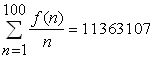.

Find 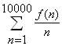.

Answer: b904a0b3d922e628a828e744ee7d3a60


Problem 304
===========


For any positive integer n the function next_prime(n) returns the smallest
prime p
such that p>n.

The sequence a(n) is defined by:
a(1)=next_prime(10^14) and a(n)=next_prime(a(n-1)) for n>1.

The fibonacci sequence f(n) is defined by:f(0)=0, f(1)=1 and
f(n)=f(n-1)+f(n-2) for n>1.

The sequence b(n) is defined as f(a(n)).

Find ∑b(n) for 1≤n≤100 000. Give your answer mod 1234567891011.


Answer: 499427a3e4bf9ad34a6df3056604b4c1


Problem 305
===========


Let's call S the (infinite) string that is made by concatenating the
consecutive positive integers (starting from 1) written down in base 10.
Thus, S = 1234567891011121314151617181920212223242...

It's easy to see that any number will show up an infinite number of times
in S.

Let's call f(n) the starting position of the nth occurrence of n in S.
For example, f(1)=1, f(5)=81, f(12)=271 and f(7780)=111111365.

Find ∑f(3^k) for 1≤k≤13.


Answer: 9def85298f598867d361e4afca8cdd96


Problem 306
===========


The following game is a classic example of Combinatorial Game Theory:

Two players start with a strip of n white squares and they take alternate turns.

On each turn, a player picks two contiguous white squares and paints them black.

The first player who cannot make a move loses.

* If n = 1, there are no valid moves, so the first player loses
  automatically.
* If n = 2, there is only one valid move, after which the second player
  loses.
* If n = 3, there are two valid moves, but both leave a situation where
  the second player loses.
* If n = 4, there are three valid moves for the first player; she can
  win the game by painting the two middle squares.
* If n = 5, there are four valid moves for the first player (shown below
  in red); but no matter what she does, the second player (blue) wins.

So, for 1 ≤ n ≤ 5, there are 3 values of n for which the first player can
force a win.
Similarly, for 1 ≤ n ≤ 50, there are 40 values of n for which the first
player can force a win.

For 1 ≤ n ≤ 1 000 000, how many values of n are there for which the first
player can force a win?


Answer: 394d602ba21e30693db90c9ecd4bd3a2


Problem 307
===========

k defects are randomly distributed amongst n integrated-circuit chips
produced by a factory (any number of defects may be found on a chip and
each defect is independent of the other defects).

Let p(k,n) represent the probability that there is a chip with at least 3
defects.
For instance p(3,7) ≈ 0.0204081633.

Find p(20 000, 1 000 000) and give your answer rounded to 10 decimal
places in the form 0.abcdefghij

Answer: 0c49094fa750365e13bb20ec4a158b6d


Problem 308
===========

A program written in the programming language Fractran consists of a list
of fractions.

The internal state of the Fractran Virtual Machine is a positive integer,
which is initially set to a seed value. Each iteration of a Fractran
program multiplies the state integer by the first fraction in the list
which will leave it an integer.

For example, one of the Fractran programs that John Horton Conway wrote
for prime-generation consists of the following 14 fractions:

17/91, 78/85, 19/51, 23/38, 29/33, 77/29, 95/23, 77/19, 1/17, 11/13, 13/11, 15/2, 1/7, 55/1

Starting with the seed integer 2, successive iterations of the program
produce the sequence:

15, 825, 725, 1925, 2275, 425, ..., 68, 4, 30, ..., 136, 8, 60, ..., 544,
32, 240, ...

The powers of 2 that appear in this sequence are 2^2, 2^3, 2^5, ...
It can be shown that all the powers of 2 in this sequence have prime
exponents and that all the primes appear as exponents of powers of 2, in
proper order!

If someone uses the above Fractran program to solve Project Euler Problem
7 (find the 10001st prime), how many iterations would be needed until the
program produces 2^10001st prime?

Answer: 43e736dfc6478a52653814248a71771d


Problem 309
===========

In the classic "Crossing Ladders" problem, we are given the lengths x and
y of two ladders resting on the opposite walls of a narrow, level street.
We are also given the height h above the street where the two ladders
cross and we are asked to find the width of the street (w).


Here, we are only concerned with instances where all four variables are
positive integers.
For example, if x = 70, y = 119 and h = 30, we can calculate that w = 56.

In fact, for integer values x, y, h and 0 < x < y < 200, there are only
five triplets (x,y,h) producing integer solutions for w:
(70, 119, 30), (74, 182, 21), (87, 105, 35), (100, 116, 35) and (119, 175,
40).

For integer values x, y, h and 0 < x < y < 1 000 000, how many triplets
(x,y,h) produce integer solutions for w?

Answer: 0875415a84bfe8bc237dcfc6b440d263


Problem 310
===========

Alice and Bob play the game Nim Square.

Nim Square is just like ordinary three-heap normal play Nim, but the
players may only remove a square number of stones from a heap.

The number of stones in the three heaps is represented by the ordered
triple (a,b,c).

If 0≤a≤b≤c≤29 then the number of losing positions for the next player is 1160.

Find the number of losing positions for the next player if 0≤a≤b≤c≤100 000.

Answer: 6b94f848996393eef163add4d17360c7

Problem 311
===========


ABCD is a convex, integer sided quadrilateral with 1 ≤ AB < BC < CD < AD.
BD has integer length. O is the midpoint of BD. AO has integer length.
We'll call ABCD a biclinic integral quadrilateral if AO = CO ≤ BO = DO.

For example, the following quadrilateral is a biclinic integral
quadrilateral:
AB = 19, BC = 29, CD = 37, AD = 43, BD = 48 and AO = CO = 23.


Let B(N) be the number of distinct biclinic integral quadrilaterals ABCD
that satisfy AB^2+BC^2+CD^2+AD^2 ≤ N.
We can verify that B(10 000) = 49 and B(1 000 000) = 38239.

Find B(10 000 000 000).

Answer: 36115d4f7dc07eea106d78e8431868e6


Problem 312
===========


A Sierpiński graph of order-1 (S[1]) is an equilateral triangle.
S[n+1] is obtained from S[n] by positioning three copies of S[n] so that
every pair of copies has one common corner.


Let C(n) be the number of cycles that pass exactly once through all the
vertices of S[n].
For example, C(3) = 8 because eight such cycles can be drawn on S[3], as
shown below:


It can also be verified that :
    C(1) = C(2) = 1
    C(5) = 71328803586048
    C(10 000) mod 10^8 = 37652224
    C(10 000) mod 13^8 = 617720485

Find C(C(C(10 000))) mod 13^8.

Answer: 535113d1a81f421fe814d48205dac570


Problem 313
===========


In a sliding game a counter may slide horizontally or vertically into an
empty space. The objective of the game is to move the red counter from the
top left corner of a grid to the bottom right corner; the space always
starts in the bottom right corner. For example, the following sequence of
pictures show how the game can be completed in five moves on a 2 by 2
grid.


Let S(m,n) represent the minimum number of moves to complete the game on
an m by n grid. For example, it can be verified that S(5,4) = 25.


There are exactly 5482 grids for which S(m,n) = p^2, where p < 100 is
prime.

How many grids does S(m,n) = p^2, where p < 10^6 is prime?

Answer: 2468d42fa1c7f61547ce71c9826218ea


Problem 314
===========

The moon has been opened up, and land can be obtained for free, but there
is a catch. You have to build a wall around the land that you stake out,
and building a wall on the moon is expensive. Every country has been
allotted a 500 m by 500 m square area, but they will possess only that
area which they wall in. 251001 posts have been placed in a rectangular
grid with 1 meter spacing. The wall must be a closed series of straight
lines, each line running from post to post.

The bigger countries of course have built a 2000 m wall enclosing the
entire 250 000 m^2 area. The [Duchy of Grand Fenwick](http://en.wikipedia.org/wiki/Grand_Fenwick), has a tighter
budget, and has asked you (their Royal Programmer) to compute what shape
would get best maximum enclosed-area/wall-length ratio.

You have done some preliminary calculations on a sheet of paper.For a 2000
meter wall enclosing the 250 000 m^2 area theenclosed-area/wall-length
ratio is 125.
Although not allowed , but to get an idea if this is anything better: if
you place a circle inside the square area touching the four sides the area
will be equal to π*250^2 m^2 and the perimeter will be π*500 m, so the
enclosed-area/wall-length ratio will also be 125.

However, if you cut off from the square four triangles with sides 75 m, 75
m and 75√2 m the total area becomes 238750 m^2 and the perimeter becomes
1400+300√2 m. So this gives an enclosed-area/wall-length ratio of 130.87,
which is significantly better.


Find the maximum enclosed-area/wall-length ratio.
Give your answer rounded to 8 places behind the decimal point in the form
abc.defghijk.

Answer: aa457cae6f67945d50683a85a9b70230


Problem 315
===========


Sam and Max are asked to transform two digital clocks into two "digital
root" clocks.
A digital root clock is a digital clock that calculates digital roots step
by step.

When a clock is fed a number, it will show it and then it will start the
calculation, showing all the intermediate values until it gets to the
result.
For example, if the clock is fed the number 137, it will show: "137" →
"11" → "2" and then it will go black, waiting for the next number.

Every digital number consists of some light segments: three horizontal
(top, middle, bottom) and four vertical (top-left, top-right, bottom-left,
bottom-right).
Number "1" is made of vertical top-right and bottom-right, number "4" is
made by middle horizontal and vertical top-left, top-right and
bottom-right. Number "8" lights them all.

The clocks consume energy only when segments are turned on/off.
To turn on a "2" will cost 5 transitions, while a "7" will cost only 4
transitions.

Sam and Max built two different clocks.

Sam's clock is fed e.g. number 137: the clock shows "137", then the panel
is turned off, then the next number ("11") is turned on, then the panel is
turned off again and finally the last number ("2") is turned on and, after
some time, off.
For the example, with number 137, Sam's clock requires:

    "137" : (2 + 5 + 4) × 2 = 22 transitions ("137" on/off).
    "11"  : (2 + 2) × 2 = 8 transitions ("11" on/off).
    "2"   : (5) × 2 = 10 transitions ("2" on/off).

For a grand total of 40 transitions.

Max's clock works differently. Instead of turning off the whole panel, it
is smart enough to turn off only those segments that won't be needed for
the next number.
For number 137, Max's clock requires:

            2 + 5 + 4 = 11 transitions ("137" on)
    "137" : 7 transitions (to turn off the segments that are not needed for
            number "11").
            0 transitions (number "11" is already turned on correctly)
    "11"  : 3 transitions (to turn off the first "1" and the bottom part of
            the second "1";
            the top part is common with number "2").
            4 tansitions (to turn on the remaining segments in order to get a
    "2"   : "2")
            5 transitions (to turn off number "2").

For a grand total of 30 transitions.

Of course, Max's clock consumes less power than Sam's one.
The two clocks are fed all the prime numbers between A = 10^7 and B =
2×10^7.
Find the difference between the total number of transitions needed by
Sam's clock and that needed by Max's one.

Answer: 79b587f9c25a72dbe95428e283628421


Problem 316
===========

Let p = p[1] p[2] p[3] ... be an infinite sequence of random digits,
selected from {0,1,2,3,4,5,6,7,8,9} with equal probability.
It can be seen that p corresponds to the real number 0.p[1] p[2] p[3] ....
It can also be seen that choosing a random real number from the interval
[0,1) is equivalent to choosing an infinite sequence of random digits
selected from {0,1,2,3,4,5,6,7,8,9} with equal probability.

For any positive integer n with d decimal digits, let k be the smallest
index such that
p[k, ]p[k+1], ...p[k+d-1] are the decimal digits of n, in the same order.
Also, let g(n) be the expected value of k; it can be proven that g(n) is
always finite and, interestingly, always an integer number.

For example, if n = 535, then
    for p = 31415926535897...., we get k = 9
    for p = 355287143650049560000490848764084685354..., we get k = 36
etc and we find that g(535) = 1008.

Given that 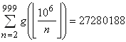, find 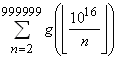

Note:  represents the floor function.

Answer: 2495e8f6e9d4cdadbf0411144e7180b9


Problem 317
===========


A firecracker explodes at a height of 100 m above level ground. It breaks
into a large number of very small fragments, which move in every
direction; all of them have the same initial velocity of 20 m/s.

We assume that the fragments move without air resistance, in a uniform
gravitational field with g=9.81 m/s^2.

Find the volume (in m^3) of the region through which the fragments move
before reaching the ground. Give your answer rounded to four decimal
places.


Answer: b0e2bec93bfe598ade5d3d1141f76bdd


Problem 318
===========


Consider the real number √2+√3.
When we calculate the even powers of √2+√3we get:
    (√2+√3)^2 = 9.898979485566356...
    (√2+√3)^4 = 97.98979485566356...
    (√2+√3)^6 = 969.998969071069263...
    (√2+√3)^8 = 9601.99989585502907...
    (√2+√3)^10 = 95049.999989479221...
    (√2+√3)^12 = 940897.9999989371855...
    (√2+√3)^14 = 9313929.99999989263...
    (√2+√3)^16 = 92198401.99999998915...

It looks like that the number of consecutive nines at the beginning of the
fractional part of these powers is non-decreasing.
In fact it can be proven that the fractional part of (√2+√3)^2n approaches
1 for large n.

Consider all real numbers of the form √p+√q with p and q positive integers
and p<q, such that the fractional part of (√p+√q)^2n approaches 1 for
large n.

Let C(p,q,n) be the number of consecutive nines at the beginning of the
fractional part of
(√p+√q)^2n.

Let N(p,q) be the minimal value of n such that C(p,q,n) ≥ 2011.

Find ∑N(p,q) for p+q ≤ 2011.


Answer: de358f1c4d6e30c1a4f82c8bc5cedf2d


Problem 319
===========

Let x[1], x[2],..., x[n] be a sequence of length n such that:

* x[1] = 2
* for all 1 < i ≤ n : x[i-1] < x[i]
* for all i and j with 1 ≤ i, j ≤ n : (x[i]) ^ j < (x[j] + 1)^i

There are only five such sequences of length 2, namely:{2,4}, {2,5},
{2,6}, {2,7} and {2,8}.
There are 293 such sequences of length 5; three examples are given below:
{2,5,11,25,55}, {2,6,14,36,88}, {2,8,22,64,181}.

Let t(n) denote the number of such sequences of length n.
You are given that t(10) = 86195 and t(20) = 5227991891.

Find t(10^10) and give your answer modulo 10^9.


Answer: d346ab7d128ee0402820edf5fe4aed30


Problem 320
===========

Let N(i) be the smallest integer n such that n! is divisible by
(i!)^1234567890

Let S(u)=∑N(i) for 10 ≤ i ≤ u.

S(1000)=614538266565663.

Find S(1 000 000) mod 10^18.

Answer: 8426f939c3ee410a8c4d43886ef77ccb


Problem 321
===========


A horizontal row comprising of 2n + 1 squares has n red counters placed at
one end and n blue counters at the other end, being separated by a single
empty square in the centre. For example, when n = 3.


A counter can move from one square to the next (slide) or can jump over
another counter (hop) as long as the square next to that counter is
unoccupied.


Let M(n) represent the minimum number of moves/actions to completely
reverse the positions of the coloured counters; that is, move all the red
counters to the right and all the blue counters to the left.

It can be verified M(3) = 15, which also happens to be a triangle number.

If we create a sequence based on the values of n for which M(n) is a
triangle number then the first five terms would be:
1, 3, 10, 22, and 63, and their sum would be 99.

Find the sum of the first forty terms of this sequence.

Answer: 6d87412130312b01a999225a5fe689b1


Problem 322
===========


Let T(m, n) be the number of the binomial coefficients iC[n] that are
divisible by 10 for n ≤ i < m(i, m and n are positive integers).
You are given that T(10^9, 10^7-10) = 989697000.

Find T(10^18, 10^12-10).

Answer: a75af9d717fa592487fb45e7552204a8


Problem 323
===========


Let y[0], y[1], y[2],... be a sequence of random unsigned 32 bit integers
(i.e. 0 ≤ y[i] < 2^32, every value equally likely).

For the sequence x[i] the following recursion is given:

     • x[0] = 0 and
     • x[i] = x[i-1] | y[i-1], for i > 0. ( | is the bitwise-OR operator)

It can be seen that eventually there will be an index N such that x[i] =
2^32 -1 (a bit-pattern of all ones) for all i ≥ N.

Find the expected value of N.
Give your answer rounded to 10 digits after the decimal point.


Answer: c8f8a7ab17a87f1b17a1f4a86c984ea7


Problem 324
===========

Let f(n) represent the number of ways one can fill a 3×3×n tower with
blocks of 2×1×1.
You're allowed to rotate the blocks in any way you like; however,
rotations, reflections etc of the tower itself are counted as distinct.

For example (with q = 100000007):

    f(2) = 229,
    f(4) = 117805,
    f(10) mod q = 96149360,
    f(10^3) mod q = 24806056,
    f(10^6) mod q = 30808124.

Find f(10^10000) mod 100000007.


Answer: b8d91b06d43a2ef98a6fcb0be4a6d617


Problem 325
===========


A game is played with two piles of stones and two players. At her turn, a
player removes a number of stones from the larger pile. The number of
stones she removes must be a positive multiple of the number of stones in
the smaller pile.

E.g., let the ordered pair(6,14) describe a configuration with 6 stones in
the smaller pile and 14 stones in the larger pile, then the first player
can remove 6 or 12 stones from the larger pile.

The player taking all the stones from a pile wins the game.

A winning configuration is one where the first player can force a win. For
example, (1,5), (2,6) and (3,12) are winning configurations because the
first player can immediately remove all stones in the second pile.

A losing configuration is one where the second player can force a win, no
matter what the first player does. For example, (2,3) and (3,4) are losing
configurations: any legal move leaves a winning configuration for the
second player.

Define S(N) as the sum of (x[i]+y[i]) for all losing configurations
(x[i],y[i]), 0 < x[i] < y[i] ≤ N. We can verify that S(10) = 211 and
S(10^4) = 230312207313.

Find S(10^16) mod 7^10.

Answer: 5b1ce9ac67e0ad6690c728ccba6f0070


Problem 326
===========

Let a[n] be a sequence recursively defined by:


So the first 10 elements of a[n] are: 1,1,0,3,0,3,5,4,1,9.

Let f(N,M) represent the number of pairs (p,q) such that:


It can be seen that f(10,10)=4 with the pairs (3,3), (5,5), (7,9) and
(9,10).

You are also given that f(10^4,10^3)=97158.

Find f(10^12,10^6).

Answer: d95dff1a5ceee0064993d98defdd603e


Problem 327
===========


A series of three rooms are connected to each other by automatic doors.


Each door is operated by a security card. Once you enter a room the door
automatically closes and that security card cannot be used again. A
machine at the start will dispense an unlimited number of cards, but each
room (including the starting room) contains scanners and if they detect
that you are holding more than three security cards or if they detect an
unattended security card on the floor, then all the doors will become
permanently locked. However, each room contains a box where you may safely
store any number of security cards for use at a later stage.

If you simply tried to travel through the rooms one at a time then as you
entered room 3 you would have used all three cards and would be trapped in
that room forever!

However, if you make use of the storage boxes, then escape is possible.
For example, you could enter room 1 using your first card, place one card
in the storage box, and use your third card to exit the room back to the
start. Then after collecting three more cards from the dispensing machine
you could use one to enter room 1 and collect the card you placed in the
box a moment ago. You now have three cards again and will be able to
travel through the remaining three doors. This method allows you to travel
through all three rooms using six security cards in total.

It is possible to travel through six rooms using a total of 123 security
cards while carrying a maximum of 3 cards.

Let C be the maximum number of cards which can be carried at any time.

Let R be the number of rooms to travel through.

Let M(C,R) be the minimum number of cards required from the dispensing
machine to travel through R rooms carrying up to a maximum of C cards at
any time.

For example, M(3,6)=123 and M(4,6)=23.
And, ΣM(C,6)=146 for 3 ≤ C ≤ 4.

You are given that ΣM(C,10)=10382 for 3 ≤ C ≤ 10.

Find ΣM(C,30) for 3 ≤ C ≤ 40.

Answer: 2cd4c0ad8a00c5be99802188ee2628fb


Problem 328
===========


We are trying to find a hidden number selected from the set of integers
{1, 2, ..., n} by asking questions. Each number (question) we ask, has a
cost equal to the number asked and we get one of three possible answers:

* "Your guess is lower than the hidden number", or
* "Yes, that's it!", or
* "Your guess is higher than the hidden number".

Given the value of n, an optimal strategy minimizes the total cost (i.e.
the sum of all the questions asked) for the worst possible case. E.g.

If n=3, the best we can do is obviously to ask the number "2". The answer
will immediately lead us to find the hidden number (at a total cost = 2).

If n=8, we might decide to use a "binary search" type of strategy: Our
first question would be "4" and if the hidden number is higher than 4 we
will need one or two additional questions.
Let our second question be "6". If the hidden number is still higher than
6, we will need a third question in order to discriminate between 7 and 8.
Thus, our third question will be "7" and the total cost for this
worst-case scenario will be 4+6+7=17.

We can improve considerably the worst-case cost for n=8, by asking "5" as
our first question.
If we are told that the hidden number is higher than 5, our second
question will be "7", then we'll know for certain what the hidden number
is (for a total cost of 5+7=12).
If we are told that the hidden number is lower than 5, our second question
will be "3" and if the hidden number is lower than 3 our third question
will be "1", giving a total cost of 5+3+1=9.
Since 12>9, the worst-case cost for this strategy is 12. That's better
than what we achieved previously with the "binary search" strategy; it is
also better than or equal to any other strategy.
So, in fact, we have just described an optimal strategy for n=8.

Let C(n) be the worst-case cost achieved by an optimal strategy for n, as
described above.
Thus C(1) = 0, C(2) = 1, C(3) = 2 and C(8) = 12.
Similarly, C(100) = 400 and 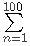C(n) = 17575.

Find 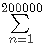C(n).

Answer: 92a3220ad5b17a562c039e6e93d6df90


Problem 329
===========

Susan has a prime frog.

Her frog is jumping around over 500 squares numbered 1 to 500.He can only
jump one square to the left or to the right, with equal probability, and
he cannot jump outside the range [1;500].
(if it lands at either end, it automatically jumps to the only available
square on the next move.)

When he is on a square with a prime number on it, he croaks 'P' (PRIME)
with probability 2/3 or 'N' (NOT PRIME) with probability 1/3 just before
jumping to the next square.
When he is on a square with a number on it that is not a prime he croaks
'P' with probability 1/3 or 'N' with probability 2/3 just before jumping
to the next square.

Given that the frog's starting position is random with the same
probability for every square, and given that she listens to his first 15
croaks, what is the probability that she hears the sequence
PPPPNNPPPNPPNPN?

Give your answer as a fraction p/q in reduced form.

Answer: e392a8b1b053c83e68663e08456bb392


Problem 330
===========

An infinite sequence of real numbers a(n) is defined for all integers n as
follows:


For example,

    a(0) = 1  + 1  + 1  + ... = e − 1
           1!   2!   3!

    a(1) = e − 1 + 1  + 1  + ... = 2e − 3
           1!      2!   3!

    a(2) = 2e − 3 + e − 1 + 1  + ... = 7 e − 6
           1!       2!      3!         2

with e = 2.7182818... being Euler's constant.

   It can be shown that a(n) is of the form (A(n) e + B(n))/(n!) for integers A(n) and B(n).
                                                  
For example:
   
    a(10) = _328161643 e − 652694486_.
                      10!

Find A(10^9) + B(10^9) and give your answer mod 77 777 777.

Answer: d385d3fe0995b48a782a91477525b154


Problem 331
===========


N×N disks are placed on a square game board. Each disk has a black side
and white side.

At each turn, you may choose a disk and flip all the disks in the same row
and the same column as this disk: thus 2×N-1 disks are flipped. The game
ends when all disks show their white side. The following example shows a
game on a 5×5 board.

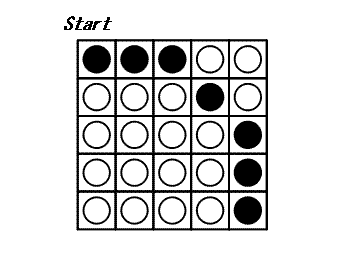

It can be proven that 3 is the minimal number of turns to finish this
game.

The bottom left disk on the N×N board has coordinates (0,0);
the bottom right disk has coordinates (N-1,0) and the top left disk has
coordinates (0,N-1).

Let C[N] be the following configuration of a board with N×N disks:
A disk at (x,y) satisfying , shows its black side; otherwise, it shows its
white side. C[5] is shown above.

Let T(N) be the minimal number of turns to finish a game starting from
configuration C[N] or 0 if configuration C[N] is unsolvable.
We have shown that T(5)=3. You are also given that T(10)=29 and T(1
000)=395253.

Find .

Answer: b609ccc578e71db9de0524fff94e1b70


Problem 332
===========

A spherical triangle is a figure formed on the surface of a sphere by
three great circular arcs intersecting pairwise in three vertices.


Let C(r) be the sphere with the centre (0,0,0) and radius r.
Let Z(r) be the set of points on the surface of C(r) with integer
coordinates.
Let T(r) be the set of spherical triangles with vertices in
Z(r).Degenerate spherical triangles, formed by three points on the same
great arc, are not included in T(r).
Let A(r) be the area of the smallest spherical triangle in T(r).

For example A(14) is 3.294040 rounded to six decimal places.

Find 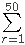A(r). Give your answer rounded to six decimal places.

Answer: c2ae53ebfb15db373cfe5d71078ea1ca


Problem 333
===========


All positive integers can be partitioned in such a way that each and every
term of the partition can be expressed as 2^ix3^j, where i,j ≥ 0.

Let's consider only those such partitions where none of the terms can
divide any of the other terms.
For example, the partition of 17 = 2 + 6 + 9 = (2^1x3^0 + 2^1x3^1 +
2^0x3^2) would not be valid since 2 can divide 6. Neither would the
partition 17 = 16 + 1 = (2^4x3^0 + 2^0x3^0) since 1 can divide 16. The
only valid partition of 17 would be 8 + 9 = (2^3x3^0 + 2^0x3^2).

Many integers have more than one valid partition, the first being 11
having the following two partitions.

    11 = 2 + 9 = (2^1x3^0 + 2^0x3^2)
    11 = 8 + 3 = (2^3x3^0 + 2^0x3^1)

Let's define P(n) as the number of valid partitions of n. For example,
P(11) = 2.

Let's consider only the prime integers q which would have a single valid
partition such as P(17).

The sum of the primes q <100 such that P(q)=1 equals 233.

Find the sum of the primes q <1000000 such that P(q)=1.

Answer: 8408ff3a470a94dbfca1819249eb547d


Problem 334
===========


In Plato's heaven, there exist an infinite number of bowls in a straight
line.
Each bowl either contains some or none of a finite number of beans.
A child plays a game, which allows only one kind of move: removing two
beans from any bowl, and putting one in each of the two adjacent bowls.
The game ends when each bowl contains either one or no beans.

For example, consider two adjacent bowls containing 2 and 3 beans
respectively, all other bowls being empty. The following eight moves will
finish the game:


You are given the following sequences:

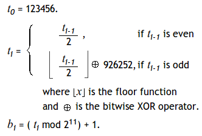

The first two terms of the last sequence are b[1] = 289 and b[2] = 145.
If we start with b[1] and b[2] beans in two adjacent bowls, 3419100 moves
would be required to finish the game.

Consider now 1500 adjacent bowls containing b[1], b[2],..., b[1500] beans
respectively, all other bowls being empty. Find how many moves it takes
before the game ends.

Answer: 71851da3058acf6b74e90251bdf4aa8f


Problem 335
===========


Whenever Peter feels bored, he places some bowls, containing one bean
each, in a circle. After this, he takes all the beans out of a certain
bowl and drops them one by one in the bowls going clockwise. He repeats
this, starting from the bowl he dropped the last bean in, until the
initial situation appears again. For example with 5 bowls he acts as
follows:


So with 5 bowls it takes Peter 15 moves to return to the initial
situation.

Let M(x) represent the number of moves required to return to the initial
situation, starting with x bowls. Thus, M(5) = 15. It can also be verified
that M(100) = 10920.

Find 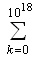M(2^k+1). Give your answer modulo 7^9.

Answer: 9a519cfa0ebdd4d1dd318f14b5799eea


Problem 336
===========


A train is used to transport four carriages in the order: ABCD. However,
sometimes when the train arrives to collect the carriages they are not in
the correct order.
To rearrange the carriages they are all shunted on to a large rotating
turntable. After the carriages are uncoupled at a specific point the train
moves off the turntable pulling the carriages still attached with it. The
remaining carriages are rotated 180 degrees. All of the carriages are then
rejoined and this process is repeated as often as necessary in order to
obtain the least number of uses of the turntable.
Some arrangements, such as ADCB, can be solved easily: the carriages are
separated between A and D, and after DCB are rotated the correct order has
been achieved.

However, Simple Simon, the train driver, is not known for his efficiency,
so he always solves the problem by initially getting carriage A in the
correct place, then carriage B, and so on.

Using four carriages, the worst possible arrangements for Simon, which we
shall call maximix arrangements, are DACB and DBAC; each requiring him
five rotations (although, using the most efficient approach, they could be
solved using just three rotations). The process he uses for DACB is shown
below.


It can be verified that there are 24 maximix arrangements for six
carriages, of which the tenth lexicographic maximix arrangement is DFAECB.

Find the 2011th lexicographic maximix arrangement for eleven carriages.


Answer: 7968e48fc692ce25bf7f5494f4ab6814


Problem 337
===========


Let {a[1], a[2],..., a[n]} be an integer sequence of length n such that:

     • a[1] = 6
     • for all 1 ≤ i < n : φ(a[i]) < φ(a[i+1]) < a[i] < a[i+1] ^1

Let S(N) be the number of such sequences with a[n] ≤ N.
For example, S(10) = 4: {6}, {6, 8}, {6, 8, 9} and {6, 10}.
We can verify that S(100) = 482073668 and S(10 000) mod 10^8 = 73808307.

Find S(20 000 000) mod 10^8.

φ denotes Euler's totient function.

Answer: a60bbbe1b90254043fb92820492a2f96


Problem 338
===========

A rectangular sheet of grid paper with integer dimensions w × h is given.
Its grid spacing is 1.
When we cut the sheet along the grid lines into two pieces and rearrange
those pieces without overlap, we can make new rectangles with different
dimensions.

For example, from a sheet with dimensions 9 × 4 , we can make rectangles
with dimensions 18 × 2, 12 × 3 and 6 × 6 by cutting and rearranging as
below:

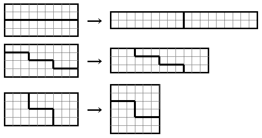

Similarly, from a sheet with dimensions 9 × 8 , we can make rectangles
with dimensions 18 × 4 and 12 × 6 .

For a pair w and h, let F(w,h) be the number of distinct rectangles that
can be made from a sheet with dimensions w × h .
For example, F(2,1) = 0, F(2,2) = 1, F(9,4) = 3 and F(9,8) = 2.
Note that rectangles congruent to the initial one are not counted in
F(w,h).
Note also that rectangles with dimensions w × h and dimensions h × w are
not considered distinct.

For an integer N, let G(N) be the sum of F(w,h) for all pairs w and h
which satisfy 0 < h ≤ w ≤ N.
We can verify that G(10) = 55, G(10^3) = 971745 and G(10^5) = 9992617687.

Find G(10^12). Give your answer modulo 10^8.

Answer: 99f4f702713f3422ced01dd7d3d79644


Problem 339
===========

"And he came towards a valley, through which ran a river; and the borders
of the valley were wooded, and on each side of the river were level
meadows. And on one side of the river he saw a flock of white sheep, and
on the other a flock of black sheep. And whenever one of the white sheep
bleated, one of the black sheep would cross over and become white; and
when one of the black sheep bleated, one of the white sheep would cross
over and become black."

[en.wikisource.org](http://en.wikisource.org/wiki/The_Mabinogion/Peredur_the_Son_of_Evrawc)

Initially each flock consists of n sheep. Each sheep (regardless of
colour) is equally likely to be the next sheep to bleat. After a sheep has
bleated and a sheep from the other flock has crossed over, Peredur may
remove a number of white sheep in order to maximize the expected final
number of black sheep. Let E(n) be the expected final number of black
sheep if Peredur uses an optimal strategy.

You are given that E(5) = 6.871346 rounded to 6 places behind the decimal
point. Find E(10 000) and give your answer rounded to 6 places behind the decimal point.

Answer: 0be02210b2d2212d37d026478093c457


Problem 340
===========


For fixed integers a, b, c, define the crazy function F(n) as follows:
    F(n) = n - c for all n > b
    F(n) = F(a + F(a + F(a + F(a + n)))) for all n ≤ b.

Also, define S(a, b, c) = .

For example, if a = 50, b = 2000 and c = 40, then F(0) = 3240 and F(2000)
= 2040.
Also, S(50, 2000, 40) = 5204240.

Find the last 9 digits of S(21^7, 7^21, 12^7).

Answer: fc838afe9ecde39bbe230923d7b50775


Problem 341
===========


The Golomb's self-describing sequence {G(n)} is the only nondecreasing
sequence of natural numbers such that n appears exactly G(n) times in the
sequence. The values of G(n) for the first few n are

	   n     1  2  3  4  5  6  7  8  9  10  11  12  13  14  15  …
	   G(n)  1  2  2  3  3  4  4  4  5  5   5   6   6   6   6   …

You are given that G(10^3) = 86, G(10^6) = 6137.
You are also given that ΣG(n^3) = 153506976 for 1 ≤ n < 10^3.

Find ΣG(n^3) for 1 ≤ n < 10^6.


Answer: 7c163c3b4886943667b5c89db0a6cd02


Problem 342
===========


Consider the number 50.
50^2 = 2500 = 2^2 × 5^4, so φ(2500) = 2 × 4 × 5^3 = 8 × 5^3 = 2^3 × 5^3.
So 2500 is a square and φ(2500) is a cube.

Find the sum of all numbers n, 1 < n < 10^10 such that φ(n^2) is a cube.

φ denotes Euler's totient function.

Answer: 0e9add0383d4116c7c5cb3dc73fc0536


Problem 343
===========


For any positive integer k, a finite sequence a[i] of fractions x[i]/y[i]
is defined by:

    a[1] = 1/k and
    a[i] = (x[i-1]+1)/(y[i-1]-1) reduced to lowest terms for i>1.

When a[i] reaches some integer n, the sequence stops. (That is, when y[i]=1.)

Define f(k) = n.
For example, for k = 20:

1/20 → 2/19 → 3/18 = 1/6 → 2/5 → 3/4 → 4/3 → 5/2 → 6/1 = 6

So f(20) = 6.

Also f(1) = 1, f(2) = 2, f(3) = 1 and Σf(k^3) = 118937 for 1 ≤ k ≤ 100.

Find Σf(k^3) for 1 ≤ k ≤ 2×10^6.

Answer: 0e10bd111425ad8e1343ac79dac7bb0e


Problem 344
===========


One variant of N.G. de Bruijn's silver dollar game can be described as
follows:

On a strip of squares a number of coins are placed, at most one coin per
square. Only one coin, called the silver dollar, has any value. Two
players take turns making moves. At each turn a player must make either a
regular or a special move.

A regular move consists of selecting one coin and moving it one or more
squares to the left. The coin cannot move out of the strip or jump on or
over another coin.

Alternatively, the player can choose to make the special move of pocketing
the leftmost coin rather than making a regular move. If no regular moves
are possible, the player is forced to pocket the leftmost coin.

The winner is the player who pockets the silver dollar.


A winning configuration is an arrangement of coins on the strip where the
first player can force a win no matter what the second player does.

Let W(n,c) be the number of winning configurations for a strip of n
squares, c worthless coins and one silver dollar.

You are given that W(10,2) = 324 and W(100,10) = 1514704946113500.

Find W(1 000 000, 100) modulo the semiprime 1000 036 000 099 (= 1 000 003 · 1 000 033).

Answer: 38e7b980b38fcac89b3e267e328cd292


Problem 345
===========


We define the Matrix Sum of a matrix as the maximum sum of matrix elements
with each element being the only one in his row and column. For example,
the Matrix Sum of the matrix below equals 3315 ( = 863 + 383 + 343 + 959 +
767):

	    7  53 183 439 863
	  497 383 563  79 973
	  287  63 343 169 583
	  627 343 773 959 943
	  767 473 103 699 303

Find the Matrix Sum of:

	    7  53 183 439 863 497 383 563  79 973 287  63 343 169 583
	  627 343 773 959 943 767 473 103 699 303 957 703 583 639 913
	  447 283 463  29  23 487 463 993 119 883 327 493 423 159 743
	  217 623   3 399 853 407 103 983  89 463 290 516 212 462 350
	  960 376 682 962 300 780 486 502 912 800 250 346 172 812 350
	  870 456 192 162 593 473 915  45 989 873 823 965 425 329 803
	  973 965 905 919 133 673 665 235 509 613 673 815 165 992 326
	  322 148 972 962 286 255 941 541 265 323 925 281 601  95 973
	  445 721  11 525 473  65 511 164 138 672  18 428 154 448 848
	  414 456 310 312 798 104 566 520 302 248 694 976 430 392 198
	  184 829 373 181 631 101 969 613 840 740 778 458 284 760 390
	  821 461 843 513  17 901 711 993 293 157 274  94 192 156 574
	   34 124   4 878 450 476 712 914 838 669 875 299 823 329 699
	  815 559 813 459 522 788 168 586 966 232 308 833 251 631 107
	  813 883 451 509 615  77 281 613 459 205 380 274 302  35 805


Answer: cf3b784c8593890043b17e24088125d4


Problem 346
===========


The number 7 is special, because 7 is 111 written in base 2, and 11
written in base 6
(i.e. 7[10] = 11[6] = 111[2]). In other words, 7 is a repunit in at least
two bases b > 1.

We shall call a positive integer with this property a strong repunit. It
can be verified that there are 8 strong repunits below 50:
{1,7,13,15,21,31,40,43}.
Furthermore, the sum of all strong repunits below 1000 equals 15864.

Find the sum of all strong repunits below 10^12.

Answer: a17874b5a9ec9d7fc8c6489ab8ff29b9


Problem 347
===========


The largest integer ≤ 100 that is only divisible by both the primes 2 and
3 is 96, as 96=32*3=2^5*3.For two distinct primes p and q let M(p,q,N) be
the largest positive integer ≤N only divisibleby both p and q and
M(p,q,N)=0 if such a positive integer does not exist.

E.g. M(2,3,100)=96.
M(3,5,100)=75 and not 90 because 90 is divisible by 2 ,3 and 5.
Also M(2,73,100)=0 because there does not exist a positive integer ≤ 100
that is divisible by both 2 and 73.

Let S(N) be the sum of all distinct M(p,q,N).S(100)=2262.

Find S(10 000 000).

Answer: 96ce0eabcbe7a2b2eb1197a1bcc5d37b


Problem 348
===========


Many numbers can be expressed as the sum of a square and a cube. Some of
them in more than one way.

Consider the palindromic numbers that can be expressed as the sum of a
square and a cube, both greater than 1, in exactly 4 different ways.
For example, 5229225 is a palindromic number and it can be expressed in
exactly 4 different ways:

    2285^2 + 20^3
    2223^2 + 66^3
    1810^2 + 125^3
    1197^2 + 156^3

Find the sum of the five smallest such palindromic numbers.

Answer: f286f9159fc20aeb97a8bf8396ba64de


Problem 349
===========


An ant moves on a regular grid of squares that are coloured either black
or white.
The ant is always oriented in one of the cardinal directions (left, right,
up or down) and moves from square to adjacent square according to the
following rules:
* if it is on a black square, it flips the color of the square to white,
rotates 90 degrees counterclockwise and moves forward one square.
*  if it is on a white square, it flips the color of the square to black,
rotates 90 degrees clockwise and moves forward one square.

Starting with a grid that is entirely white, how many squares are black
after 10^18 moves of the ant?


Answer: 412b0faec10b3adb415363d2df26530d


Problem 350
===========


A list of size n is a sequence of n natural numbers.
Examples are (2,4,6), (2,6,4), (10,6,15,6), and (11).

The greatest common divisor, or gcd, of a list is the largest natural
number that divides all entries of the list.
Examples: gcd(2,6,4) = 2, gcd(10,6,15,6) = 1 and gcd(11) = 11.

The least common multiple, or lcm, of a list is the smallest natural
number divisible by each entry of the list.
Examples: lcm(2,6,4) = 12, lcm(10,6,15,6) = 30 and lcm(11) = 11.

Let f(G, L, N) be the number of lists of size N with gcd ≥ G and lcm ≤ L.
For example:

f(10, 100, 1) = 91.
f(10, 100, 2) = 327.
f(10, 100, 3) = 1135.
f(10, 100, 1000) mod 101^4 = 3286053.

Find f(10^6, 10^12, 10^18) mod 101^4.

Answer: cad3ce6a252568bbcb41ca627d7e58ae


Problem 351
===========

A hexagonal orchard of order n is a triangular lattice made up of points
within a regular hexagon with side n. The following is an example of a
hexagonal orchard of order 5:

Highlighted in green are the points which are hidden from the center by a
point closer to it. It can be seen that for a hexagonal orchard of order
5, 30 points are hidden from the center.

Let H(n) be the number of points hidden from the center in a hexagonal
orchard of order n.

H(5) = 30. H(10) = 138. H(1 000) = 1177848.

Find H(100 000 000).


Answer: 338481092e945257756075a8d03978fd

Problem 352
===========


   Each one of the 25 sheep in a flock must be tested for a rare virus, known
   to affect 2% of the sheep population.An accurate and extremely sensitive
   PCR test exists for blood samples, producing a clear positive / negative
   result, but it is very time-consuming and expensive.

   Because of the high cost, the vet-in-charge suggests that instead of
   performing 25 separate tests, the following procedure can be used instead:

   The sheep are split into 5 groups of 5 sheep in each group. For each
   group, the 5 samples are mixed together and a single test is performed.
   Then,

     • If the result is negative, all the sheep in that group are deemed to
       be virus-free.
     • If the result is positive, 5 additional tests will be performed (a
       separate test for each animal) to determine the affected
       individual(s).

   Since the probability of infection for any specific animal is only 0.02,
   the first test (on the pooled samples) for each group will be:

     • Negative (and no more tests needed) with probability 0.98^5 =
       0.9039207968.
     • Positive (5 additional tests needed) with probability 1 - 0.9039207968
       = 0.0960792032.

   Thus, the expected number of tests for each group is 1 + 0.0960792032 × 5
   = 1.480396016.
   Consequently, all 5 groups can be screened using an average of only
   1.480396016 × 5 = 7.40198008 tests, which represents a huge saving of more
   than 70% !

   Although the scheme we have just described seems to be very efficient, it
   can still be improved considerably (always assuming that the test is
   sufficiently sensitive and that there are no adverse effects caused by
   mixing different samples). E.g.:

     • We may start by running a test on a mixture of all the 25 samples. It
       can be verified that in about 60.35% of the cases this test will be
       negative, thus no more tests will be needed. Further testing will only
       be required for the remaining 39.65% of the cases.
     • If we know that at least one animal in a group of 5 is infected and
       the first 4 individual tests come out negative, there is no need to
       run a test on the fifth animal (we know that it must be infected).
     • We can try a different number of groups / different number of animals
       in each group, adjusting those numbers at each level so that the total
       expected number of tests will be minimised.

   To simplify the very wide range of possibilities, there is one restriction
   we place when devising the most cost-efficient testing scheme: whenever we
   start with a mixed sample, all the sheep contributing to that sample must
   be fully screened (i.e. a verdict of infected / virus-free must be reached
   for all of them) before we start examining any other animals.

   For the current example, it turns out that the most cost-efficient testing
   scheme (we'll call it the optimal strategy) requires an average of just
   4.155452 tests!

   Using the optimal strategy, let T(s,p) represent the average number of
   tests needed to screen a flock of s sheep for a virus having probability p
   to be present in any individual.
   Thus, rounded to six decimal places, T(25, 0.02) = 4.155452 and T(25,
   0.10) = 12.702124.

   Find ΣT(10000, p) for p=0.01, 0.02, 0.03, ... 0.50.
   Give your answer rounded to six decimal places.

   
   Answer: 2e74b2fb574d6318cdbf2a41ad006de7


Problem 353
===========


   A moon could be described by the sphere C(r) with centre (0,0,0) and
   radius r.

   There are stations on the moon at the points on the surface of C(r) with
   integer coordinates. The station at (0,0,r) is called North Pole station,
   the station at (0,0,-r) is called South Pole station.

   All stations are connected with each other via the shortest road on the
   great arc through the stations. A journey between two stations is risky.
   If d is the length of the road between two stations, (d/(π r))^2 is a
   measure for the risk of the journey (let us call it the risk of the road).
   If the journey includes more than two stations, the risk of the journey is
   the sum of risks of the used roads.

   A direct journey from the North Pole station to the South Pole station has
   the length πr and risk 1. The journey from the North Pole station to the
   South Pole station via (0,r,0) has the same length, but a smaller risk:
   (½πr/(πr))^2+(½πr/(πr))^2=0.5.

   The minimal risk of a journey from the North Pole station to the South
   Pole station on C(r) is M(r).

   You are given that M(7)=0.1784943998 rounded to 10 digits behind the
   decimal point.

   Find ∑M(2^n-1) for 1≤n≤15.

   Give your answer rounded to 10 digits behind the decimal point in the form
   a.bcdefghijk.

   
   Answer: 211b5626459be71baefc78478d18bdc3


Problem 354
===========

Consider a honey bee's honeycomb where each cell is a perfect regular
hexagon with side length 1.

One particular cell is occupied by the queen bee.
For a positive real number L, let B(L) count the cells with distance L
from the queen bee cell (all distances are measured from centre to
centre); you may assume that the honeycomb is large enough to accommodate
for any distance we wish to consider.
For example, B(√3) = 6, B(√21) = 12 and B(111 111 111) = 54.

Find the number of L ≤ 5·10^11 such that B(L) = 450.

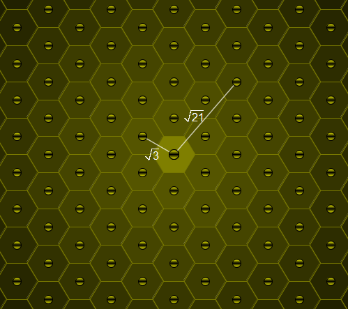

Answer: e36240897614dc46e83405ae8cdf198c


Problem 355
===========


   Define Co(n) to be the maximal possible sum of a set of mutually co-prime
   elements from {1, 2, ..., n}.
   For example Co(10) is 30 and hits that maximum on the subset
   {1, 5, 7, 8, 9}.

   You are given that Co(30) = 193 and Co(100) = 1356.

   Find Co(200000).

   
   Answer: 41cb97b6d02878d79f8b2e3b6c74920a


Problem 356
===========


   Let a[n] be the largest real root of a polynomial g(x) = x^3 - 2^n·x^2 +
   n.
   For example, a[2] = 3.86619826...

   Find the last eight digits of .

   Note: 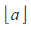 represents the floor function.

   Answer: ab2104e80fa7da630ce7fd835d8006ee


Problem 357
===========


   Consider the divisors of 30: 1,2,3,5,6,10,15,30.
   It can be seen that for every divisor d of 30, d+30/d is prime.

   Find the sum of all positive integers n not exceeding 100 000 000
   such thatfor every divisor d of n, d+n/d is prime.

   
   Answer: ed25b13b18a21c1077fed00ef42f503b


Problem 358
===========

A cyclic number with n digits has a very interesting property:
When it is multiplied by 1, 2, 3, 4, ... n, all the products have exactly
the same digits, in the same order, but rotated in a circular fashion!

The smallest cyclic number is the 6-digit number 142857:

    142857 × 1 = 142857
    142857 × 2 = 285714
    142857 × 3 = 428571
    142857 × 4 = 571428
    142857 × 5 = 714285
    142857 × 6 = 857142

The next cyclic number is 0588235294117647 with 16 digits:
   
    0588235294117647 × 1 = 0588235294117647
    0588235294117647 × 2 = 1176470588235294
    0588235294117647 × 3 = 1764705882352941
    ...
    0588235294117647 × 16 = 9411764705882352

Note that for cyclic numbers, leading zeros are important.

There is only one cyclic number for which, the eleven leftmost digits are
00000000137 and the five rightmost digits are 56789 (i.e., it has the form
00000000137...56789 with an unknown number of digits in the middle). Find
the sum of all its digits.


Answer: 359e1ec8aeaa3932b54f2a5d20fa4f73


Problem 359
===========


An infinite number of people (numbered 1, 2, 3, etc.) are lined up to get
a room at Hilbert's newest infinite hotel. The hotel contains an infinite
number of floors (numbered 1, 2, 3, etc.), and each floor contains an
infinite number of rooms (numbered 1, 2, 3, etc.).

Initially the hotel is empty. Hilbert declares a rule on how the nth
person is assigned a room: person n gets the first vacant room in the
lowest numbered floor satisfying either of the following:

* the floor is empty
* floor is not empty, and if the latest person taking a room in that
  floor is person m, then m + n is a perfect square

Person 1 gets room 1 in floor 1 since floor 1 is empty.
Person 2 does not get room 2 in floor 1 since 1 + 2 = 3 is not a perfect
square.
Person 2 instead gets room 1 in floor 2 since floor 2 is empty.
Person 3 gets room 2 in floor 1 since 1 + 3 = 4 is a perfect square.

Eventually, every person in the line gets a room in the hotel.

Define P(f, r) to be n if person n occupies room r in floor f, and 0 if no
person occupies the room. Here are a few examples:
   
    P(1, 1) = 1
    P(1, 2) = 3
    P(2, 1) = 2
    P(10, 20) = 440
    P(25, 75) = 4863
    P(99, 100) = 19454

Find the sum of all P(f, r) for all positive f and r such that f × r =
71328803586048 and give the last 8 digits as your answer.

Answer: 91525a22396940a99c496efcb75f2eee


Problem 360
===========


Given two points (x[1],y[1],z[1]) and (x[2],y[2],z[2]) in three
dimensional space, the Manhattan distance between those points is defined
as |x[1]-x[2]|+|y[1]-y[2]|+|z[1]-z[2]|.

Let C(r) be a sphere with radius r and center in the origin O(0,0,0).
Let I(r) be the set of all points with integer coordinates on the surface
of C(r).
Let S(r) be the sum of the Manhattan distances of all elements of I(r) to
the origin O.

E.g. S(45)=34518.

Find S(10^10).

Answer: 82ec91527315eafb7e3acc139eeeb8eb


Problem 361
===========


The Thue-Morse sequence {T[n]} is a binary sequence satisfying:

* T[0] = 0
* T[2n] = T[n]
* T[2n+1] = 1 - T[n]

The first several terms of {T[n]} are given as follows: 01101001100101101001011001101001...

We define {A[n]} as the sorted sequence of integers such that the binary
expression of each element appears as a subsequence in {T[n]}.
For example, the decimal number 18 is expressed as 10010 in binary. 10010
appears in {T[n]} (T[8] to T[12]), so 18 is an element of {A[n]}.
The decimal number 14 is expressed as 1110 in binary. 1110 never appears
in {T[n]}, so 14 is not an element of {A[n]}.

The first several terms of A[n] are given as follows:

		  n     0  1  2  3  4  5  6  7  8   9   10  11  12  …
		  A[n]  0  1  2  3  4  5  6  9  10  11  12  13  18  …

We can also verify that A[100] = 3251 and A[1000] = 80852364498.

Find the last 9 digits of 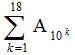.

Answer: 6540278145900f1fa45b95cc2f9599f1


Problem 362
===========

Consider the number 54.

54 can be factored in 7 distinct ways into one or more factors larger than 1:

54, 2×27, 3×18, 6×9, 3×3×6, 2×3×9 and 2×3×3×3.

If we require that the factors are all squarefree only two ways remain:
3×3×6 and 2×3×3×3.

Let's call Fsf(n) the number of ways n can be factored into one or more
squarefree factors larger than 1, soFsf(54)=2.

Let S(n) be ∑Fsf(k) for k=2 to n.

S(100)=193.

Find S(10 000 000 000).

Answer: b62f0d524bec8653ba7b8a2cab70260b

Problem 363
===========

A cubic Bézier curve is defined by four points: P[0], P[1], P[2] and P[3].

The curve is constructed as follows:
On the segments P[0]P[1], P[1]P[2] and P[2]P[3] the points Q[0],Q[1] and
Q[2] are drawn such that
P[0]Q[0]/P[0]P[1]=P[1]Q[1]/P[1]P[2]=P[2]Q[2]/P[2]P[3]=t (t in [0,1]).
On the segments Q[0]Q[1] and Q[1]Q[2] the points R[0] and R[1] are drawn
such thatQ[0]R[0]/Q[0]Q[1]=Q[1]R[1]/Q[1]Q[2]=t for the same value of t.
On the segment R[0]R[1] the point B is drawn such that R[0]B/R[0]R[1]=t
for the same value of t.The Bézier curve defined by the points P[0], P[1],
P[2], P[3] is the locus of B as Q[0] takes all possible positions on the
segment P[0]P[1]. (Please note that for all points the value of t is the
same.)

In the applet to the right you can drag the points P[0], P[1], P[2] and
P[3] to see what the Bézier curve (green curve) defined by those points
looks like. You can also drag the point Q[0] along the segment P[0]P[1].

**NOTE: The applet is currently unavailable**

From the construction it is clear that the Bézier curve will be tangent to
the segments P[0]P[1] in P[0] and P[2]P[3] in P[3].

A cubic Bézier curve with P[0]=(1,0), P[1]=(1,v), P[2]=(v,1) and
P[3]=(0,1) is used to approximate a quarter circle.
The value v>0 is chosen such that the area enclosed by the lines OP[0],
OP[3] and the curve is equal to ^π/[4] (the area of the quarter circle).

By how many percent does the length of the curve differ from the length of
the quarter circle?
That is, if L is the length of the curve, calculate 100*^(L-π/2)/[(π/2)].
Give your answer rounded to 10 digits behind the decimal point.

Answer: 2bc63386b7cccc64c67f90e719936143


Problem 364
===========

There are N seats in a row. N people come after each other to fill the
seats according to the following rules:

1. If there is any seat whose adjacent seat(s) are not occupied take such
   a seat.
2. If there is no such seat and there is any seat for which only one
   adjacent seat is occupied take such a seat.
3. Otherwise take one of the remaining available seats.

Let T(N) be the number of possibilities that N seats are occupied by N
people with the given rules.

The following figure shows T(4)=8.


We can verify that T(10) = 61632 and T(1 000) mod 100 000 007 = 47255094.

Find T(1 000 000) mod 100 000 007.

Answer: d631977573d415a4766de9e6bd388cca


Problem 365
===========


   The binomial coeffient C(10^18,10^9) is a number with more than 9 billion
   (9×10^9) digits.

   Let M(n,k,m) denote the binomial coefficient C(n,k) modulo m.

   Calculate ∑M(10^18,10^9,p*q*r) for 1000<p<q<r<5000 and p,q,r prime.

   
   Answer: 53addf69042b0cefbeb94f3bd3224918


Problem 366
===========

Two players, Anton and Bernhard, are playing the following game.

There is one pile of n stones.

The first player may remove any positive number of stones, but not the
whole pile.

Thereafter, each player may remove at most twice the number of stones his
opponent took on the previous move.
The player who removes the last stone wins.

E.g. n=5
If the first player takes anything more than one stone the next player
will be able to take all remaining stones.
If the first player takes one stone, leaving four, his opponent will take
also one stone, leaving three stones.
The first player cannot take all three because he may take at most 2x1=2
stones. So let's say he takes also one stone, leaving 2. The second player
can take the two remaining stones and wins.
So 5 is a losing position for the first player.
For some winning positions there is more than one possible move for the
first player.
E.g. when n=17 the first player can remove one or four stones.

Let M(n) be the maximum number of stones the first player can take from a
winning position at his first turn and M(n)=0 for any other position.

∑M(n) for n≤100 is 728.

Find ∑M(n) for n≤10^18.Give your answer modulo 10^8.

Answer: 8a080de12c5163d903b6212dd8086570


Problem 367
===========

Bozo sort, not to be confused with the slightly less efficient bogo sort,
consists out of checking if the input sequence is sorted and if not
swapping randomly two elements. This is repeated until eventually the
sequence is sorted.

If we consider all permutations of the first 4 natural numbers as input
the expectation value of the number of swaps, averaged over all 4! input
sequences is 24.75.
The already sorted sequence takes 0 steps.

In this problem we consider the following variant on bozo sort.
If the sequence is not in order we pick three elements at random and
shuffle these three elements randomly.
All 3!=6 permutations of those three elements are equally likely.
The already sorted sequence will take 0 steps.
If we consider all permutations of the first 4 natural numbers as input
the expectation value of the number of shuffles, averaged over all 4!
input sequences is 27.5.
Consider as input sequences the permutations of the first 11 natural
numbers.
Averaged over all 11! input sequences, what is the expected number of
shuffles this sorting algorithm will perform?

Give your answer rounded to the nearest integer.

Answer: 0589f090524e0eea1544b50eefd0ebd8


Problem 368
===========

The harmonic series 1 + 1/2 + 1/3 + 1/4 + ... is well known to be divergent.

If we however omit from this series every term where the denominator has a
9 in it, the series remarkably enough converges to approximately
22.9206766193.
This modified harmonic series is called the Kempner series.

Let us now consider another modified harmonic series by omitting from the
harmonic series every term where the denominator has 3 or more equal
consecutive digits.One can verify that out of the first 1200 terms of the
harmonic series, only 20 terms will be omitted.
These 20 omitted terms are: 1/111, 1/222, 1/333, 1/444, 1/555, 1/666, 1/777, 1/888, 1/999, 1/1000, 1/1110, 1/1111, 1/1112, 1/1113, 1/1114, 1/1115, 1/1116, 1/1117, 1/1118, and 1/1119.

This series converges as well.

Find the value the series converges to.
Give your answer rounded to 10 digits behind the decimal point.

Answer: bfb15c388f4721cbd5eb89f17be2eef2


Problem 369
===========


   In a standard 52 card deck of playing cards, a set of 4 cards is a Badugi
   if it contains 4 cards with no pairs and no two cards of the same suit.

   Let f(n) be the number of ways to choose n cards with a 4 card subset that
   is a Badugi. For example, there are 2598960 ways to choose five cards from
   a standard 52 card deck, of which 514800 contain a 4 card subset that is a
   Badugi, so f(5) = 514800.

   Find ∑f(n) for 4 ≤ n ≤ 13.

   
   Answer: 0f8828f58dbac4f15f296c79b686ed0e


Problem 370
===========


   Let us define a geometric triangle as an integer sided triangle with sides
   a ≤ b ≤ c so that its sides form a geometric progression, i.e.
   b^2 = a · c . 

   An example of such a geometric triangle is the triangle with sides a =
   144, b = 156 and c = 169.

   There are 861805 geometric triangles with perimeter ≤ 10^6 .

   How many geometric triangles exist with perimeter ≤ 2.5·10^13 ?

   
   Answer: 85b5048e25677205555a5308991c2e04


Problem 371
===========


   Oregon licence plates consist of three letters followed by a three digit
   number (each digit can be from [0..9]).
   While driving to work Seth plays the following game:
   Whenever the numbers of two licence plates seen on his trip add to 1000
   that's a win.

   E.g. MIC-012 and HAN-988 is a win and RYU-500 and SET-500 too. (as long as
   he sees them in the same trip).

   Find the expected number of plates he needs to see for a win.
   Give your answer rounded to 8 decimal places behind the decimal point.

   Note: We assume that each licence plate seen is equally likely to have any
   three digit number on it.

   
   Answer: 537403a97924621c604ce5ab6288b97d


Problem 372
===========

Let R(M, N) be the number of lattice points (x, y) which satisfy M<x≤N,
M<y≤N and 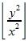 is odd.

We can verify that R(0, 100) = 3019 and R(100, 10000) = 29750422.
Find R(2·10^6, 10^9).

Note: represents  the floor function.

Answer: 5fdeda0dca23d12ae3eb1763b2c6f5ea


Problem 373
===========


   Every triangle has a circumscribed circle that goes through the three
   vertices.Consider all integer sided triangles for which the radius of the
   circumscribed circle is integral as well.

   Let S(n) be the sum of the radii of the circumscribed circles of all such
   triangles for which the radius does not exceed n.

   S(100)=4950 and S(1200)=1653605.

   Find S(10^7).

   
   Answer: 888d60a6b2b4b9146d7c9c14ffd82673


Problem 374
===========


   An integer partition of a number n is a way of writing n as a sum of
   positive integers.

   Partitions that differ only in the order of their summands are considered
   the same.A partition of n into distinct parts is a partition of n in which
   every part occurs at most once.

   The partitions of 5 into distinct parts are:
   5, 4+1 and 3+2.

   Let f(n) be the maximum product of the parts of any such partition of n
   into distinct parts and let m(n) be the number of elements of any such
   partition of n with that product.

   So f(5)=6 and m(5)=2.

   For n=10 the partition with the largest product is 10=2+3+5, which gives
   f(10)=30 and m(10)=3.
   And their product, f(10)·m(10) = 30·3 = 90

   It can be verified that
   ∑f(n)·m(n) for 1 ≤ n ≤ 100 = 1683550844462.

   Find ∑f(n)·m(n) for 1 ≤ n ≤ 10^14.
   Give your answer modulo 982451653, the 50 millionth prime.

   
   Answer: 6fcb063062076b5aaaff3e3cd03e4b2f


Problem 375
===========


   Let S[n] be an integer sequence produced with the following pseudo-random
   number generator:

                        S[0]   =[ ] 290797[ ]
                        S[n+1] =[ ] S[n]^2 mod 50515093

   Let A(i, j) be the minimum of the numbers S[i], S[i+1], ... , S[j] for i ≤
   j.
   Let M(N) = ΣA(i, j) for 1 ≤ i ≤ j ≤ N.
   We can verify that M(10) = 432256955 and M(10 000) = 3264567774119.

   Find M(2 000 000 000).

   
   Answer: 68a12e3f2e4ccbae9c8555e547fbe096


Problem 376
===========


   Consider the following set of dice with nonstandard pips:

   Die A: 1 4 4 4 4 4
   Die B: 2 2 2 5 5 5
   Die C: 3 3 3 3 3 6

   A game is played by two players picking a die in turn and rolling it. The
   player who rolls the highest value wins.

   If the first player picks die A and the second player picks die B we get
   P(second player wins) = 7/12 > 1/2

   If the first player picks die B and the second player picks die C we get
   P(second player wins) = 7/12 > 1/2

   If the first player picks die C and the second player picks die A we get
   P(second player wins) = 25/36 > 1/2

   So whatever die the first player picks, the second player can pick another
   die and have a larger than 50% chance of winning.
   A set of dice having this property is called a nontransitive set of dice.

   We wish to investigate how many sets of nontransitive dice exist. We will
   assume the following conditions:

     • There are three six-sided dice with each side having between 1 and N
       pips, inclusive.
     • Dice with the same set of pips are equal, regardless of which side on
       the die the pips are located.
     • The same pip value may appear on multiple dice; if both players roll
       the same value neither player wins.
     • The sets of dice {A,B,C}, {B,C,A} and {C,A,B} are the same set.

   For N = 7 we find there are 9780 such sets.
   How many are there for N = 30 ?

   
   Answer: c64df302990eb3738f8ec62ea6b66c0b


Problem 377
===========


   There are 16 positive integers that do not have a zero in their digits and
   that have a digital sum equal to 5, namely:
   5, 14, 23, 32, 41, 113, 122, 131, 212, 221, 311, 1112, 1121, 1211, 2111
   and 11111.
   Their sum is 17891.

   Let f(n) be the sum of all positive integers that do not have a zero in
   their digits and have a digital sum equal to n.

   Find .
   Give the last 9 digits as your answer.

   
   Answer: a915ccbae49de15208c88affba84d206


Problem 378
===========


   Let T(n) be the nth triangle number, so T(n) = n (n+1) .
                                                   2

   Let dT(n) be the number of divisors of T(n).
   E.g.:T(7) = 28 and dT(7) = 6.

   Let Tr(n) be the number of triples (i, j, k) such that 1 ≤ i < j < k ≤ n
   and dT(i) > dT(j) > dT(k).
   Tr(20) = 14, Tr(100) = 5772 and Tr(1000) = 11174776.

   Find Tr(60 000 000).
   Give the last 18 digits of your answer.

   
   Answer: 336745dc9d90928596237c4b471a8927


Problem 379
===========


   Let f(n) be the number of couples (x,y) with x and y positive integers, x
   ≤ y and the least common multiple of x and y equal to n.

   Let g be the summatory function of f, i.e.: g(n) = ∑ f(i) for 1 ≤ i ≤ n.

   You are given that g(10^6) = 37429395.

   Find g(10^12).

   
   Answer: de20f710cb6665c48795072197ad53e0


Problem 380
===========


   An m×n maze is an m×n rectangular grid with walls placed between grid
   cells such that there is exactly one path from the top-left square to any
   other square.
   The following are examples of a 9×12 maze and a 15×20 maze:

   Let C(m,n) be the number of distinct m×n mazes. Mazes which can be formed
   by rotation and reflection from another maze are considered distinct.

   It can be verified that C(1,1) = 1, C(2,2) = 4, C(3,4) = 2415, and C(9,12)
   = 2.5720e46 (in scientific notation rounded to 5 significant digits).
   Find C(100,500) and write your answer in scientific notation rounded to 5
   significant digits.

   When giving your answer, use a lowercase e to separate mantissa and
   exponent.E.g. if the answer is 1234567891011 then the answer format would
   be 1.2346e12.

   
   Answer: c86d2f4c17c8134fbebed5d37a0f90d7


Problem 381
===========


   For a prime p let S(p) = (∑(p-k)!) mod(p) for 1 ≤ k ≤ 5.

   For example, if p=7,
   (7-1)! + (7-2)! + (7-3)! + (7-4)! + (7-5)! = 6! + 5! + 4! + 3! + 2! =
   720+120+24+6+2 = 872.
   As 872 mod(7) = 4, S(7) = 4.

   It can be verified that ∑S(p) = 480 for 5 ≤ p < 100.

   Find ∑S(p) for 5 ≤ p < 10^8.

   
   Answer: 80c84973a9643e46d49d79d7284e7ff3


Problem 382
===========


   A polygon is a flat shape consisting of straight line segments that are
   joined to form a closed chain or circuit. A polygon consists of at least
   three sides and does not self-intersect.

   A set S of positive numbers is said to generate a polygon P if:

     • no two sides of P are the same length,
     • the length of every side of P is in S, and
     • S contains no other value.

   For example:
   The set {3, 4, 5} generates a polygon with sides 3, 4, and 5 (a triangle).
   The set {6, 9, 11, 24} generates a polygon with sides 6, 9, 11, and 24 (a
   quadrilateral).
   The sets {1, 2, 3} and {2, 3, 4, 9} do not generate any polygon at all.

   Consider the sequence s, defined as follows:

     • s[1] = 1, s[2] = 2, s[3] = 3
     • s[n] = s[n-1] + s[n-3] for n > 3.

   Let U[n] be the set {s[1], s[2], ..., s[n]}. For example, U[10] = {1, 2,
   3, 4, 6, 9, 13, 19, 28, 41}.
   Let f(n) be the number of subsets of U[n] which generate at least one
   polygon.
   For example, f(5) = 7, f(10) = 501 and f(25) = 18635853.

   Find the last 9 digits of f(10^18).

   
   Answer: 56a121bcf3bb674d0d3ce561b6b24ea5


Problem 383
===========


   Let f[5](n) be the largest integer x for which 5^x divides n.
   For example, f[5](625000) = 7.

   Let T[5](n) be the number of integers i which satisfy f[5]((2·i-1)!) <
   2·f[5](i!) and 1 ≤ i ≤ n.
   It can be verified that T[5](10^3) = 68 and T[5](10^9) = 2408210.

   Find T[5](10^18).

   
   Answer: c1bc7c945344e1967bfaced9ade895a0


Problem 384
===========


   Define the sequence a(n) as the number of adjacent pairs of ones in the
   binary expansion of n (possibly overlapping).
   E.g.: a(5) = a(101[2]) = 0, a(6) = a(110[2]) = 1, a(7) = a(111[2]) = 2

   Define the sequence b(n) = (-1)^a(n).
   This sequence is called the Rudin-Shapiro sequence.

   Also consider the summatory sequence of b(n): .

   The first couple of values of these sequences are:
   n        0     1     2     3     4     5     6     7
   a(n)     0     0     0     1     0     0     1     2
   b(n)     1     1     1    -1     1     1    -1     1
   s(n)     1     2     3     2     3     4     3     4

   The sequence s(n) has the remarkable property that all elements are
   positive and every positive integer k occurs exactly k times.

   Define g(t,c), with 1 ≤ c ≤ t, as the index in s(n) for which t occurs for
   the c'th time in s(n).
   E.g.: g(3,3) = 6, g(4,2) = 7 and g(54321,12345) = 1220847710.

   Let F(n) be the fibonacci sequence defined by:
   F(0)=F(1)=1 and
   F(n)=F(n-1)+F(n-2) for n>1.

   Define GF(t)=g(F(t),F(t-1)).

   Find ΣGF(t) for 2≤t≤45.

   
   Answer: ea0bb1fff1a51b48971762b93aeed103


Problem 385
===========


   For any triangle T in the plane, it can be shown that there is a unique
   ellipse with largest area that is completely inside T.

   For a given n, consider triangles T such that:
   - the vertices of T have integer coordinates with absolute value ≤ n, and
   - the foci^1 of the largest-area ellipse inside T are (√13,0) and
   (-√13,0).
   Let A(n) be the sum of the areas of all such triangles.

   For example, if n = 8, there are two such triangles. Their vertices are
   (-4,-3),(-4,3),(8,0) and (4,3),(4,-3),(-8,0), and the area of each
   triangle is 36. Thus A(8) = 36 + 36 = 72.

   It can be verified that A(10) = 252, A(100) = 34632 and A(1000) = 3529008.

   Find A(1 000 000 000).

   ^1The foci (plural of focus) of an ellipse are two points A and B such
   that for every point P on the boundary of the ellipse, AP + PB is
   constant.

   
   Answer: a21c033d9e119c293e51966ea78c9950


Problem 386
===========


   Let n be an integer and S(n) be the set of factors of n.

   A subset A of S(n) is called an antichain of S(n) if A contains only one
   element or if none of the elements of A divides any of the other elements
   of A.

   For example: S(30) = {1, 2, 3, 5, 6, 10, 15, 30}
   {2, 5, 6} is not an antichain of S(30).
   {2, 3, 5} is an antichain of S(30).

   Let N(n) be the maximum length of an antichain of S(n).

   Find ΣN(n) for 1 ≤ n ≤ 10^8

   
   Answer: d1d893f7c50910aa10daec5e9352e86d


Problem 387
===========


   A Harshad or Niven number is a number that is divisible by the sum of its
   digits.
   201 is a Harshad number because it is divisible by 3 (the sum of its
   digits.)
   When we truncate the last digit from 201, we get 20, which is a Harshad
   number.
   When we truncate the last digit from 20, we get 2, which is also a Harshad
   number.
   Let's call a Harshad number that, while recursively truncating the last
   digit, always results in a Harshad number a right truncatable Harshad
   number.

   Also:
   201/3=67 which is prime.
   Let's call a Harshad number that, when divided by the sum of its digits,
   results in a prime a strong Harshad number.

   Now take the number 2011 which is prime.
   When we truncate the last digit from it we get 201, a strong Harshad
   number that is also right truncatable.
   Let's call such primes strong, right truncatable Harshad primes.

   You are given that the sum of the strong, right truncatable Harshad primes
   less than 10000 is 90619.

   Find the sum of the strong, right truncatable Harshad primes less than
   10^14.

   
   Answer: a20cbd8639767decfa2c2c9955eb6be3


Problem 388
===========


   Consider all lattice points (a,b,c) with 0 ≤ a,b,c ≤ N.

   From the origin O(0,0,0) all lines are drawn to the other lattice points.
   Let D(N) be the number of distinct such lines.

   You are given that D(1 000 000) = 831909254469114121.

   Find D(10^10). Give as your answer the first nine digits followed by the
   last nine digits.

   
   Answer: 2bab886c7d98d802d9249c9e12d72c25


Problem 389
===========


   An unbiased single 4-sided die is thrown and its value, T, is noted.
   T unbiased 6-sided dice are thrown and their scores are added together.
   The sum, C, is noted.
   C unbiased 8-sided dice are thrown and their scores are added together.
   The sum, O, is noted.
   O unbiased 12-sided dice are thrown and their scores are added together.
   The sum, D, is noted.
   D unbiased 20-sided dice are thrown and their scores are added together.
   The sum, I, is noted.
   Find the variance of I, and give your answer rounded to 4 decimal places.

   
   Answer: 79a080d38b837547b975c97b44764dfb


Problem 390
===========


   Consider the triangle with sides √5, √65 and √68.It can be shown that this
   triangle has area 9.

   S(n) is the sum of the areas of all triangles with sides √(1+b^2),
   √(1+c^2) and √(b^2+c^2) (for positive integers b and c ) that have an
   integral area not exceeding n.

   The example triangle has b=2 and c=8.

   S(10^6)=18018206.

   Find S(10^10).

   
   Answer: ed7f2fbc05a2fd2033d80de671f35ea3


Problem 391
===========


   Let s[k] be the number of 1’s when writing the numbers from 0 to k in
   binary.
   For example, writing 0 to 5 in binary, we have 0, 1, 10, 11, 100, 101.
   There are seven 1’s, so s[5] = 7.
   The sequence S = {s[k] : k ≥ 0} starts {0, 1, 2, 4, 5, 7, 9, 12, ...}.

   A game is played by two players. Before the game starts, a number n is
   chosen. A counter c starts at 0. At each turn, the player chooses a number
   from 1 to n (inclusive) and increases c by that number. The resulting
   value of c must be a member of S. If there are no more valid moves, the
   player loses.

   For example:
   Let n = 5. c starts at 0.
   Player 1 chooses 4, so c becomes 0 + 4 = 4.
   Player 2 chooses 5, so c becomes 4 + 5 = 9.
   Player 1 chooses 3, so c becomes 9 + 3 = 12.
   etc.
   Note that c must always belong to S, and each player can increase c by at
   most n.

   Let M(n) be the highest number the first player can choose at her first
   turn to force a win, and M(n) = 0 if there is no such move. For example,
   M(2) = 2, M(7) = 1 and M(20) = 4.

   Given Σ(M(n))^3 = 8150 for 1 ≤ n ≤ 20.

   Find Σ(M(n))^3 for 1 ≤ n ≤ 1000.

   
   Answer: b2947548d4f5c4878c5f788f9849e750


Problem 392
===========


   A rectilinear grid is an orthogonal grid where the spacing between the
   gridlines does not have to be equidistant.
   An example of such grid is logarithmic graph paper.

   Consider rectilinear grids in the Cartesian coordinate system with the
   following properties:

     • The gridlines are parallel to the axes of the Cartesian coordinate
       system.
     • There are N+2 vertical and N+2 horizontal gridlines. Hence there are
       (N+1) x (N+1) rectangular cells.
     • The equations of the two outer vertical gridlines are x = -1 and x =
       1.
     • The equations of the two outer horizontal gridlines are y = -1 and y =
       1.
     • The grid cells are colored red if they overlap with the unit circle,
       black otherwise.

   For this problem we would like you to find the postions of the remaining N
   inner horizontal and N inner vertical gridlines so that the area occupied
   by the red cells is minimized.

   E.g. here is a picture of the solution for N = 10:

   The area occupied by the red cells for N = 10 rounded to 10 digits behind
   the decimal point is 3.3469640797.

   Find the positions for N = 400.
   Give as your answer the area occupied by the red cells rounded to 10
   digits behind the decimal point.

   
   Answer: 3268b0bc489187db3d234c097040d909


Problem 393
===========


   An n×n grid of squares contains n^2 ants, one ant per square.
   All ants decide to move simultaneously to an adjacent square (usually 4
   possibilities, except for ants on the edge of the grid or at the corners).
   We define f(n) to be the number of ways this can happen without any ants
   ending on the same square and without any two ants crossing the same edge
   between two squares.

   You are given that f(4) = 88.
   Find f(10).

   
   Answer: 58e4990838fb3d1725872da30f9db748


Problem 394
===========


   Jeff eats a pie in an unusual way.
   The pie is circular. He starts with slicing an initial cut in the pie
   along a radius.
   While there is at least a given fraction F of pie left, he performs the
   following procedure:
   - He makes two slices from the pie centre to any point of what is
   remaining of the pie border, any point on the remaining pie border equally
   likely. This will divide the remaining pie into three pieces.
   - Going counterclockwise from the initial cut, he takes the first two pie
   pieces and eats them.
   When less than a fraction F of pie remains, he does not repeat this
   procedure. Instead, he eats all of the remaining pie.

   For x ≥ 1, let E(x) be the expected number of times Jeff repeats the
   procedure above with F = ^1/[x].
   It can be verified that E(1) = 1, E(2) ≈ 1.2676536759, and E(7.5) ≈
   2.1215732071.

   Find E(40) rounded to 10 decimal places behind the decimal point.

   
   Answer: f8ad575e1a03365a60b6429c3b7a64df


Problem 395
===========


The Pythagorean tree is a fractal generated by the following procedure:

Start with a unit square. Then, calling one of the sides its base (in the
animation, the bottom side is the base):

1. Attach a right triangle to the side opposite the base, with the
   hypotenuse coinciding with that side and with the sides in a 3-4-5
   ratio. Note that the smaller side of the triangle must be on the
   'right' side with respect to the base (see animation).
2. Attach a square to each leg of the right triangle, with one of its
   sides coinciding with that leg.
3. Repeat this procedure for both squares, considering as their bases the
   sides touching the triangle.

The resulting figure, after an infinite number of iterations, is the
Pythagorean tree.


It can be shown that there exists at least one rectangle, whose sides are
parallel to the largest square of the Pythagorean tree, which encloses the
Pythagorean tree completely.

Find the smallest area possible for such a bounding rectangle, and give
your answer rounded to 10 decimal places.

Answer: 505048b0c619161d05b9b3e492f3edc3


Problem 396
===========


   For any positive integer n, the nth weak Goodstein sequence {g[1], g[2],
   g[3], ...} is defined as:

     • g[1] = n
     • for k > 1, g[k] is obtained by writing g[k-1] in base k, interpreting
       it as a base k + 1 number, and subtracting 1.

   The sequence terminates when g[k] becomes 0.

   For example, the 6th weak Goodstein sequence is {6, 11, 17, 25, ...}:

     • g[1] = 6.
     • g[2] = 11 since 6 = 110[2], 110[3] = 12, and 12 - 1 = 11.
     • g[3] = 17 since 11 = 102[3], 102[4] = 18, and 18 - 1 = 17.
     • g[4] = 25 since 17 = 101[4], 101[5] = 26, and 26 - 1 = 25.

   and so on.

   It can be shown that every weak Goodstein sequence terminates.

   Let G(n) be the number of nonzero elements in the nth weak Goodstein
   sequence.
   It can be verified that G(2) = 3, G(4) = 21 and G(6) = 381.
   It can also be verified that ΣG(n) = 2517 for 1 ≤ n < 8.

   Find the last 9 digits of ΣG(n) for 1 ≤ n < 16.

   
   Answer: 4665c73fdca473ccc0643fc982f24e06


Problem 397
===========


   On the parabola y = x^2/k, three points A(a, a^2/k), B(b, b^2/k) and C(c,
   c^2/k) are chosen.

   Let F(K, X) be the number of the integer quadruplets (k, a, b, c) such
   that at least one angle of the triangle ABC is 45-degree, with 1 ≤ k ≤ K
   and -X ≤ a < b < c ≤ X.

   For example, F(1, 10) = 41 and F(10, 100) = 12492.
   Find F(10^6, 10^9).

   
   Answer: 07f769df9543bc05e6318878c34d074d


Problem 398
===========


   Inside a rope of length n, n-1 points are placed with distance 1 from each
   other and from the endpoints. Among these points, we choose m-1 points at
   random and cut the rope at these points to create m segments.

   Let E(n, m) be the expected length of the second-shortest segment.For
   example, E(3, 2) = 2 and E(8, 3) = 16/7.Note that if multiple segments
   have the same shortest length the length of the second-shortest segment is
   defined as the same as the shortest length.

   Find E(10^7, 100).Give your answer rounded to 5 decimal places behind the
   decimal point.

   
   Answer: fa0a25d62fa225e05fd8736713a9bfc0


Problem 399
===========


   The first 15 fibonacci numbers are:
   1,1,2,3,5,8,13,21,34,55,89,144,233,377,610.
   It can be seen that 8 and 144 are not squarefree: 8 is divisible by 4 and
   144 is divisible by 4 and by 9.
   So the first 13 squarefree fibonacci numbers are:
   1,1,2,3,5,13,21,34,55,89,233,377 and 610.

   The 200th squarefree fibonacci number
   is:971183874599339129547649988289594072811608739584170445.
   The last sixteen digits of this number are: 1608739584170445 and in
   scientific notation this number can be written as 9.7e53.

   Find the 100 000 000th squarefree fibonacci number.
   Give as your answer its last sixteen digits followed by a comma followed
   by the number in scientific notation (rounded to one digit after the
   decimal point).
   For the 200th squarefree number the answer would have been:
   1608739584170445,9.7e53

   Note:
   For this problem, assume that for every prime p, the first fibonacci
   number divisible by p is not divisible by p^2 (this is part of Wall's
   conjecture). This has been verified for primes ≤ 3·10^15, but has not been
   proven in general.
   If it happens that the conjecture is false, then the accepted answer to
   this problem isn't guaranteed to be the 100 000 000th squarefree fibonacci
   number, rather it represents only a lower bound for that number.

   
   Answer: a0819cfe3be6a04645b8d4fe2345e184


Problem 400
===========


   A Fibonacci tree is a binary tree recursively defined as:

     • T(0) is the empty tree.
     • T(1) is the binary tree with only one node.
     • T(k) consists of a root node that has T(k-1) and T(k-2) as children.

   On such a tree two players play a take-away game. On each turn a player
   selects a node and removes that node along with the subtree rooted at that
   node.
   The player who is forced to take the root node of the entire tree loses.

   Here are the winning moves of the first player on the first turn for T(k)
   from k=1 to k=6.

   Let f(k) be the number of winning moves of the first player (i.e. the
   moves for which the second player has no winning strategy) on the first
   turn of the game when this game is played on T(k).

   For example, f(5) = 1 and f(10) = 17.

   Find f(10000). Give the last 18 digits of your answer.

   
   Answer: 60aa790c07af1446c1e2deba72543a1f


Problem 401
===========


   The divisors of 6 are 1,2,3 and 6.
   The sum of the squares of these numbers is 1+4+9+36=50.

   Let sigma2(n) represent the sum of the squares of the divisors of n.Thus
   sigma2(6)=50.

   Let SIGMA2 represent the summatory function of sigma2, that is
   SIGMA2(n)=∑sigma2(i) for i=1 to n.
   The first 6 values of SIGMA2 are: 1,6,16,37,63 and 113.

   Find SIGMA2(10^15) modulo 10^9.

   
   Answer: 982a249d8b45ef10c98c32dabac00751


Problem 402
===========


   It can be shown that the polynomial n^4 + 4n^3 + 2n^2 + 5n is a multiple
   of 6 for every integer n. It can also be shown that 6 is the largest
   integer satisfying this property.

   Define M(a, b, c) as the maximum m such that n^4 + an^3 + bn^2 + cn is a
   multiple of m for all integers n. For example, M(4, 2, 5) = 6.

   Also, define S(N) as the sum of M(a, b, c) for all 0 < a, b, c ≤ N.

   We can verify that S(10) = 1972 and S(10000) = 2024258331114.

   Let F[k] be the Fibonacci sequence:
   F[0] = 0, F[1] = 1 and
   F[k] = F[k-1] + F[k-2] for k ≥ 2.

   Find the last 9 digits of Σ S(F[k]) for 2 ≤ k ≤ 1234567890123.

   
   Answer: fa7ae8e9243f01b0eac10ec5aaff1f42


Problem 403
===========


   For integers a and b, we define D(a, b) as the domain enclosed by the
   parabola y = x^2 and the line y = a·x + b:
   D(a, b) = { (x, y) | x^2 ≤ y ≤ a·x + b }.

   L(a, b) is defined as the number of lattice points contained in D(a, b).
   For example, L(1, 2) = 8 and L(2, -1) = 1.

   We also define S(N) as the sum of L(a, b) for all the pairs (a, b) such
   that the area of D(a, b) is a rational number and |a|,|b| ≤ N.
   We can verify that S(5) = 344 and S(100) = 26709528.

   Find S(10^12). Give your answer mod 10^8.

   
   Answer: 31c018e3781a3e170366f01e30f09602


Problem 404
===========


E[a] is an ellipse with an equation of the form x^2 + 4y^2 = 4a^2.
E[a]' is the rotated image of E[a] by θ degrees counterclockwise around
the origin O(0, 0) for 0° < θ < 90°.


b is the distance to the origin of the two intersection points closest to
the origin and c is the distance of the two other intersection points.
We call an ordered triplet (a, b, c) a canonical ellipsoidal triplet if a,
b and c are positive integers.
For example, (209, 247, 286) is a canonical ellipsoidal triplet.

Let C(N) be the number of distinct canonical ellipsoidal triplets (a, b,
c) for a ≤ N.
It can be verified that C(10^3) = 7, C(10^4) = 106 and C(10^6) = 11845.

Find C(10^17).

Answer: 2d1bc4b93bbc19d9e70c5b04338dea2e


Problem 405
===========

We wish to tile a rectangle whose length is twice its width.
Let T(0) be the tiling consisting of a single rectangle.
For n > 0, let T(n) be obtained from T(n-1) by replacing all tiles in the
following manner:

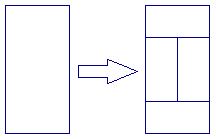

The following animation demonstrates the tilings T(n) for n from 0 to 5:


Let f(n) be the number of points where four tiles meet in T(n).
For example, f(1) = 0, f(4) = 82 and f(10^9) mod 17^7 = 126897180.

Find f(10^k) for k = 10^18, give your answer modulo 17^7.

Answer: 93b712426b768586f88d0bfe597842e6

Problem 406
===========


   We are trying to find a hidden number selected from the set of integers
   {1, 2, ..., n} by asking questions. Each number (question) we ask, we get
   one of three possible answers:

     • "Your guess is lower than the hidden number" (and you incur a cost of
       a), or
     • "Your guess is higher than the hidden number" (and you incur a cost of
       b), or
     • "Yes, that's it!" (and the game ends).

   Given the value of n, a, and b, an optimal strategy minimizes the total
   cost for the worst possible case.

   For example, if n = 5, a = 2, and b = 3, then we may begin by asking "2"
   as our first question.

   If we are told that 2 is higher than the hidden number (for a cost of
   b=3), then we are sure that "1" is the hidden number (for a total cost of
   3).
   If we are told that 2 is lower than the hidden number (for a cost of a=2),
   then our next question will be "4".
   If we are told that 4 is higher than the hidden number (for a cost of
   b=3), then we are sure that "3" is the hidden number (for a total cost of
   2+3=5).
   If we are told that 4 is lower than the hidden number (for a cost of a=2),
   then we are sure that "5" is the hidden number (for a total cost of
   2+2=4).
   Thus, the worst-case cost achieved by this strategy is 5. It can also be
   shown that this is the lowest worst-case cost that can be achieved. So, in
   fact, we have just described an optimal strategy for the given values of
   n, a, and b.

   Let C(n, a, b) be the worst-case cost achieved by an optimal strategy for
   the given values of n, a, and b.

   Here are a few examples:
   C(5, 2, 3) = 5
   C(500, √2, √3) = 13.22073197...
   C(20000, 5, 7) = 82
   C(2000000, √5, √7) = 49.63755955...

   Let F[k] be the Fibonacci numbers: F[k] = F[k-1] + F[k-2] with base cases
   F[1] = F[2] = 1.
   Find ∑[1≤k≤30] C(10^12, √k, √F[k]), and give your answer rounded to 8
   decimal places behind the decimal point.

   
   Answer: 0766b1ee975f5674d30fd6c3c934c6e0


Problem 407
===========


   If we calculate a^2 mod 6 for 0 ≤ a ≤ 5 we get: 0,1,4,3,4,1.

   The largest value of a such that a^2 ≡ a mod 6 is 4.
   Let's call M(n) the largest value of a < n such that a^2 ≡ a (mod n).
   So M(6) = 4.

   Find ∑M(n) for 1 ≤ n ≤ 10^7.

   
   Answer: f4da34a4b357123cb142739a52e010f2


Problem 408
===========


   Let's call a lattice point (x, y) inadmissible if x, y and x + y are all
   positive perfect squares.
   For example, (9, 16) is inadmissible, while (0, 4), (3, 1) and (9, 4) are
   not.

   Consider a path from point (x[1], y[1]) to point (x[2], y[2]) using only
   unit steps north or east.
   Let's call such a path admissible if none of its intermediate points are
   inadmissible.

   Let P(n) be the number of admissible paths from (0, 0) to (n, n).
   It can be verified that P(5) = 252, P(16) = 596994440 and P(1000) mod
   1 000 000 007 = 341920854.

   Find P(10 000 000) mod 1 000 000 007.

   
   Answer: 2c09e247c6144c16cae2358d316affd9


Problem 409
===========


   Let n be a positive integer. Consider nim positions where:

     • There are n non-empty piles.
     • Each pile has size less than 2^n.
     • No two piles have the same size.

   Let W(n) be the number of winning nim positions satisfying the
   aboveconditions (a position is winning if the first player has a winning
   strategy). For example, W(1) = 1, W(2) = 6, W(3) = 168, W(5) = 19764360
   and W(100) mod 1 000 000 007 = 384777056.

   Find W(10 000 000) mod 1 000 000 007.

   
   Answer: 56c32e75a2656ec08ce177089bda2f53


Problem 410
===========


   Let C be the circle with radius r, x^2 + y^2 = r^2. We choose two points
   P(a, b) and Q(-a, c) so that the line passing through P and Q is tangent
   to C.

   For example, the quadruplet (r, a, b, c) = (2, 6, 2, -7) satisfies this
   property.

   Let F(R, X) be the number of the integer quadruplets (r, a, b, c) with
   this property, and with 0 < r ≤ R and 0 < a ≤ X.

   We can verify that F(1, 5) = 10, F(2, 10) = 52 and F(10, 100) = 3384.
   Find F(10^8, 10^9) + F(10^9, 10^8).

   
   Answer: 45826f3a23aa321f97acb1d2a8f2170b


Problem 411
===========


   Let n be a positive integer. Suppose there are stations at the coordinates
   (x, y) = (2^i mod n, 3^i mod n) for 0 ≤ i ≤ 2n. We will consider stations
   with the same coordinates as the same station.

   We wish to form a path from (0, 0) to (n, n) such that the x and y
   coordinates never decrease.
   Let S(n) be the maximum number of stations such a path can pass through.

   For example, if n = 22, there are 11 distinct stations, and a valid path
   can pass through at most 5 stations. Therefore, S(22) = 5.The case is
   illustrated below, with an example of an optimal path:

   It can also be verified that S(123) = 14 and S(10000) = 48.

   Find ∑ S(k^5) for 1 ≤ k ≤ 30.

   
   Answer: e351762bf2220ca1396e6a9ee3f6c84f


Problem 412
===========


   For integers m, n (0 ≤ n < m), let L(m, n) be an m×m grid with the
   top-right n×n grid removed.

   For example, L(5, 3) looks like this:

   We want to number each cell of L(m, n) with consecutive integers 1, 2, 3,
   ... such that the number in every cell is smaller than the number below it
   and to the left of it.

   For example, here are two valid numberings of L(5, 3):

   Let LC(m, n) be the number of valid numberings of L(m, n).
   It can be verified that LC(3, 0) = 42, LC(5, 3) = 250250, LC(6, 3) =
   406029023400 and LC(10, 5) mod 76543217 = 61251715.

   Find LC(10000, 5000) mod 76543217.

   
   Answer: 8919ccca34b7ccc293d33e06872c668d


Problem 413
===========


   We say that a d-digit positive number (no leading zeros) is a one-child
   number if exactly one of its sub-strings is divisible by d.

   For example, 5671 is a 4-digit one-child number. Among all its sub-strings
   5, 6, 7, 1, 56, 67, 71, 567, 671 and 5671, only 56 is divisible by 4.
   Similarly, 104 is a 3-digit one-child number because only 0 is divisible
   by 3.
   1132451 is a 7-digit one-child number because only 245 is divisible by 7.

   Let F(N) be the number of the one-child numbers less than N.
   We can verify that F(10) = 9, F(10^3) = 389 and F(10^7) = 277674.

   Find F(10^19).

   
   Answer: 569ad33af889215704df5a9e278aa004


Problem 414
===========


   6174 is a remarkable number; if we sort its digits in increasing order and
   subtract that number from the number you get when you sort the digits in
   decreasing order, we get 7641-1467=6174.
   Even more remarkable is that if we start from any 4 digit number and
   repeat this process of sorting and subtracting, we'll eventually end up
   with 6174 or immediately with 0 if all digits are equal.
   This also works with numbers that have less than 4 digits if we pad the
   number with leading zeroes until we have 4 digits.
   E.g. let's start with the number 0837:
   8730-0378=8352
   8532-2358=6174

   6174 is called the Kaprekar constant. The process of sorting and
   subtracting and repeating this until either 0 or the Kaprekar constant is
   reached is called the Kaprekar routine.

   We can consider the Kaprekar routine for other bases and number of digits.
   Unfortunately, it is not guaranteed a Kaprekar constant exists in all
   cases; either the routine can end up in a cycle for some input numbers or
   the constant the routine arrives at can be different for different input
   numbers.
   However, it can be shown that for 5 digits and a base b = 6t+3≠9, a
   Kaprekar constant exists.
   E.g. base 15: (10,4,14,9,5)[15]
   base 21: (14,6,20,13,7)[21]

   Define C[b] to be the Kaprekar constant in base b for 5 digits.Define the
   function sb(i) to be

     • 0 if i = C[b] or if i written in base b consists of 5 identical digits
     • the number of iterations it takes the Kaprekar routine in base b to
       arrive at C[b], otherwise

   Note that we can define sb(i) for all integers i < b^5. If i written in
   base b takes less than 5 digits, the number is padded with leading zero
   digits until we have 5 digits before applying the Kaprekar routine.

   Define S(b) as the sum of sb(i) for 0 < i < b^5.
   E.g. S(15) = 5274369
   S(111) = 400668930299

   Find the sum of S(6k+3) for 2 ≤ k ≤ 300.
   Give the last 18 digits as your answer.

   
   Answer: 42f095bdfd71e1ae4ae0ceead1bb1802


Problem 415
===========


   A set of lattice points S is called a titanic set if there exists a line
   passing through exactly two points in S.

   An example of a titanic set is S = {(0, 0), (0, 1), (0, 2), (1, 1), (2,
   0), (1, 0)}, where the line passing through (0, 1) and (2, 0) does not
   pass through any other point in S.

   On the other hand, the set {(0, 0), (1, 1), (2, 2), (4, 4)} is not a
   titanic set since the line passing through any two points in the set also
   passes through the other two.

   For any positive integer N, let T(N) be the number of titanic sets S whose
   every point (x, y) satisfies 0 ≤ x, y ≤ N.It can be verified that T(1) =
   11, T(2) = 494, T(4) = 33554178, T(111) mod 10^8 = 13500401 and
   T(10^5) mod 10^8 = 63259062.

   Find T(10^11) mod 10^8.

   
   Answer: 2357ad217832274f444cae2a6580b193


Problem 416
===========


   A row of n squares contains a frog in the leftmost square. By successive
   jumps the frog goes to the rightmost square and then back to the leftmost
   square. On the outward trip he jumps one, two or three squares to the
   right, and on the homeward trip he jumps to the left in a similar manner.
   He cannot jump outside the squares. He repeats the round-trip travel m
   times.

   Let F(m, n) be the number of the ways the frog can travel so that at most
   one square remains unvisited.
   For example, F(1, 3) = 4, F(1, 4) = 15, F(1, 5) = 46, F(2, 3) = 16 and
   F(2, 100) mod 10^9 = 429619151.

   Find the last 9 digits of F(10, 10^12).

   
   Answer: 6f398386fdfec57ac166d4970c2bcad2


Problem 417
===========


   A unit fraction contains 1 in the numerator. The decimal representation of
   the unit fractions with denominators 2 to 10 are given:

     1/2  =  0.5
     1/3  =  0.(3)
     1/4  =  0.25
     1/5  =  0.2
     1/6  =  0.1(6)
     1/7  =  0.(142857)
     1/8  =  0.125
     1/9  =  0.(1)
     1/10 =  0.1

   Where 0.1(6) means 0.166666..., and has a 1-digit recurring cycle. It can
   be seen that 1/7 has a 6-digit recurring cycle.

   Unit fractions whose denominator has no other prime factors than 2 and/or
   5 are not considered to have a recurring cycle.
   We define the length of the recurring cycle of those unit fractions as 0.

   Let L(n) denote the length of the recurring cycle of 1/n.You are given
   that ∑L(n) for 3 ≤ n ≤ 1 000 000 equals 55535191115.

   Find ∑L(n) for 3 ≤ n ≤ 100 000 000

   
   Answer: 93a7df08c972f1e7788516d056a7e016


Problem 418
===========


   Let n be a positive integer. An integer triple (a, b, c) is called a
   factorisation triple of n if:

     • 1 ≤ a ≤ b ≤ c
     • a·b·c = n.

   Define f(n) to be a + b + c for the factorisation triple (a, b, c) of n
   which minimises c / a. One can show that this triple is unique.

   For example, f(165) = 19, f(100100) = 142 and f(20!) = 4034872.

   Find f(43!).

   
   Answer: b032468ddb4847d8a2273789379753f5


Problem 419
===========


   The look and say sequence goes 1, 11, 21, 1211, 111221, 312211, 13112221,
   1113213211, ...
   The sequence starts with 1 and all other members are obtained by
   describing the previous member in terms of consecutive digits.
   It helps to do this out loud:
   1 is 'one one' → 11
   11 is 'two ones' → 21
   21 is 'one two and one one' → 1211
   1211 is 'one one, one two and two ones' → 111221
   111221 is 'three ones, two twos and one one' → 312211
   ...

   Define A(n), B(n) and C(n) as the number of ones, twos and threes in the
   n'th element of the sequence respectively.
   One can verify that A(40) = 31254, B(40) = 20259 and C(40) = 11625.

   Find A(n), B(n) and C(n) for n = 10^12.
   Give your answer modulo 2^30 and separate your values for A, B and C by a
   comma.
   E.g. for n = 40 the answer would be 31254,20259,11625

   
   Answer: b27db655498b3d64ad4338fcdc9d178f


Problem 420
===========

A positive integer matrix is a matrix whose elements are all positive
integers.
Some positive integer matrices can be expressed as a square of a positive
integer matrix in two different ways. Here is an example:

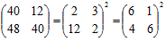

We define F(N) as the number of the 2x2 positive integer matrices which
have a trace less than N and which can be expressed as a square of a
positive integer matrix in two different ways.
We can verify that F(50) = 7 and F(1000) = 1019.

Find F(10^7).

Answer: e265e34e34fc54e8ceecd5e4b94b1381


Problem 421
===========


   Numbers of the form n^15+1 are composite for every integer n > 1.
   For positive integers n and m let s(n,m) be defined as the sum of the
   distinct prime factors of n^15+1 not exceeding m.

   E.g. 2^15+1 = 3×3×11×331.
   So s(2,10) = 3 and s(2,1000) = 3+11+331 = 345.

   Also 10^15+1 = 7×11×13×211×241×2161×9091.
   So s(10,100) = 31 and s(10,1000) = 483.

   Find &Sum; s(n,10^8) for 1 ≤ n ≤ 10^11.

   
   Answer: 481fcc5ff16ccf1645fb136c123ed660


Problem 422
===========


   Let H be the hyperbola defined by the equation 12x^2 + 7xy - 12y^2 = 625.

   Next, define X as the point (7, 1). It can be seen that X is in H.

   Now we define a sequence of points in H, {P[i] : i ≥ 1}, as:

     • P[1] = (13, 61/4).
     • P[2] = (-43/6, -4).
     • For i > 2, P[i] is the unique point in H that is different from P[i-1]
       and such that line P[i]P[i-1] is parallel to line P[i-2]X. It can be
       shown that P[i] is well-defined, and that its coordinates are always
       rational.

   You are given that P[3] = (-19/2, -229/24), P[4] = (1267/144, -37/12) and
   P[7] = (17194218091/143327232, 274748766781/1719926784).

   Find P[n] for n = 11^14 in the following format:
   If P[n] = (a/b, c/d) where the fractions are in lowest terms and the
   denominators are positive, then the answer is (a + b + c + d) mod
   1 000 000 007.

   For n = 7, the answer would have been: 806236837.

   
   Answer: 7034610688a8851f742f912143c1becf


Problem 423
===========


   Let n be a positive integer.
   A 6-sided die is thrown n times. Let c be the number of pairs of
   consecutive throws that give the same value.

   For example, if n = 7 and the values of the die throws are
   (1,1,5,6,6,6,3), then the following pairs of consecutive throws give the
   same value:
   (1,1,5,6,6,6,3)
   (1,1,5,6,6,6,3)
   (1,1,5,6,6,6,3)
   Therefore, c = 3 for (1,1,5,6,6,6,3).

   Define C(n) as the number of outcomes of throwing a 6-sided die n times
   such that c does not exceed π(n).^1
   For example, C(3) = 216, C(4) = 1290, C(11) = 361912500 and C(24) =
   4727547363281250000.

   Define S(L) as ∑ C(n) for 1 ≤ n ≤ L.
   For example, S(50) mod 1 000 000 007 = 832833871.

   Find S(50 000 000) mod 1 000 000 007.

   ^1 π denotes the prime-counting function, i.e. π(n) is the number of
   primes ≤ n.

   
   Answer: e2add9d46ebd8ba59a07dca791cd629b


Problem 424
===========

The above is an example of a cryptic kakuro (also known as cross sums, or
even sums cross) puzzle, with its final solution on the right. (The common
rules of kakuro puzzles can be found easily on numerous internet sites.
Other related information can also be currently found at [krazydad.com](http://krazydad.com)
whose author has provided the puzzle data for this challenge.)

The downloadable text file ([kakuro200.txt](files/kakuro200.txt)) contains the description of
200 such puzzles, a mix of 5x5 and 6x6 types. The first puzzle in the file
is the above example which is coded as follows:

6,X,X,(vCC),(vI),X,X,X,(hH),B,O,(vCA),(vJE),X,(hFE,vD),O,O,O,O,(hA),O,I,(hJC,vB),O,O,(hJC),H,O,O,O,X,X,X,(hJE),O,O,X

The first character is a numerical digit indicating the size of the
information grid. It would be either a 6 (for a 5x5 kakuro puzzle) or a 7
(for a 6x6 puzzle) followed by a comma (,). The extra top line and left
column are needed to insert information.

The content of each cell is then described and followed by a comma, going
left to right and starting with the top line.
X = Gray cell, not required to be filled by a digit.
O (upper case letter)= White empty cell to be filled by a digit.
A = Or any one of the upper case letters from A to J to be replaced by its
equivalent digit in the solved puzzle.
( ) = Location of the encrypted sums. Horizontal sums are preceded by a
lower case "h" and vertical sums are preceded by a lower case "v". Those
are followed by one or two upper case letters depending if the sum is a
single digit or double digit one. For double digit sums, the first letter
would be for the "tens" and the second one for the "units". When the cell
must contain information for both a horizontal and a vertical sum, the
first one is always for the horizontal sum and the two are separated by a
comma within the same set of brackets, ex.: (hFE,vD). Each set of brackets
is also immediately followed by a comma.

The description of the last cell is followed by a Carriage Return/Line
Feed (CRLF) instead of a comma.

The required answer to each puzzle is based on the value of each letter
necessary to arrive at the solution and according to the alphabetical
order. As indicated under the example puzzle, its answer would be 8426039571. 
At least 9 out of the 10 encrypting letters are always part of
the problem description. When only 9 are given, the missing one must be
assigned the remaining digit.

You are given that the sum of the answers for the first 10 puzzles in the
file is 64414157580.

Find the sum of the answers for the 200 puzzles.

Answer: c412afe5b5d76dbfbb77443ed5836d89

Problem 425
===========


   Two positive numbers A and B are said to be connected (denoted by "A ↔ B")
   if one of these conditions holds:
   (1) A and B have the same length and differ in exactly one digit; for
   example, 123 ↔ 173.
   (2) Adding one digit to the left of A (or B) makes B (or A); for example,
   23 ↔ 223 and 123 ↔ 23.

   We call a prime P a 2's relative if there exists a chain of connected
   primes between 2 and P and no prime in the chain exceeds P.

   For example, 127 is a 2's relative. One of the possible chains is shown
   below:
   2 ↔ 3 ↔ 13 ↔ 113 ↔ 103 ↔ 107 ↔ 127
   However, 11 and 103 are not 2's relatives.

   Let F(N) be the sum of the primes ≤ N which are not 2's relatives.
   We can verify that F(10^3) = 431 and F(10^4) = 78728.

   Find F(10^7).

   
   Answer: 3d229894ba4c585138125e802af2d06e


Problem 426
===========


Consider an infinite row of boxes. Some of the boxes contain a ball. For
example, an initial configuration of 2 consecutive occupied boxes followed
by 2 empty boxes, 2 occupied boxes, 1 empty box, and 2 occupied boxes can
be denoted by the sequence (2, 2, 2, 1, 2), in which the number of
consecutive occupied and empty boxes appear alternately.

A turn consists of moving each ball exactly once according to the
following rule: Transfer the leftmost ball which has not been moved to the
nearest empty box to its right.

After one turn the sequence (2, 2, 2, 1, 2) becomes (2, 2, 1, 2, 3) as can
be seen below; note that we begin the new sequence starting at the first
occupied box.


A system like this is called a Box-Ball System or BBS for short.

It can be shown that after a sufficient number of turns, the system
evolves to a state where the consecutive numbers of occupied boxes is
invariant. In the example below, the consecutive numbers of occupied boxes
evolves to [1, 2, 3]; we shall call this the final state.

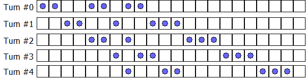

We define the sequence {t[i]}:

 • s[0] = 290797
 • s[k+1] = s[k]^2 mod 50515093
 • t[k] = (s[k] mod 64) + 1

Starting from the initial configuration (t[0], t[1], …, t[10]), the final
state becomes [1, 3, 10, 24, 51, 75].
Starting from the initial configuration (t[0], t[1], …, t[10 000 000]),
find the final state.
Give as your answer the sum of the squares of the elements of the final
state. For example, if the final state is [1, 2, 3] then 14 ( = 1^2 + 2^2
+ 3^2) is your answer.

Answer: b5d8157a351482da47da0512ca374007


Problem 427
===========


   A sequence of integers S = {s[i]} is called an n-sequence if it has n
   elements and each element s[i] satisfies 1 ≤ s[i] ≤ n. Thus there are n^n
   distinct n-sequences in total.For example, the sequence S = {1, 5, 5, 10,
   7, 7, 7, 2, 3, 7} is a 10-sequence.

   For any sequence S, let L(S) be the length of the longest contiguous
   subsequence of S with the same value.For example, for the given sequence S
   above, L(S) = 3, because of the three consecutive 7's.

   Let f(n) = ∑ L(S) for all n-sequences S.

   For example, f(3) = 45, f(7) = 1403689 and f(11) = 481496895121.

   Find f(7 500 000) mod 1 000 000 009.

   
   Answer: ecb4da2c940b517c63d8d256814dd511


Problem 428
===========


   Let a, b and c be positive numbers.
   Let W, X, Y, Z be four collinear points where |WX| = a, |XY| = b, |YZ| = c
   and |WZ| = a + b + c.
   Let C[in] be the circle having the diameter XY.
   Let C[out] be the circle having the diameter WZ.

   The triplet (a, b, c) is called a necklace triplet if you can place k ≥ 3
   distinct circles C[1], C[2], ..., C[k] such that:

     • C[i] has no common interior points with any C[j] for 1 ≤ i, j ≤ k and
       i ≠ j,
     • C[i] is tangent to both C[in] and C[out] for 1 ≤ i ≤ k,
     • C[i] is tangent to C[i+1] for 1 ≤ i < k, and
     • C[k] is tangent to C[1].

   For example, (5, 5, 5) and (4, 3, 21) are necklace triplets, while it can
   be shown that (2, 2, 5) is not.

   Let T(n) be the number of necklace triplets (a, b, c) such that a, b and c
   are positive integers, and b ≤ n.For example, T(1) = 9, T(20) = 732 and
   T(3000) = 438106.

   Find T(1 000 000 000).

   
   Answer: c6010c109b66b34bf3594e63eb58b446


Problem 429
===========


   A unitary divisor d of a number n is a divisor of n that has the property
   gcd(d, n/d) = 1.
   The unitary divisors of 4! = 24 are 1, 3, 8 and 24.
   The sum of their squares is 1^2 + 3^2 + 8^2 + 24^2 = 650.

   Let S(n) represent the sum of the squares of the unitary divisors of n.
   Thus S(4!)=650.

   Find S(100 000 000!) modulo 1 000 000 009.

   
   Answer: ec4f87b0c01680e951326d9e85d2c03f


Problem 430
===========


N disks are placed in a row, indexed 1 to N from left to right.
Each disk has a black side and white side. Initially all disks show their
white side.

At each turn, two, not necessarily distinct, integers A and B between 1
and N (inclusive) are chosen uniformly at random.
All disks with an index from A to B (inclusive) are flipped.

The following example shows the case N = 8. At the first turn A = 5 and B
= 2, and at the second turn A = 4 and B = 6.

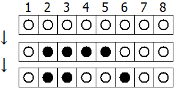

Let E(N, M) be the expected number of disks that show their white side
after M turns.
We can verify that E(3, 1) = 10/9, E(3, 2) = 5/3, E(10, 4) ≈ 5.157 and
E(100, 10) ≈ 51.893.

Find E(10^10, 4000).
Give your answer rounded to 2 decimal places behind the decimal point.

Answer: 32b0825d7a110a1a220e80629c413411


Problem 431
===========

Fred the farmer arranges to have a new storage silo installed on his farm
and having an obsession for all things square he is absolutely devastated
when he discovers that it is circular. Quentin, the representative from
the company that installed the silo, explains that they only manufacture
cylindrical silos, but he points out that it is resting on a square base.
Fred is not amused and insists that it is removed from his property.

Quick thinking Quentin explains that when granular materials are delivered
from above a conical slope is formed and the natural angle made with the
horizontal is called the angle of repose. For example if the angle of
repose, $\alpha = 30$ degrees, and grain is delivered at the centre of the
silo then a perfect cone will form towards the top of the cylinder. In the
case of this silo, which has a diameter of 6m, the amount of space wasted
would be approximately 32.648388556 m^3. However, if grain is delivered at
a point on the top which has a horizontal distance of $x$ metres from the
centre then a cone with a strangely curved and sloping base is formed. He
shows Fred a picture.


We shall let the amount of space wasted in cubic metres be given by
$V(x)$. If $x = 1.114785284$, which happens to have three squared decimal
places, then the amount of space wasted, $V(1.114785284) \approx 36$.
Given the range of possible solutions to this problem there is exactly one
other option: $V(2.511167869) \approx 49$. It would be like knowing that
the square is king of the silo, sitting in splendid glory on top of your
grain.

Fred's eyes light up with delight at this elegant resolution, but on
closer inspection of Quentin's drawings and calculations his happiness
turns to despondency once more. Fred points out to Quentin that it's the
radius of the silo that is 6 metres, not the diameter, and the angle of
repose for his grain is 40 degrees. However, if Quentin can find a set of
solutions for this particular silo then he will be more than happy to keep
it.

If Quick thinking Quentin is to satisfy frustratingly fussy Fred the
farmer's appetite for all things square then determine the values of $x$
for all possible square space wastage options and calculate $\sum x$
correct to 9 decimal places.

Answer: 5e5d81aa8bfaf92f68cdef0154c5c238


Problem 432
===========


   Let S(n,m) = ∑φ(n × i) for 1 ≤ i ≤ m. (φ is Euler's totient function)
   You are given that S(510510,10^6 )= 45480596821125120.

   Find S(510510,10^11).
   Give the last 9 digits of your answer.

   
   Answer: e171c2872d650e47589842faa80f5707


Problem 433
===========


   Let E(x[0], y[0]) be the number of steps it takes to determine the
   greatest common divisor of x[0] and y[0] with Euclid's algorithm. More
   formally:
   x[1] = y[0], y[1] = x[0] mod y[0]
   x[n] = y[n-1], y[n] = x[n-1] mod y[n-1]
   E(x[0], y[0]) is the smallest n such that y[n] = 0.

   We have E(1,1) = 1, E(10,6) = 3 and E(6,10) = 4.

   Define S(N) as the sum of E(x,y) for 1 ≤ x,y ≤ N.
   We have S(1) = 1, S(10) = 221 and S(100) = 39826.

   Find S(5·10^6).

   
   Answer: 0eeca9fa5cf25a2bfae01f1f04d6cd35


Problem 434
===========


   Recall that a graph is a collection of vertices and edges connecting the
   vertices, and that two vertices connected by an edge are called adjacent.
   Graphs can be embedded in Euclidean space by associating each vertex with
   a point in the Euclidean space.
   A flexible graph is an embedding of a graph where it is possible to move
   one or more vertices continuously so that the distance between at least
   two nonadjacent vertices is altered while the distances between each pair
   of adjacent vertices is kept constant.
   A rigid graph is an embedding of a graph which is not flexible.
   Informally, a graph is rigid if by replacing the vertices with fully
   rotating hinges and the edges with rods that are unbending and inelastic,
   no parts of the graph can be moved independently from the rest of the
   graph.

   The grid graphs embedded in the Euclidean plane are not rigid, as the
   following animation demonstrates:

   However, one can make them rigid by adding diagonal edges to the cells.
   For example, for the 2x3 grid graph, there are 19 ways to make the graph
   rigid:

   Note that for the purposes of this problem, we do not consider changing
   the orientation of a diagonal edge or adding both diagonal edges to a cell
   as a different way of making a grid graph rigid.

   Let R(m,n) be the number of ways to make the m × n grid graph rigid.
   E.g. R(2,3) = 19 and R(5,5) = 23679901

   Define S(N) as ∑R(i,j) for 1 ≤ i, j ≤ N.
   E.g. S(5) = 25021721.
   Find S(100), give your answer modulo 1000000033

   
   Answer: f51d9fd41a8ce217682321a020be6fec


Problem 435
===========


The Fibonacci numbers {f[n], n ≥ 0} are defined recursively as f[n] =
f[n-1] + f[n-2] with base cases f[0] = 0 and f[1] = 1.

Define the polynomials {F[n], n ≥ 0} as `F[n](x)` = ∑f[i]x^i for 0 ≤ i ≤ n.

For example, `F[7](x)` = x + x^2 + 2x^3 + 3x^4 + 5x^5 + 8x^6 + 13x^7, and
`F[7](11)` = 268357683.

Let n = 10^15. Find the sum [∑[0≤x≤100] `F[n](x)`] mod 1307674368000 (=
15!).


Answer: 0f08231a97e872f565a085de75743a1c


Problem 436
===========


   Julie proposes the following wager to her sister Louise.
   She suggests they play a game of chance to determine who will wash the
   dishes.
   For this game, they shall use a generator of independent random numbers
   uniformly distributed between 0 and 1.
   The game starts with S = 0.
   The first player, Louise, adds to S different random numbers from the
   generator until S > 1 and records her last random number 'x'.
   The second player, Julie, continues adding to S different random numbers
   from the generator until S > 2 and records her last random number 'y'.
   The player with the highest number wins and the loser washes the dishes,
   i.e. if y > x the second player wins.

   For example, if the first player draws 0.62 and 0.44, the first player
   turn ends since 0.62+0.44 > 1 and x = 0.44.
   If the second players draws 0.1, 0.27 and 0.91, the second player turn
   ends since 0.62+0.44+0.1+0.27+0.91 > 2 and y = 0.91.Since y > x, the
   second player wins.

   Louise thinks about it for a second, and objects: "That's not fair".
   What is the probability that the second player wins?
   Give your answer rounded to 10 places behind the decimal point in the form
   0.abcdefghij

   
   Answer: d797ed72189f045e8ea48aa960fec1f3


Problem 437
===========


   When we calculate 8^n modulo 11 for n=0 to 9 we get: 1, 8, 9, 6, 4, 10, 3,
   2, 5, 7.
   As we see all possible values from 1 to 10 occur. So 8 is a primitive root
   of 11.
   But there is more:
   If we take a closer look we see:
   1+8=9
   8+9=17≡6 mod 11
   9+6=15≡4 mod 11
   6+4=10
   4+10=14≡3 mod 11
   10+3=13≡2 mod 11
   3+2=5
   2+5=7
   5+7=12≡1 mod 11.

   So the powers of 8 mod 11 are cyclic with period 10, and 8^n + 8^n+1 ≡
   8^n+2 (mod 11).
   8 is called a Fibonacci primitive root of 11.
   Not every prime has a Fibonacci primitive root.
   There are 323 primes less than 10000 with one or more Fibonacci primitive
   roots and the sum of these primes is 1480491.
   Find the sum of the primes less than 100,000,000 with at least one
   Fibonacci primitive root.
   
   Answer: 98bb66462d635d8225416a644e4637b0


Problem 438
===========


   For an n-tuple of integers t = (a[1], ..., a[n]), let (x[1], ..., x[n]) be
   the solutions of the polynomial equation x^n + a[1]x^n-1 + a[2]x^n-2 + ...
   + a[n-1]x + a[n] = 0.

   Consider the following two conditions:

     • x[1], ..., x[n] are all real.
     • If x[1], ..., x[n] are sorted, ⌊x[i]⌋ = i for 1 ≤ i ≤ n. (⌊·⌋: floor
       function.)

   In the case of n = 4, there are 12 n-tuples of integers which satisfy both
   conditions.
   We define S(t) as the sum of the absolute values of the integers in t.
   For n = 4 we can verify that ∑S(t) = 2087 for all n-tuples t which satisfy
   both conditions.

   Find ∑S(t) for n = 7.

   
   Answer: ff0c265a14c2c0bb56f10dbff1768338


Problem 439
===========


   Let d(k) be the sum of all divisors of k.
   We define the function S(N) = ∑[1≤i≤N] ∑[1≤j≤N] d(i·j).
   For example, S(3) = d(1) + d(2) + d(3) + d(2) + d(4) + d(6) + d(3) + d(6)
   + d(9) = 59.

   You are given that S(10^3) = 563576517282 and S(10^5) mod 10^9 =
   215766508.
   Find S(10^11) mod 10^9.

   
   Answer: da937ac1432c8ccd4de6f68df36e7980


Problem 440
===========


   We want to tile a board of length n and height 1 completely, with either 1
   × 2 blocks or 1 × 1 blocks with a single decimal digit on top:

   For example, here are some of the ways to tile a board of length n = 8:

   Let T(n) be the number of ways to tile a board of length n as described
   above.

   For example, T(1) = 10 and T(2) = 101.

   Let S(L) be the triple sum ∑[a,b,c] gcd(T(c^a), T(c^b)) for 1 ≤ a, b, c ≤
   L.
   For example:
   S(2) = 10444
   S(3) = 1292115238446807016106539989
   S(4) mod 987 898 789 = 670616280.

   Find S(2000) mod 987 898 789.

   
   Answer: 214573d310bf2f02e066e4a9c193cc23


Problem 441
===========


   For an integer M, we define R(M) as the sum of 1/(p·q) for all the integer
   pairs p and q which satisfy all of these conditions:

     • 1 ≤ p < q ≤ M
     • p + q ≥ M
     • p and q are coprime.

   We also define S(N) as the sum of R(i) for 2 ≤ i ≤ N.
   We can verify that S(2) = R(2) = 1/2, S(10) ≈ 6.9147 and S(100) ≈ 58.2962.

   Find S(10^7). Give your answer rounded to four decimal places.

   
   Answer: 152cc265f5461c5055db95a122280416


Problem 442
===========


   An integer is called eleven-free if its decimal expansion does not contain
   any substring representing a power of 11 except 1.

   For example, 2404 and 13431 are eleven-free, while 911 and 4121331 are
   not.

   Let E(n) be the nth positive eleven-free integer. For example, E(3) = 3,
   E(200) = 213 and E(500 000) = 531563.

   Find E(10^18).

   
   Answer: c31bb13db787bce9a169dce600aec863


Problem 443
===========


   Let g(n) be a sequence defined as follows:
   g(4) = 13,
   g(n) = g(n-1) + gcd(n, g(n-1)) for n > 4.

   The first few values are:

 n     4   5   6   7   8   9   10  11  12  13  14  15  16  17  18  19  20  ...
 g(n)  13  14  16  17  18  27  28  29  30  31  32  33  34  51  54  55  60  ...

   You are given that g(1 000) = 2524 and g(1 000 000) = 2624152.

   Find g(10^15).

   
   Answer: 28f9d9a9bf8fb3d606e0b711b59f42aa


Problem 444
===========


   A group of p people decide to sit down at a round table and play a
   lottery-ticket trading game. Each person starts off with a
   randomly-assigned, unscratched lottery ticket. Each ticket, when
   scratched, reveals a whole-pound prize ranging anywhere from £1 to £p,
   with no two tickets alike. The goal of the game is for each person to
   maximize his ticket winnings upon leaving the game.

   An arbitrary person is chosen to be the first player. Going around the
   table, each player has only one of two options:

   1. The player can scratch his ticket and reveal its worth to everyone at
   the table.
   2. The player can trade his unscratched ticket for a previous player's
   scratched ticket, and then leave the game with that ticket. The previous
   player then scratches his newly-acquired ticket and reveals its worth to
   everyone at the table.

   The game ends once all tickets have been scratched. All players still
   remaining at the table must leave with their currently-held tickets.

   Assume that each player uses the optimal strategy for maximizing the
   expected value of his ticket winnings.

   Let E(p) represent the expected number of players left at the table when
   the game ends in a game consisting of p players (e.g. E(111) = 5.2912 when
   rounded to 5 significant digits).

   Let S[1](N) = E(p)
   Let S[k](N) = S[k-1](p) for k > 1

   Find S[20](10^14) and write the answer in scientific notation rounded to
   10 significant digits. Use a lowercase e to separate mantissa and exponent
   (e.g. S[3](100) = 5.983679014e5).

   
   Answer: e6745c386ba3c0de1bf56897e453c7c8


Problem 445
===========


For every integer n>1, the family of functions f[n,a,b] is defined by
`f[n,a,b](x)`≡ax+b mod n for a,b,x integer and 0<a<n, 0≤b<n, 0≤x<n.
We will call f[n,a,b] a retraction if `f[n,a,b](f[n,a,b](x))`≡`f[n,a,b](x)
mod n` for every 0≤x<n.
Let R(n) be the number of retractions for n.

You are given that
∑ R(c) for c=C(100 000,k), and 1 ≤ k ≤99 999 ≡628701600 (mod 1 000 000
007).
(C(n,k) is the binomial coefficient).

Find ∑ R(c) for c=C(10 000 000,k), and 1 ≤k≤ 9 999 999.
Give your answer modulo 1 000 000 007.


Answer: 0183cdbc44f24e971bd824e9deb2b478


Problem 446
===========


   For every integer n>1, the family of functions f[n,a,b] is defined by
   `f[n,a,b](x)`≡ax+b mod n for a,b,x integer and 0<a<n, 0≤b<n, 0≤x<n.
   We will call f[n,a,b] a retraction if `f[n,a,b](f[n,a,b](x))`≡`f[n,a,b](x)
   mod n` for every 0≤x<n.
   Let R(n) be the number of retractions for n.

   F(N)=∑R(n^4+4) for 1≤n≤N.
   F(1024)=77532377300600.

   Find F(10^7) (mod 1 000 000 007)

   
   Answer: 0a9aa05f7bce906adb602af96ba06dc0


Problem 447
===========


   For every integer n>1, the family of functions f[n,a,b] is defined by
   `f[n,a,b](x)`≡ax+b mod n for a,b,x integer and 0<a<n, 0≤b<n, 0≤x<n.
   We will call f[n,a,b] a retraction if `f[n,a,b](f[n,a,b](x))`≡`f[n,a,b](x)
   mod n` for every 0≤x<n.
   Let R(n) be the number of retractions for n.

   F(N)=∑R(n) for 2≤n≤N.
   F(10^7)≡638042271 (mod 1 000 000 007).

   Find F(10^14) (mod 1 000 000 007).

   
   Answer: ea764a33b7368fccb4a1bbd37768d08c


Problem 448
===========


   The function lcm(a,b) denotes the least common multiple of a and b.
   Let A(n) be the average of the values of lcm(n,i) for 1≤i≤n.
   E.g: A(2)=(2+2)/2=2 and A(10)=(10+10+30+20+10+30+70+40+90+10)/10=32.

   Let S(n)=∑A(k) for 1≤k≤n.
   S(100)=122726.

   Find S(99999999019) mod 999999017.

   
   Answer: e6e7e87005c7b070cbc08ce727ae4e6a


Problem 449
===========


   Phil the confectioner is making a new batch of chocolate covered candy.
   Each candy centre is shaped like an ellipsoid of revolution defined by the
   equation: b^2x^2 + b^2y^2 + a^2z^2 = a^2b^2.

   Phil wants to know how much chocolate is needed to cover one candy centre
   with a uniform coat of chocolate one millimeter thick.

   If a=1 mm and b=1 mm, the amount of chocolate required is 28 π mm^3
                                                             3

   If a=2 mm and b=1 mm, the amount of chocolate required is approximately
   60.35475635 mm^3.

   Find the amount of chocolate in mm^3 required if a=3 mm and b=1 mm. Give
   your answer as the number rounded to 8 decimal places behind the decimal
   point.

   
   Answer: 8ac19d0d06980691526883bc8c0950ef


Problem 450
===========


   A hypocycloid is the curve drawn by a point on a small circle rolling
   inside a larger circle. The parametric equations of a hypocycloid centered
   at the origin, and starting at the right most point is given by:

              $x(t) = (R - r) \cos(t) + r \cos(\frac {R - r} r t)$
              $y(t) = (R - r) \sin(t) - r \sin(\frac {R - r} r t)$

   Where R is the radius of the large circle and r the radius of the small
   circle.

   Let $C(R, r)$ be the set of distinct points with integer coordinates on
   the hypocycloid with radius R and r and for which there is a corresponding
   value of t such that $\sin(t)$ and $\cos(t)$ are rational numbers.

   Let $S(R, r) = \sum_{(x,y) \in C(R, r)} |x| + |y|$ be the sum of the
   absolute values of the x and y coordinates of the points in $C(R, r)$.

   Let $T(N) = \sum_{R = 3}^N \sum_{r=1}^{\lfloor \frac {R - 1} 2 \rfloor}
   S(R, r)$ be the sum of $S(R, r)$ for R and r positive integers, $R\leq N$
   and $2r < R$.

   You are given:
   C(3, 1) = {(3, 0), (-1, 2), (-1,0), (-1,-2)}

   C(2500, 1000) =

     {(2500, 0), (772, 2376), (772, -2376), (516, 1792), (516, -1792), (500,
     0), (68, 504), (68, -504),
     (-1356, 1088), (-1356, -1088), (-1500, 1000), (-1500, -1000)}

   Note: (-625, 0) is not an element of C(2500, 1000) because $\sin(t)$ is
   not a rational number for the corresponding values of t.

   S(3, 1) = (|3| + |0|) + (|-1| + |2|) + (|-1| + |0|) + (|-1| + |-2|) = 10

   T(3) = 10; T(10) = 524 ;T(100) = 580442; T(10^3) = 583108600.

   Find T(10^6).

   
   Answer: d4ac68b5850e626fa95199b2b03efd53


Problem 451
===========


   Consider the number 15.
   There are eight positive numbers less than 15 which are coprime to 15: 1,
   2, 4, 7, 8, 11, 13, 14.
   The modular inverses of these numbers modulo 15 are: 1, 8, 4, 13, 2, 11,
   7, 14
   because
   1*1 mod 15=1
   2*8=16 mod 15=1
   4*4=16 mod 15=1
   7*13=91 mod 15=1
   11*11=121 mod 15=1
   14*14=196 mod 15=1

   Let I(n) be the largest positive number m smaller than n-1 such that the
   modular inverse of m modulo n equals m itself.
   So I(15)=11.
   Also I(100)=51 and I(7)=1.

   Find ∑I(n) for 3≤n≤2·10^7

   
   Answer: 9848878734a1d751a0e428147ab0b4aa


Problem 452
===========


   Define F(m,n) as the number of n-tuples of positive integers for which the
   product of the elements doesn't exceed m.

   F(10, 10) = 571.

   F(10^6, 10^6) mod 1 234 567 891 = 252903833.

   Find F(10^9, 10^9) mod 1 234 567 891.

   
   Answer: a75f50818cab61a160cafa2c4145ed23


Problem 453
===========


   A simple quadrilateral is a polygon that has four distinct vertices, has
   no straight angles and does not self-intersect.

   Let Q(m, n) be the number of simple quadrilaterals whose vertices are
   lattice points with coordinates (x,y) satisfying 0 ≤ x ≤ m and 0 ≤ y ≤ n.

   For example, Q(2, 2) = 94 as can be seen below:

   It can also be verified that Q(3, 7) = 39590, Q(12, 3) = 309000 and Q(123,
   45) = 70542215894646.

   Find Q(12345, 6789) mod 135707531.

   
   Answer: 7f5ed466531a399174a64c6de41ea707


Problem 454
===========


   In the following equation x, y, and n are positive integers.

                                   1   1   1
                                   ─ + ─ = ─
                                   x   y   n

   For a limit L we define F(L) as the number of solutions which satisfy x <
   y ≤ L.

   We can verify that F(15) = 4 and F(1000) = 1069.
   Find F(10^12).

   
   Answer: cf4e45f50c511e558b3dccb3ed481cb5


Problem 455
===========


   Let f(n) be the largest positive integer x less than 10^9 such that the
   last 9 digits of n^x form the number x (including leading zeros), or zero
   if no such integer exists.

   For example:

     • f(4) = 411728896 (4^411728896 = ...490411728896)
     • f(10) = 0
     • f(157) = 743757 (157^743757 = ...567000743757)
     • Σf(n), 2 ≤ n ≤ 10^3 = 442530011399

   Find Σf(n), 2 ≤ n ≤ 10^6.

   
   Answer: 22d6cf30a29e14e5c78dca980edc2796


Problem 456
===========


   Define:
   x[n] = (1248^n mod 32323) - 16161
   y[n] = (8421^n mod 30103) - 15051
   P[n] = {(x[1], y[1]), (x[2], y[2]), ..., (x[n], y[n])}

   For example, P[8] = {(-14913, -6630), (-10161, 5625), (5226, 11896),
   (8340, -10778), (15852, -5203), (-15165, 11295), (-1427, -14495), (12407,
   1060)}.

   Let C(n) be the number of triangles whose vertices are in P[n] which
   contain the origin in the interior.

   Examples:
   C(8) = 20
   C(600) = 8950634
   C(40 000) = 2666610948988

   Find C(2 000 000).

   
   Answer: e2811a92b4658ca420be740f6c66572b


Problem 457
===========


   Let f(n) = n^2 - 3n - 1.
   Let p be a prime.
   Let R(p) be the smallest positive integer n such that f(n) mod p^2 = 0 if
   such an integer n exists, otherwise R(p) = 0.

   Let SR(L) be &Sum;R(p) for all primes not exceeding L.

   Find SR(10^7).

   
   Answer: 5eae79c2f4887f6cf08c099840317a51


Problem 458
===========


   Consider the alphabet A made out of the letters of the word "project":
   A={c,e,j,o,p,r,t}.
   Let T(n) be the number of strings of length n consisting of letters from A
   that do not have a substring that is one of the 5040 permutations of
   "project".

   T(7)=7^7-7!=818503.

   Find T(10^12). Give the last 9 digits of your answer.

   
   Answer: d304abee61f0f6ac83a73de56d2fe578


Problem 459
===========


   The flipping game is a two player game played on a N by N square board.
   Each square contains a disk with one side white and one side black.
   The game starts with all disks showing their white side.

   A turn consists of flipping all disks in a rectangle with the following
   properties:

     • the upper right corner of the rectangle contains a white disk
     • the rectangle width is a perfect square (1, 4, 9, 16, ...)
     • the rectangle height is a triangular number (1, 3, 6, 10, ...)

   Players alternate turns. A player wins by turning the grid all black.

   Let W(N) be the number of winning moves for the first player on a N by N
   board with all disks white, assuming perfect play.
   W(1) = 1, W(2) = 0, W(5) = 8 and W(10^2) = 31395.

   For N=5, the first player's eight winning first moves are:

   Find W(10^6).

   
   Answer: abe2c990b8f028376186c2bc339e4c1e


Problem 460
===========


   On the Euclidean plane, an ant travels from point A(0, 1) to point B(d, 1)
   for an integer d.

   In each step, the ant at point (x[0], y[0]) chooses one of the lattice
   points (x[1], y[1]) which satisfy x[1] ≥ 0 and y[1] ≥ 1 and goes straight
   to (x[1], y[1]) at a constant velocity v. The value of v depends on y[0]
   and y[1] as follows:

     • If y[0] = y[1], the value of v equals y[0].
     • If y[0] ≠ y[1], the value of v equals (y[1] - y[0]) / (ln(y[1]) -
       ln(y[0])).

   The left image is one of the possible paths for d = 4. First the ant goes
   from A(0, 1) to P[1](1, 3) at velocity (3 - 1) / (ln(3) - ln(1)) ≈ 1.8205.
   Then the required time is sqrt(5) / 1.8205 ≈ 1.2283.
   From P[1](1, 3) to P[2](3, 3) the ant travels at velocity 3 so the
   required time is 2 / 3 ≈ 0.6667. From P[2](3, 3) to B(4, 1) the ant
   travels at velocity (1 - 3) / (ln(1) - ln(3)) ≈ 1.8205 so the required
   time is sqrt(5) / 1.8205 ≈ 1.2283.
   Thus the total required time is 1.2283 + 0.6667 + 1.2283 = 3.1233.

   The right image is another path. The total required time is calculated as
   0.98026 + 1 + 0.98026 = 2.96052. It can be shown that this is the quickest
   path for d = 4.

   Let F(d) be the total required time if the ant chooses the quickest path.
   For example, F(4) ≈ 2.960516287.
   We can verify that F(10) ≈ 4.668187834 and F(100) ≈ 9.217221972.

   Find F(10000). Give your answer rounded to nine decimal places.

   
   Answer: 134fd9e25365ddb970971dd21f386408


Problem 461
===========


   Let f[n](k) = e^k/n - 1, for all non-negative integers k.

   Remarkably, f[200](6) + f[200](75) + f[200](89) + f[200](226) =
   3.141592644529… ≈ π.

   In fact, it is the best approximation of π of the form
   f[n](a) + f[n](b) + f[n](c) + f[n](d) for n = 200.

   Let g(n) = a^2 + b^2 + c^2 + d^ 2 for a, b, c, d that minimize the error:
   | f[n](a) + f[n](b) + f[n](c) + f[n](d) - π|
   (where |x| denotes the absolute value of x).

   You are given g(200) = 6^2 + 75^2 + 89^2 + 226^2 = 64658.

   Find g(10000). ^

   
   Answer: 70c3eff774c9d5cdb29284c16b9d1bc6


Problem 462
===========


   A 3-smooth number is an integer which has no prime factor larger than 3.
   For an integer N, we define S(N) as the set of 3-smooth numbers less than
   or equal to N . For example, S(20) = { 1, 2, 3, 4, 6, 8, 9, 12, 16, 18 }.

   We define F(N) as the number of permutations of S(N) in which each element
   comes after all of its proper divisors.

   This is one of the possible permutations for N = 20.
   - 1, 2, 4, 3, 9, 8, 16, 6, 18, 12.
   This is not a valid permutation because 12 comes before its divisor 6.
   - 1, 2, 4, 3, 9, 8, 12, 16, 6, 18.

   We can verify that F(6) = 5, F(8) = 9, F(20) = 450 and F(1000) ≈
   8.8521816557e21.
   Find F(10^18). Give as your answer its scientific notation rounded to ten
   digits after the decimal point.
   When giving your answer, use a lowercase e to separate mantissa and
   exponent. E.g. if the answer is 112,233,445,566,778,899 then the answer
   format would be 1.1223344557e17.

   
   Answer: 77c84f6238d9987d204eb771d3dcde13


Problem 463
===========


   The function $f$ is defined for all positive integers as follows:

     • $f(1)=1$
     • $f(3)=3$
     • $f(2n)=f(n)$
     • $f(4n + 1)=2f(2n + 1) - f(n)$
     • $f(4n + 3)=3f(2n + 1) - 2f(n)$

   The function $S(n)$ is defined as $\sum_{i=1}^{n}f(i)$.

   $S(8)=22$ and $S(100)=3604$.

   Find $S(3^{37})$. Give the last 9 digits of your answer.

   
   Answer: 95481696a65b0c1d9f73186a693686f5


Problem 464
===========


   The Möbius function, denoted μ(n), is defined as:

     • μ(n) = (-1)^ω(n) if n is squarefree (where ω(n) is the number of
       distinct prime factors of n)
     • μ(n) = 0 if n is not squarefree.

   Let P(a,b) be the number of integers n in the interval [a,b] such that
   μ(n) = 1.
   Let N(a,b) be the number of integers n in the interval [a,b] such that
   μ(n) = -1.
   For example, P(2,10) = 2 and N(2,10) = 4.

   Let C(n) be the number of integer pairs (a,b) such that:

     • 1 ≤ a ≤ b ≤ n,
     • 99·N(a,b) ≤ 100·P(a,b), and
     • 99·P(a,b) ≤ 100·N(a,b).

   For example, C(10) = 13, C(500) = 16676 and C(10 000) = 20155319.

   Find C(20 000 000).

   
   Answer: 6d3598e116ae19efe33063bccf0b693b


Problem 465
===========


   The kernel of a polygon is defined by the set of points from which the
   entire polygon's boundary is visible. We define a polar polygon as a
   polygon for which the origin is strictly contained inside its kernel.

   For this problem, a polygon can have collinear consecutive vertices.
   However, a polygon still cannot have self-intersection and cannot have
   zero area.

   For example, only the first of the following is a polar polygon (the
   kernels of the second, third, and fourth do not strictly contain the
   origin, and the fifth does not have a kernel at all):

   Notice that the first polygon has three consecutive collinear vertices.

   Let P(n) be the number of polar polygons such that the vertices (x, y)
   have integer coordinates whose absolute values are not greater than n.

   Note that polygons should be counted as different if they have different
   set of edges, even if they enclose the same area. For example, the polygon
   with vertices [(0,0),(0,3),(1,1),(3,0)] is distinct from the polygon with
   vertices [(0,0),(0,3),(1,1),(3,0),(1,0)].

   For example, P(1) = 131, P(2) = 1648531, P(3) = 1099461296175 and P(343)
   mod 1 000 000 007 = 937293740.

   Find P(7^13) mod 1 000 000 007.

   
   Answer: 64de4b2572602c3bdea4b4360a694ca7


Problem 466
===========


   Let P(m,n) be the number of distinct terms in an m×n multiplication table.

   For example, a 3×4 multiplication table looks like this:

                                                                      × 1 2 3 4
                                                                      1 1 2 3 4
                                                                      2 2 4 6 8
                                                                      3 3 6 9 12

   There are 8 distinct terms {1,2,3,4,6,8,9,12}, therefore P(3,4) = 8.

   You are given that:
   P(64,64) = 1263,
   P(12,345) = 1998, and
   P(32,10^15) = 13826382602124302.

   Find P(64,10^16).

   
   Answer: ff8b91e50170810dccd15ea59fb5efd8


Problem 467
===========


   An integer s is called a superinteger of another integer n if the digits
   of n form a subsequence of the digits of s.
   For example, 2718281828 is a superinteger of 18828, while 314159 is not a
   superinteger of 151.

   Let p(n) be the nth prime number, and let c(n) be the nth composite
   number. For example, p(1) = 2, p(10) = 29, c(1) = 4 and c(10) = 18.
   {p(i) : i ≥ 1} = {2, 3, 5, 7, 11, 13, 17, 19, 23, 29, ...}
   {c(i) : i ≥ 1} = {4, 6, 8, 9, 10, 12, 14, 15, 16, 18, ...}

   Let P^D the sequence of the digital roots of {p(i)} (C^D is defined
   similarly for {c(i)}):
   P^D = {2, 3, 5, 7, 2, 4, 8, 1, 5, 2, ...}
   C^D = {4, 6, 8, 9, 1, 3, 5, 6, 7, 9, ...}

   Let P[n] be the integer formed by concatenating the first n elements of
   P^D (C[n] is defined similarly for C^D).
   P[10] = 2357248152
   C[10] = 4689135679

   Let f(n) be the smallest positive integer that is a common superinteger of
   P[n] and C[n].
   For example, f(10) = 2357246891352679, and f(100) mod 1 000 000 007 =
   771661825.

   Find f(10 000) mod 1 000 000 007.

   
   Answer: 3ee327e7b4415f9e1cb75e3363c388b5


Problem 468
===========


   An integer is called B-smooth if none of its prime factors is greater than
   B.

   Let S[B](n) be the largest B-smooth divisor of n.
   Examples:
   S[1](10) = 1
   S[4](2100) = 12
   S[17](2496144) = 5712

   Define F(n) = ∑[1≤B≤n] ∑[0≤r≤n] S[B](C(n,r)). Here, C(n,r) denotes the
   binomial coefficient.
   Examples:
   F(11) = 3132
   F(1 111) mod 1 000 000 993 = 706036312
   F(111 111) mod 1 000 000 993 = 22156169

   Find F(11 111 111) mod 1 000 000 993.

   
   Answer: b7aa617d57bf1947ddfb9ae47c0feaac


Problem 469
===========


   In a room N chairs are placed around a round table.
   Knights enter the room one by one and choose at random an available empty
   chair.
   To have enough elbow room the knights always leave at least one empty
   chair between each other.

   When there aren't any suitable chairs left, the fraction C of empty chairs
   is determined.
   We also define E(N) as the expected value of C.
   We can verify that E(4) = 1/2 and E(6) = 5/9.

   Find E(10^18). Give your answer rounded to fourteen decimal places in the
   form 0.abcdefghijklmn.

   
   Answer: 3c2b641262880db5b735cfa4d4c957bc


Problem 470
===========


   Consider a single game of Ramvok:

   Let t represent the maximum number of turns the game lasts. If t = 0, then
   the game ends immediately. Otherwise, on each turn i, the player rolls a
   die. After rolling, if i < t the player can either stop the game and
   receive a prize equal to the value of the current roll, or discard the
   roll and try again next turn. If i = t, then the roll cannot be discarded
   and the prize must be accepted. Before the game begins, t is chosen by the
   player, who must then pay an up-front cost ct for some constant c. For c =
   0, t can be chosen to be infinite (with an up-front cost of 0). Let R(d,
   c) be the expected profit (i.e. net gain) that the player receives from a
   single game of optimally-played Ramvok, given a fair d-sided die and cost
   constant c. For example, R(4, 0.2) = 2.65. Assume that the player has
   sufficient funds for paying any/all up-front costs.

   Now consider a game of Super Ramvok:

   In Super Ramvok, the game of Ramvok is played repeatedly, but with a
   slight modification. After each game, the die is altered. The alteration
   process is as follows: The die is rolled once, and if the resulting face
   has its pips visible, then that face is altered to be blank instead. If
   the face is already blank, then it is changed back to its original value.
   After the alteration is made, another game of Ramvok can begin (and during
   such a game, at each turn, the die is rolled until a face with a value on
   it appears). The player knows which faces are blank and which are not at
   all times. The game of Super Ramvok ends once all faces of the die are
   blank.

   Let S(d, c) be the expected profit that the player receives from an
   optimally-played game of Super Ramvok, given a fair d-sided die to start
   (with all sides visible), and cost constant c. For example, S(6, 1) =
   208.3.

   Let F(n) = ∑[4≤d≤n] ∑[0≤c≤n] S(d, c).

   Calculate F(20), rounded to the nearest integer.

   
   Answer: a37644507221e441ca9667e1c7e660c4


Problem 471
===========


   The triangle ΔABC is inscribed in an ellipse with equation $\frac {x^2}
   {a^2} + \frac {y^2} {b^2} = 1$, 0 < 2b < a, a and b integers.

   Let r(a,b) be the radius of the incircle of ΔABC when the incircle has
   center (2b, 0) and A has coordinates $\left( \frac a 2, \frac {\sqrt 3} 2
   b\right)$.

   For example, r(3,1) = ½, r(6,2) = 1, r(12,3) = 2.

   Let $G(n) = \sum_{a=3}^n \sum_{b=1}^{\lfloor \frac {a - 1} 2 \rfloor} r(a,
   b)$

   You are given G(10) = 20.59722222, G(100) = 19223.60980 (rounded to 10
   significant digits).

   Find G(10^11).

   Give your answer in scientific notation rounded to 10 significant digits.
   Use a lowercase e to separate mantissa and exponent.

   For G(10) the answer would have been 2.059722222e1.

   
   Answer: d632b70a0a349ed70ac17ef6246dd7d8


Problem 472
===========


   There are N seats in a row. N people come one after another to fill the
   seats according to the following rules:

    1. No person sits beside another.
    2. The first person chooses any seat.
    3. Each subsequent person chooses the seat furthest from anyone else
       already seated, as long as it does not violate rule 1. If there is
       more than one choice satisfying this condition, then the person
       chooses the leftmost choice.

   Note that due to rule 1, some seats will surely be left unoccupied, and
   the maximum number of people that can be seated is less than N (for N >
   1).

   Here are the possible seating arrangements for N = 15:

   We see that if the first person chooses correctly, the 15 seats can seat
   up to 7 people.
   We can also see that the first person has 9 choices to maximize the number
   of people that may be seated.

   Let f(N) be the number of choices the first person has to maximize the
   number of occupants for N seats in a row. Thus, f(1) = 1, f(15) = 9,
   f(20) = 6, and f(500) = 16.

   Also, ∑f(N) = 83 for 1 ≤ N ≤ 20 and ∑f(N) = 13343 for 1 ≤ N ≤ 500.

   Find ∑f(N) for 1 ≤ N ≤ 10^12. Give the last 8 digits of your answer.

   
   Answer: 7d7ff31d9448e86ba9c901878c1fa5c6


Problem 473
===========


   Let $\varphi$ be the golden ratio: $\varphi=\frac{1+\sqrt{5}}{2}.$
   Remarkably it is possible to write every positive integer as a sum of
   powers of $\varphi$ even if we require that every power of $\varphi$ is
   used at most once in this sum.
   Even then this representation is not unique.
   We can make it unique by requiring that no powers with consecutive
   exponents are used and that the representation is finite.
   E.g: $2=\varphi+\varphi^{-2}$ and $3=\varphi^{2}+\varphi^{-2}$

   To represent this sum of powers of $\varphi$ we use a string of 0's and
   1's with a point to indicate where the negative exponents start.
   We call this the representation in the phigital numberbase.
   So $1=1_{\varphi}$, $2=10.01_{\varphi}$, $3=100.01_{\varphi}$ and
   $14=100100.001001_{\varphi}$.
   The strings representing 1, 2 and 14 in the phigital number base are
   palindromic, while the string representating 3 is not.
   (the phigital point is not the middle character).

   The sum of the positive integers not exceeding 1000 whose phigital
   representation is palindromic is 4345.

   Find the sum of the positive integers not exceeding $10^{10}$ whose
   phigital representation is palindromic.

   
   Answer: a4ea7a2040b6385b6d12863fd693e434


Problem 474
===========


   For a positive integer n and digits d, we define F(n, d) as the number of
   the divisors of n whose last digits equal d.
   For example, F(84, 4) = 3. Among the divisors of 84 (1, 2, 3, 4, 6, 7, 12,
   14, 21, 28, 42, 84), three of them (4, 14, 84) have the last digit 4.

   We can also verify that F(12!, 12) = 11 and F(50!, 123) = 17888.

   Find F(10^6!, 65432) modulo (10^16 + 61).

   
   Answer: dcfd11c680aa4cce11e1eee1a448440c


Problem 475
===========


   12n musicians participate at a music festival. On the first day, they form
   3n quartets and practice all day.

   It is a disaster. At the end of the day, all musicians decide they will
   never again agree to play with any member of their quartet.

   On the second day, they form 4n trios, each musician avoiding his previous
   quartet partners.

   Let f(12n) be the number of ways to organize the trios amongst the 12n
   musicians.

   You are given f(12) = 576 and f(24) mod 1 000 000 007 = 509089824.

   Find f(600) mod 1 000 000 007.

   
   Answer: 6be2411783d9ca8e7ad174b269a85be5


Problem 476
===========


   Let R(a, b, c) be the maximum area covered by three non-overlapping
   circles inside a triangle with edge lengths a, b and c.

   Let S(n) be the average value of R(a, b, c) over all integer triplets (a,
   b, c) such that 1 ≤ a ≤ b ≤ c < a + b ≤ n

   You are given S(2) = R(1, 1, 1) ≈ 0.31998, S(5) ≈ 1.25899.

   Find S(1803) rounded to 5 decimal places behind the decimal point.

   
   Answer: 4d6a99b2a0f22af561aeeb69c0126fef


Problem 477
===========
    

The number sequence game starts with a sequence _S_ of _N_ numbers written on a line.

Two players alternate turns. At his turn, a player must select and remove either the first or the last number remaining in the sequence.

The player score is the sum of all the numbers he has taken. Each player attempts to maximize his own sum.

If _N_ = 4 and _S_ = {1, 2, 10, 3}, then each player maximizes his score as follows:
Player 1: removes the first number (1)
Player 2: removes the last number from the remaining sequence (3)
Player 1: removes the last number from the remaining sequence (10)
Player 2: removes the remaining number (2)
Player 1 score is 1 + 10 = 11.

Let _F(N)_ be the score of player 1 if both players follow the optimal strategy for the sequence S = {s1, s2, ..., sN} defined as:

s1 = 0
si+1 = (si^2 + 45) modulo 1 000 000 007
The sequence begins with _S_ = {0, 45, 2070, 4284945, 753524550, 478107844, 894218625, ...}.

You are given F(2) = 45, F(4) = 4284990, F(100) = 26365463243, F(10^4) = 2495838522951.

Find F(10^8).


Answer: 4eb1b9788c1c6bed02f98d25c5633a21


Problem 478
===========


Let us consider mixtures of three substances: A, B and C. A mixture can be described by a ratio of the amounts of A, B, and C in it, i.e., `(a : b : c)`. For example, a mixture described by the ratio `(2 : 3 : 5)` contains 20% A, 30% B and 50% C.

For the purposes of this problem, we cannot separate the individual components from a mixture. However, we can combine different amounts of different mixtures to form mixtures with new ratios.

For example, say we have three mixtures with ratios `(3 : 0 : 2)`, `(3 : 6 : 11)` and `(3 : 3 : 4)`. By mixing 10 units of the first, 20 units of the second and 30 units of the third, we get a new mixture with ratio `(6 : 5 : 9)`, since:
```
(10·3/5 + 20·3/20 + 30·3/10 : 10·0/5 + 20·6/20 + 30·3/10 : 10·2/5 + 20·11/20 + 30·4/10) = (18 : 15 : 27) = (6 : 5 : 9)
```
However, with the same three mixtures, it is impossible to form the ratio `(3 : 2 : 1)`, since the amount of B is always less than the amount of C.

Let _n_ be a positive integer. Suppose that for every triple of integers `(a, b, c)` with `0 ≤ a, b, c ≤ n` and `gcd(a, b, c) = 1`, we have a mixture with ratio `(a : b : c)`. Let M(_n_) be the set of all such mixtures.

For example, M(2) contains the 19 mixtures with the following ratios:
```
{(0 : 0 : 1), (0 : 1 : 0), (0 : 1 : 1), (0 : 1 : 2), (0 : 2 : 1), 
(1 : 0 : 0), (1 : 0 : 1), (1 : 0 : 2), (1 : 1 : 0), (1 : 1 : 1), 
(1 : 1 : 2), (1 : 2 : 0), (1 : 2 : 1), (1 : 2 : 2), (2 : 0 : 1), 
(2 : 1 : 0), (2 : 1 : 1), (2 : 1 : 2), (2 : 2 : 1)}.
```

Let E(_n_) be the number of subsets of M(_n_) which can produce the mixture with ratio `(1 : 1 : 1)`, i.e., the mixture with equal parts A, B and C. 
We can verify that `E(1) = 103`, `E(2) = 520447`, `E(10) mod 118 = 82608406` and `E(500) mod 11^8 = 13801403`.
Find `E(10 000 000) mod 11^8`.


Answer: 02760aada255f7a5246b6ddc96b70a52


Problem 479
===========


Let _a<sub>k</sub>_, _b<sub>k</sub>_, and _c<sub>k</sub>_ represent the three solutions (real or complex numbers) to the expression 1/_x_ = (_k_/_x_)<sup>2</sup> (_k_+_x_<sup>2</sup>) - _kx_.

For instance, for _k_ = 5, we see that {_a<sub>5</sub>_, _b<sub>5</sub>_, _c<sub>5</sub>_} is approximately `{5.727244, -0.363622+2.057397i, -0.363622-2.057397i}`.

Let S(_n_) = Σ (_a<sub>k</sub>_+_b<sub>k</sub>_)_<sup>p</sup>_ (_b<sub>k</sub>_+_c<sub>k</sub>_)_<sup>p</sup>_ (_c<sub>k</sub>_+_a<sub>k</sub>_)_<sup>p</sup>_ for all integers _p_, _k_ such that 1 ≤ _p_, _k_ ≤ _n_.

Interestingly, S(_n_) is always an integer. For example, `S(4) = 51160`.

Find S(10<sup>6</sup>) modulo 1 000 000 007.


Answer: b64da7e8067be18d8145d3b550240d90


Problem 480
===========


Consider all the words which can be formed by selecting letters, in any order, from the phrase:

**thereisasyetinsufficientdataforameaningfulanswer**

Suppose those with 15 letters or less are listed in alphabetical order and numbered sequentially starting at 1.
The list would include:

1 : a<br/>
2 : aa<br/>
3 : aaa<br/>
4 : aaaa<br/>
5 : aaaaa<br/>
6 : aaaaaa<br/>
7 : aaaaaac<br/>
8 : aaaaaacd<br/>
9 : aaaaaacde<br/>
10 : aaaaaacdee<br/>
11 : aaaaaacdeee<br/>
12 : aaaaaacdeeee<br/>
13 : aaaaaacdeeeee<br/>
14 : aaaaaacdeeeeee<br/>
15 : aaaaaacdeeeeeef<br/>
16 : aaaaaacdeeeeeeg<br/>
17 : aaaaaacdeeeeeeh<br/>
...<br/>
28 : aaaaaacdeeeeeey<br/>
29 : aaaaaacdeeeeef<br/>
30 : aaaaaacdeeeeefe<br/>
...<br/>
115246685191495242: euleoywuttttsss<br/>
115246685191495243: euler<br/>
115246685191495244: eulera<br/>
...<br/>
525069350231428029: ywuuttttssssrrr<br/>

Define _P_(_w_) as the position of the word _w_.<br/>
Define _W_(_p_) as the word in position _p_.<br/>
We can see that _P_(_w_) and _W_(_p_) are inverses: _P_(_W_(_p_)) = _p_ and _W_(_P_(_w_)) = _w_.<br/>

Examples:

_W_(10) = aaaaaacdee<br/>
_P_(aaaaaacdee) = 10<br/>
_W_(115246685191495243) = euler<br/>
_P_(euler) = 115246685191495243<br/>

Find _W_(_P_(legionary) + _P_(calorimeters) - _P_(annihilate) + _P_(orchestrated) - _P_(fluttering)).
Give your answer using lowercase characters (no punctuation or space).

Answer: b97e157bf53033d21f610d2350b92faf

